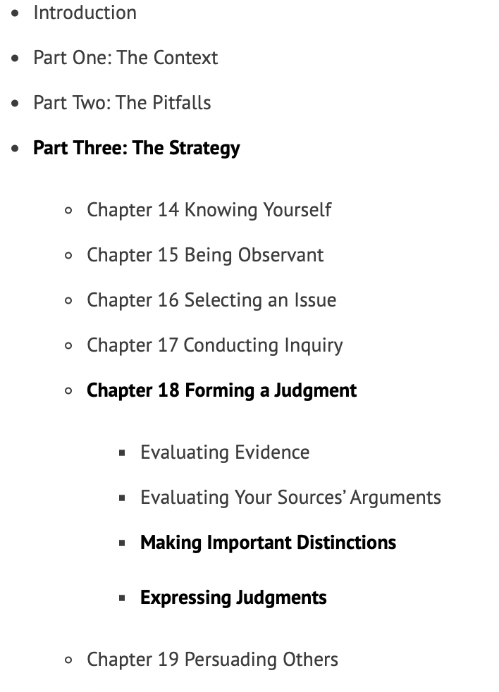

**说在前面**：我星期一到星期五的每天早上我将花差不多2个小时的时间来阅读英文书。边阅读边整理成公众号文章，我不会粘贴所有的原文，但我会将能体现主脉络和核心观点段落整理出来。其实，章节之间没有太多的联系，不用担心前面没有阅读，尽量耐心一点地去阅读文章里粘贴的原文。欢迎任何意见和问题，请底部留言哦！

### 导读
继续阅读第18章后面两个小节——如何作出确切的区分以及如何表达对一个观点的判断，有哪些方面我们去考虑如何区分？表达判断时有应该避免哪些坑？

### Chapter 18
### Evaluating Evidence
### Evaluating Your Sources’ Arguments
文章链接

### Making Important Distinctions 
Still another important consideration in evaluating evidence and arguments is making careful distinctions. The exact distinction needed, of course, depends on the situation. Here are six kinds of distinctions that frequently are necessary to avoid faulty evaluations:
在评估证据和论据时，另一个重要的考虑因素是仔细区分。当然，所需的确切区别取决于情况，为了避免错误的评估，经常需要以下六种区别：

**1 Between the person and the idea在人和想法之间**
It’s easy to confuse the person with the idea. Just as we tend to overlook the faults of our friends and exaggerate those of our enemies, so do we tend to look favorably on the ideas of people we like or admire and unfavorably on those we dislike or do not admire. 
Similarly, we tend to disregard the ideas of people who we feel ought not to have ideas on certain subjects.
Furthermore, a person’s gender, color, nationality, or religion is not a proper basis for accepting or rejecting his or her ideas.
Therefore, we should make a conscious effort to keep **our analyses of ideas** separate from **our feelings about the people who hold them**. 
我们很容易把人和想法混淆起来，正如我们倾向于忽视朋友的缺点，夸大敌人的缺点一样，我们也倾向于看好我们喜欢或钦佩的人的想法，而不看好我们不喜欢或不钦佩的人的想法。
同样，我们倾向于忽视那些我们认为不应该对某些主题有想法的人的想法。
此外，一个人的性别、肤色、国籍或宗教不是接受或拒绝其思想的适当基础。
因此，我们应该有意识地努力使我们**对想法的分析**与**我们对有想法的人的感觉**分开。

**2 Between what is said and how it is said表达什么和怎么表达之间**
Style and substance are quite different matters. Unfortunately, the person with the clearest and most graceful expression does not always have the soundest idea. 
So, although it is natural for us to be impressed by eloquent writers or speakers, it’s unwise to assume that their ideas are necessarily sound. 
As Saint Augustine said, “Our concern with a man is not with what eloquence he teaches, but with what evidence.”
怎么表达和实质内容是截然不同的，不幸的是，表情最清晰、最优雅的人并不总是有最健全的想法。
因此，尽管我们很自然地会被能言善辩的作家或演说家所打动，但认为他们的想法一定正确是不明智的。
正如圣奥古斯丁所说，“我们关注一个人并不是其教授的口才，而是凭借什么证据”

**3 Between why people think as they do and whether what they think is correct人们为什么要这样想和他们的想法是否正确之间** 
It’s common to judge people’s motives for thinking and acting as they do. 
Although such judging is sometimes rash, at other times it is very helpful. But it is important for us to remember that unworthy motivations do not necessarily contaminate the position. 
The soundness of an idea doesn’t depend on the motivations of those who support it. It depends on how well the idea fits the realities of the situation.
判断人们思考和行动的动机是很常见的。虽然这样的判断有时很鲁莽，但有时却很有帮助。但重要的是，我们要记住，不值得的动机并不一定会影响其地位。
一个想法的正确性并不取决于那些支持它的人的动机，这取决于这个想法与实际情况的吻合程度。

**4  Between the individual and the group or class个人与团体或班级之间**. 
The individual person or thing may differ from the group or class in one or more significant respects. 
Therefore, the characteristics of the individual should not be carelessly attributed to the group, or vice versa.
个人或事物在一些重要的方面可能与群体或阶级不同。因此，个人的特征不应粗心地归因于群体，反之亦然。

**5 Between matters of preference and matters of judgment偏好与判断之间**
Matters of preference concern taste, which it is pointless to debate. However, matters of judgment concern interpretations of fact and theory, which are debatable. It is therefore appropriate to question matters of judgment.
偏好的问题与品味有关，这是毫无意义的争论。然而，判断问题涉及对事实和理论的解释，这是可以争论的。因此，质疑判断事项是适当的。

>**6 Between familiarity and correctness熟悉与正确之间**
>To respond less guardedly to the familiar than to the unfamiliar is natural. Yet familiar ideas are not necessarily correct. Accordingly, when judging correctness, we should disregard the familiarity or unfamiliarity of the idea. Then we will be open to insights from both sides of issues, not just from the side we favor.
对熟悉的人的反应没有对不熟悉的人的反应那么谨慎是很自然的。然而，熟悉的想法并不一定正确，因此，在判断正确性时，我们应该忽略对这个概念的熟悉度。然后，我们将对问题双方的见解持开放态度，也不仅仅是在我们赞成的方面上。

### Expressing Judgments
The act of expressing a judgment can alter it. Therefore, no matter how clear your judgment of an issue might be in your mind, it is best to consider it **formless** until you have expressed it accurately in words. The following approach will help you express all your judgments effectively:
1 Strive for a balanced view. 
2 Deal with probability. 
3 Make your subject appropriately **specific**. 
4 Make your predicate exact. 
5 Include all appropriate qualifications. 
6 Avoid exaggeration. 
Let’s look more closely at each of these guidelines. 
表达你的观点(判断)这个行为可以改变观点本身。因此，无论你对一个问题的判断在你的头脑中有多清楚，最好是认为它是无形的，直到你用语言准确地表达出来。以下方法将帮助您有效地表达您的所有判断：
1 力求观点平衡 
2 处理概率 
3 使你的主题适当具体 
4 精确使用谓语
5 包括所有适当的资格 
6 避免夸大其词 
让我们更仔细地看一下这些准则。

**1 Strive for a balanced view**
To achieve a balanced view of the issues you address, you must be willing to look for the *neglected* side of the issue and, when there is good reason to do so, to *challenge* the prevailing view.
为了对你所处理的问题有一个平衡的看法，你必须愿意寻找这个问题**被忽视**的那一面，当有充分的理由忽视时，你必须对主流观点提出质疑。

**2 Deal with probability. **
Despite our best efforts to investigate issues, sometimes we cannot accumulate sufficient evidence to arrive at a judgment with certainty. This is especially true with controversial issues. At such times, the irresponsible often raise their voices, choose more forceful words, and pretend certainty. That is a grave mistake, first because the pretense seldom fools good thinkers, but, more important, because it is intellectually dishonest.
Whenever you cannot achieve **certainty**, focus on **probability**.
尽管我们尽了最大的努力调查问题，但有时我们无法积累足够的证据来确定作出的判断。在有争议的问题上尤其如此。在这个时候，不负责任的人常常提高嗓门，选择更有说服力的话语，假装确定。这是一个严重的错误，首先因为伪装很少愚弄好的思考者，但更重要的是，它是智力上的不诚实。
当你无法确定的时候，就把注意力放在可能性上。

**3 Make your subject appropriately **specific**. **
**The subject** in a careful judgment is appropriately specific. Consider these sentences, in which the subject is italicized: 
*Today’s college students* are less proficient in grammar and usage than their counterparts were ten years ago. 
*Today’s U.S. college students* are less proficient in grammar and usage than their counterparts were ten years ago. 
*Today’s U.S. two-year college students* are less proficient in grammar and usage than their counterparts were ten years ago. 
*Today’s students at **this** college* are less proficient in grammar and usage than their counterparts were ten years ago. 
经过仔细考量的判断里的**主题**是适当和具体的。请考虑下面这些句子，其中的主题是斜体的：
*如今的大学生*在语法和用法方面不如十年前的同龄人熟练。
*如今的美国大学生*在语法和用法方面不如十年前的同龄人熟练。
*如今的美国两年制大学生*在语法和用法方面不如十年前的同龄人熟练。
*现在这所大学的学生*在语法和用法方面不如十年前的学生熟练。

If the evidence covers only students at a particular college, only the last judgment can be sound. The other three are too generalized. To avoid this kind of error in your writing and speaking, choose the subjects of your judgments with care.
如果证据只涵盖某所大学的学生，那么只有最后的判断才是正确的，其他三个太笼统了。为了避免在你的写作和演讲中出现这种错误，请谨慎选择你的判断对象。

**4 Make your predicate exact. **
The predicate in a careful judgment asserts exactly what you want to assert. Compare these sentences, in which part of the predicate is italicized: 
Peace *has been* achieved. 
Peace *can be* achieved. 
Peace *must be* achieved. 
Peace *should be* achieved. 
Peace *could be* achieved. 
Peace *will be* achieved.
Although these sentences are very similar in construction, their meanings are very different. Unless we deliberately embrace ambiguity, we should **choose our predicates judiciously**.
谨慎判断里的**谓词**准确地表达了你想要表达的内容。比较这些句子，其中谓词的一部分是斜体的：
和平*已经*实现了。
和平*是可以*实现的。
*必须*实现和平。
和平*应该*实现。
和平*本可以*实现的。
和平*将会*实现。
尽管这些句子在结构上很相似，但它们的意思却大不相同。除非我们故意接受歧义，否则我们应该**明智地选择谓词**。

Unless the original writer or speaker made clear which of these meanings he or she had in mind, the audience would have been neither informed nor persuaded. To leave an audience guessing about your meaning is **irresponsible** and **self-defeating**.
除非原作者或演讲者清楚地说出他或她所想表达的意思，否则听众既不会被告知，也不会被说服。让观众猜测你的意思是不负责任和自欺欺人的。 

**5 Include all appropriate qualifications. **
Saying that something **usually** happens is different from saying that it **frequently** happens or that it happens **every other Tuesday**. The more care you take to include the qualifications necessary to express your thoughts precisely, the more defensible your judgment is likely to be. And that includes not only qualifications of time but those of place and condition as well.
说某事**通常**会发生与说它**经常**发生或**每隔一个星期二**发生是不同的。你越是小心地准确地表达思想所必需的条件包括进去，你的判断就越有可能站得住脚。这不仅包括**时间**的限制，也包括**地点**和**条件**的限制。

**6 Avoid exaggeration. **
Most of us know one or more people for whom every occasion is “memorable,” every problem is a “crisis,” every enjoyable film is “worthy of an Academy Award nomination,” and every attractive new car or fashion is “incomparable.” To such people nothing is merely good or bad—it is the best or worst. Their vocabulary is filled with superlatives. When someone is late for an appointment with them, they wait an “eternity.” When they go to the dentist, the pain is “unbearable.” Their debts are “titanic.”  
我们大多数人都认识一个或多个这样的人，对他们来说，每一个场合都是“难忘的”，每一个问题都是“危机”，每一部令人愉快的电影都是“值得奥斯卡奖提名的”，每一款吸引人的新车或时尚都是“无与伦比的”。对这些人来说，没有什么是好的或坏的，而是最好的或最坏的。他们的词汇里充满了最高级的词。当有人和他们约会迟到时，他们会等待“永恒”。当他们去看牙医时，疼痛是“无法忍受的”。他们的债务是“泰坦尼克号”
- - - - - 
The critical thinking strategy presented in this chapter and the four preceding chapters may be summarized as follows: 
1  Know yourself and remain mindful of the ways in which your habits of mind undermine your treatment of issues. 
2 Be observant and reflect on what you see and hear. 
3  When you identify an issue, clarify it by listing its aspects and raising probing questions about each. 
4 Conduct a thorough inquiry, obtaining all relevant facts and informed opinions. 
5 Evaluate your findings, and then form and express your judgment. 
This summary is a convenient checklist. Refer to it whenever you examine issues.
本章和前四章提出的批判性思维策略可概括如下：
1 了解你自己，并时刻留意你的思维习惯是如何影响你处理问题的。
2 注意观察并反省你所看到和听到的。
3 当你发现一个问题时，通过列出它的各个方面并提出关于每个方面的探究性问题来澄清它。
4 进行彻底的调查，获取所有相关事实和知情意见。
5 评估你的发现，然后形成并表达你的判断。
这个摘要是一个方便的检查表，每当你检查问题时都要参考它。

