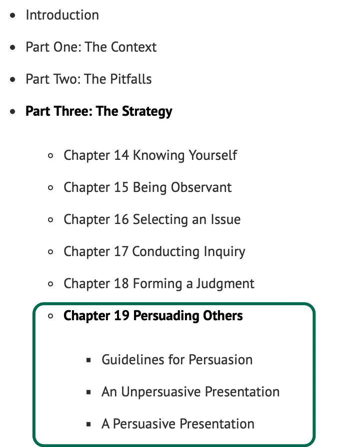
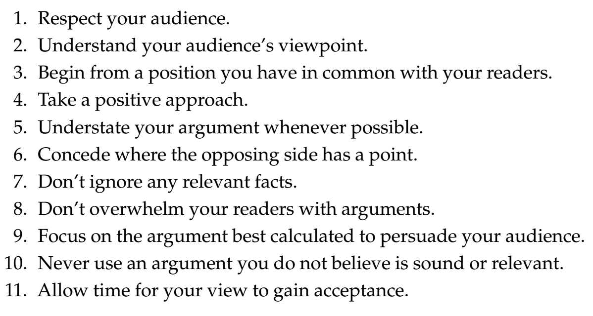
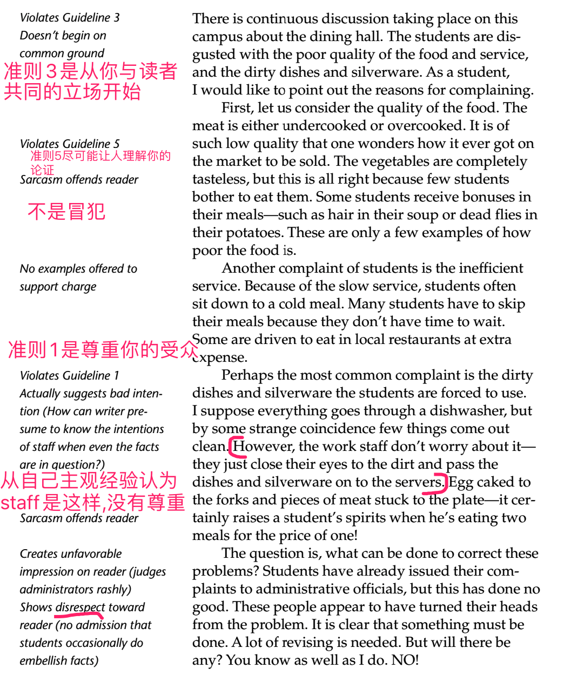
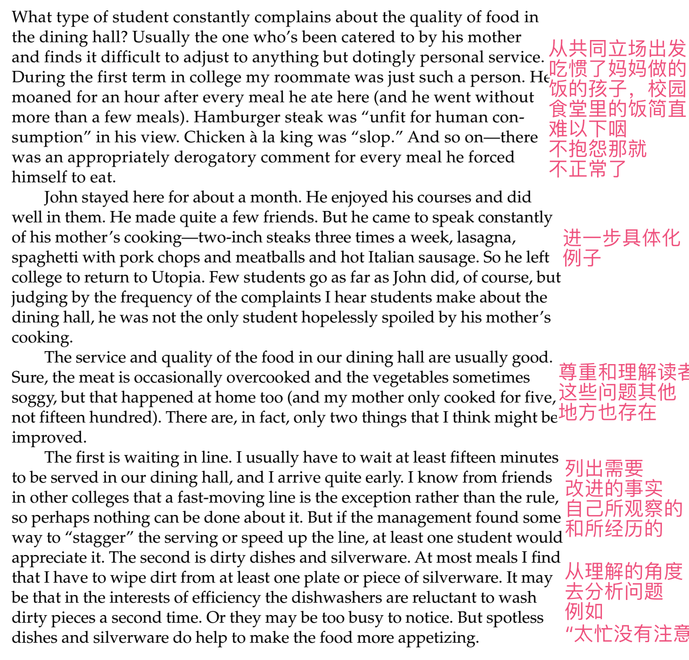

**说在前面**：我星期一到星期五的每天早上我将花差不多2个小时的时间来阅读英文书。边阅读边整理成公众号文章，我不会粘贴所有的原文，但我会将能体现主脉络和核心观点段落整理出来。其实，章节之间没有太多的联系，不用担心前面没有阅读，尽量耐心一点地去阅读文章里粘贴的原文。欢迎任何意见和问题，请底部留言哦！

### 导读
阅读本书的最后一个章节(Persuading others)——说服其他人，总共有三个小节。第一小节主要是讲了说服他人的11个原则， 这不仅帮助我们在表达自己的观点，我想如果用这样的态度和原则去沟通，肯定会创造不一样和双方都享受的对话过程。第二三小节用写投诉信的例子来说明什么样的内容是具有说服力的。

### Chapter 19 Persuading Others
When you read the previous chapter, it might have seemed an appropriate place to conclude the book. That is an understandable impression. 
The thinking process could reasonably be considered complete when a judgment has been made and put into words.
Why, then, has this chapter been included? The simple answer is because **thoughtful judgments deserve to be shared**, and the way they are presented can strongly influence the way others react to them. By learning the principles of persuasion and applying them in your writing (and speaking), you will extend the benefits of your critical thinking beyond the **confines** of your own mind.
当你读上一章时，它可能是一个合适的地方来结束这本书，这是一个可以理解的印象。
当一个判断被做出并用语言表达出来时，这个思考过程可以被合理地认为是完整的。
那么，为什么会包括这一章呢？答案很简单，因为**深思熟虑的判断值得分享**，它们的呈现方式会强烈影响其他人对它们的反应。通过学习说服的原则并将其应用到你的写作（和演讲）中，你将把你的批判性思维的好处扩展到你自己思想的**范围**之外。

*Persuasion* means presenting your view so effectively that people who have no position on the issue will **be inclined to** agree with you and those who disagree with you will **be motivated to** reconsider their own view. This task is more difficult than it may seem. 
Those who are neutral will be open to suggestion, but **only if** you demonstrate the reasonableness of your view. ?Those who disagree with you will **be disposed to** reject your view for the obvious reason that it **disputes** theirs. 
*说服*意味着有效地表达你的观点，以至于在这个问题上没有立场的人会**倾向于**同意你的观点，而不同意你的人会**有动力**重新考虑他们自己的观点，这项任务比看上去更困难。
那些中立的人会接受建议，但**前提**是你证明你的观点是合理的。那些不同意你的人将**倾向于**拒绝你的观点，因为这显然与他们的观点**有矛盾**。

To appreciate how difficult it can be to persuade others, you need only reflect on your own **resistance** to ideas that oppose yours. If you still have trouble giving such ideas a fair hearing even after a semester’s study of critical thinking, it is unreasonable to expect individuals who lack your training to respond more generously.
要理解说服别人是困难的，你只需要想想自己对与你相反的想法的**抵制**就知道有多难。如果你甚至在一个学期的批判性思维学习之后仍然难以公平地听取这些想法，那么期望那些缺乏的训练的人做出更慷慨的回应是不合理的。

### 01 Guidelines for Persuasion
Here are **eleven** guidelines for persuasion. Each is designed to help you overcome a specific challenge. The more faithfully you follow these guidelines, the more effective you will be in demonstrating the merit of your ideas.
这里有**11**条劝说的准则，每一个都是为了帮助你克服特定的挑战。你越遵循这些准则，你就越能有效地证明你的想法的价值。

**GUIDELINE 1. Respect your audience**
**尊重你的听众**
Ask yourself what might **account for** their disagreement with your view. Consider all the factors that can influence a person’s perspective, including age, gender, race, ethnicity, family background, religion, income level, political affiliation, degree of education, and personal experience. If one or more of these could account for the difference in viewpoint, you will have good reason for regarding their disagreement as thoughtful and honest.
问问自己是什么原因导致他们不同意你的观点。考虑所有可能影响个人观点的因素，包括年龄、性别、种族、民族、家庭背景、宗教、收入水平、政治背景、教育程度和个人经历。如果其中一个或多个能够解释观点上的差异，你将有充分的理由认为他们的分歧是深思熟虑和诚实的。

A caution is in order here: Don’t feel you need to state your respect for your audience. Such statements have a way of sounding **insincere**. Work on acting respectfully; if you can accomplish that, there will be no need to state it. It will show
这里有一个警告：不要觉得你需要表达你对听众的尊重，这种说法听起来是**不真诚的**。努力表现出尊重，如果你能做到这一点，就没有必要说出来，它会展现出来的。

**GUIDELINE 2. Understand your audience’s viewpoint **
**理解你的听众的观点**
Many people make the mistake of thinking that knowing their own viewpoint is all that is necessary to be persuasive. “What my readers think about the issue is really irrelevant,” they reason. “All that matters is what I’m going to get them to think.” In addition to being **pompous**, this attitude ignores two crucial points. 
First, people’s views matter very much to them, and when others refuse to acknowledge this fact they feel offended.
Second, we must know where people stand before we can hope to reach them.
许多人错误地认为，只有了解自己的观点才有说服力。他们解释道："我的读者对这个问题的看法真的无关紧要，重要的是我要让他们怎么想”。除了**傲慢**，这种态度忽略了两个关键点。
首先，人们的观点对他们很重要，当其他人拒绝承认这一事实时，他们会感到被冒犯。
第二，我们必须先知道人们的立场，然后才有希望接触到他们。

**GUIDELINE 3. Begin from a position you have in common with your readers**
** 从你与读者的共同立场开始**
Beginning from a position of agreement with your reader is not an arbitrary requirement or a matter of courtesy or good form. It is a simple matter of psychology. If you begin by saying—in effect, if not directly—”Look here, you are wrong, and I’m going to show you,” you push your readers to defensive if not outright hostile reactions. They are likely to read the rest of your paper thinking not of what you are saying but of ways to refute it, concerned with measuring only the weaknesses of your argument. And if they are unreasonable and unbalanced in their reading, the fault will be more yours than theirs.
从与读者达成一致的立场出发，并不是一种武断的要求，也不是一种礼貌或良好的形式。这是一个简单的心理学问题。如果你一开始就直截了当地说“看这里，你错了，我要告诉你，”如果不是完全敌对的反应，你就会迫使你的读者进行防御。他们可能会阅读你论文的其余部分，而不是考虑你在说什么，而是考虑反驳的方法，只考虑衡量你论点的弱点。如果他们在阅读上不讲理、不平衡，那么错误将更多地归咎于你而不是他们。

**GUIDELINE 4. Take a positive approach**
**采取积极的措施**
Keep in mind, however, that the mere perception that you are being negative will make your readers defensive. The solution is not to be so **timid** that you don’t say anything meaningful but to be **sensitive** to your readers’ reactions. 
请记住，仅仅当读者察觉到你是消极的，就会让你的读者感到防御性。解决办法不是**胆小**到什么都不说，而是对读者的反应**敏感**。

 Whenever you can avoid direct **refutation**—that is, whenever you can effectively present and support your own views without direct reference to your reader’s opposing views—do so.
无论何时你可以避免**直接反驳**，也就是说，无论何时你可以有效地表达和支持你自己的观点，而不必直接引用你读者的相反观点。

**GUIDELINE 5. Understate your argument whenever possible**
**尽可能少陈述你的论点**
The sharpest points of disagreement between you and your readers should always be approached most carefully. These points represent the greatest obstacle to persuasion. If you **overstate** your position, you **are bound to** reinforce your readers’ **conviction** about their position rather than **dispose** them to question their conviction.
你和你的读者之间最尖锐的分歧点应该总是被最仔细地对待，这些观点是说服的最大障碍。如果你**夸大**了自己的立场，你**必然会**强化读者对自己立场的**信心**，而不是让他们**质疑**自己的信念。

**GUIDELINE 6. Concede where the opposing side has a point**
**当对方有道理时，让步**
The natural tendency of all of us to value our own position too highly makes it difficult for us to admit that opposing views may also have merit. 
Overcoming this tendency can be accomplished only by remembering that in most controversial issues no one side possesses the total truth. 
If you can approach controversial issues with this thought, you are likely to grasp more of the total truth and to attract reasonable readers to your position.
我们所有人都很自然地把自己的地位看得太高，这使得我们很难承认，对立的观点也可能有其价值。
要克服这种倾向，就必须记住，在大多数有争议的问题上，没有一方拥有全部真理。
如果你能用这种想法来处理有争议的问题，你很可能会掌握更多的全部真相，并吸引合理的读者来你的立场。

Remember that the readers are likely to be no more generous to you than you are to them. Only if you are open and honest in your concessions can you expect them to be so in theirs.
记住，读者对你的慷慨程度可能不会比你对他们的慷慨程度高，只有你的让步是公开和诚实的，你才能指望他们会这样做。

**GUIDELINE 7. Don’t ignore any relevant facts**
**不要忽视任何相关事实**
The purpose of argument is not to defeat others but, through the exchange of views, to **discover the truth** in all its complexity. When that happens, everyone wins. When any part of the truth is hidden, no one wins, even though it may appear that someone does. 
By presenting all the facts, even those that force you to modify your position, you impress your readers with your **objectivity** and **honesty** and invite them to show theirs.
论证的目的不是为了战胜他人，而是通过交换观点，在所有的复杂性中**发现真理**。当这种情况发生时，每个人都会赢。当真相的任何部分被隐藏时，没有人会赢，即使看起来有人会赢。
通过展示所有的事实，甚至那些迫使你改变立场的事实，你用你的**客观和诚实**给读者留下深刻印象，并邀请他们展示自己的立场。

**GUIDELINE 8. Don’t overwhelm your readers with arguments**
**不要用论据压倒你的读者**
Although evidence may “seem **irrefutable**” to you and you may see “no question,” remember that it is wiser to **permit readers to make their own judgment**. And no reader enjoys feeling that agreement with the writer is required in order to be considered a “reasonable person.”
尽管证据对你来说“似乎是**无可辩驳**的”，可能“毫无疑问”的，但请记住，**允许读者做出自己的判断**更为明智。没有一个读者喜欢这样的感觉：为了被认为是一个“通情达理的人”，必须与作者达成一致

**GUIDELINE 9. Focus on the argument best calculated to persuade your audience**
**专注于最有说服力的论点**
Let’s say you are writing a persuasive paper on this issue and you personally believe that the most telling arguments are moral and/or religious but you know your readers would be more impressed with the political and/or practical or the philosophic arguments. Generally speaking, it would be foolish to follow your personal preference—doing so could defeat your purpose in writing.
假设你正在写一篇关于这个问题的有说服力的论文，你个人认为最有说服力的论点是道德和/或宗教的，但你知道你的读者会对政治和/或实践或哲学的论点印象更深刻。一般来说，遵循你的个人喜好是愚蠢的，这样做可能会挫败你写作的目的。

**GUIDELINE 10. Never use an argument you do not believe is sound or relevant**
**不要使用你认为不合理或不相关的论点**
This guideline should be understood as a qualification of the previous one. **Sincerity** and **regard** for the truth are among the most important characteristics of a writer. Without them there is no real persuasion, only clever presentation. 
本指南应理解为前一个指南的限定，**真诚**和**尊重**真理是作家最重要的特征之一，没有真诚和尊重就没有真正的说服力，只有聪明的表达。

**GUIDELINE 11. Allow time for your view to gain acceptance**
**留出时间让你的观点得到接受**
It may be tempting to believe that when you present your view, your readers will immediately abandon their own and embrace yours. That expectation is unrealistic. 
Except in rare cases, the best you should hope for is that they will be moved to **reconsider the issue in light of what you said** and that your insights eventually will cause them to modify their view. The fact that “**eventually**” may turn out to be next week or next year rather than five minutes from now is not necessarily a comment on your skill in persuading others. It may merely reflect the reality that **the bonds people form with their opinions** are not easily broken.
当你提出自己的观点时，你的读者会立刻抛弃自己的观点，拥抱你的观点，这可能是一种诱惑，但这种期望是不现实的。
除了在少数情况下，你最好的希望是他们会根据你所说的**重新考虑这个问题**，你的见解最终会导致他们改变他们的观点。事实上，“**最终**”可能是下周或明年，而不是五分钟后，这并不一定是对你说服他人的技巧的评论。它可能仅仅反映了这样一个现实：**人们与自己的观点形成的联系**并不容易被打破。

 
### 02 An Unpersuasive Presentation
A student chose to write a letter pointing out his complaints about the quality of the campus dining hall food and service. His reader was the dining hall manager, his task to impress the reader with his reasonableness and **dispose** her to reevaluate the performance of her staff.
一位学生选择写一封信，指出他对校园食堂食物和服务质量的抱怨。他的读者是食堂经理，学生的任务是用他的理性给读者留下深刻印象，并让经理重新评估员工的表现。

这封信信中提到经理运营餐厅方法有误，我们都不愿看到和承认自己行动中的错误，这是人性，反而更加强烈去排斥这些想法。经理会想，“我不可能看不到所有这些问题。这个学生一定是个爱抱怨的人”。如果想要说服经理，这封信应该怎么写呢？

#### 03 A Persuasive Presentation
A student skilled in persuasive writing would have **anticipated** all these reactions from his reader and written his letter in this manner:
一个善于说服性写作的学生会**预料到**读者的所有这些反应，并以这种方式写信：

最后再这段话结尾：
Neither improvement would satisfy students who, like John, are spoiled or who enjoy complaining. But they would help to make our dining hall an even better place to eat.
这两种改进都不能满足像约翰一样被宠坏或喜欢抱怨的学生，但是他们会帮助我们把食堂变成一个更好的吃饭的地方。

The difference between these two presentations should be obvious. 
=>The most conscientious, eager-to-please, dining hall manager could not help discounting the first as an exaggerated blast written by a **chronic complainer** or as a release of hostilities by a student angry not only with the dining hall staff but also with his girlfriend, his professors, his parents, and the world. 
=>But any reasonably conscientious dining hall manager could not help but regard the second letter as the work of a reasonable, understanding, mature student. It would make her want to improve the service. In other words, it would be persuasive.
这两种陈述之间的区别应该是显而易见的。
即使是最有责任心的、渴望取悦他人的食堂经理，也会忍不住把第一封信理解为一个**长期抱怨者**写的夸张的愤怒爆发，认为这个学生不仅对餐厅工作人员不满，对他的女朋友、教授、父母和全世界都容易感到愤怒，从而释放了敌意。
但任何一个合理认真的食堂经理都会情不自禁地把第二封信看作是一个合理、理解、成熟的学生的作品，这会使她想改进服务，换句话说，这将是有说服力的。

- - - - - 
全书19个章节，已全部更新完，接下来我会用一篇文章来简单地总结下全书的内容。