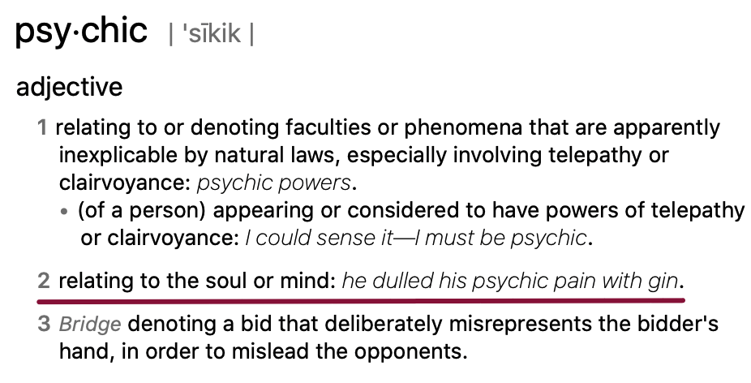

#Chapter 2 The Anatomy of Consciousness
* The Limits of Consciousness 
* **Attention as Psychic Energy **
* Enter the Self 
* Disorder in Consciousness: Psychic Entropy 
* Order in Consciousness: Flow 
* Complexity and the Growth of the Self 

**说在前面**：
第二章第二小节(ATTENTION AS PSYCHIC ENERGY)

Psychic是可以理解为精神上的，这小节的标题可以理解为注意力作为人的精神能源。
我们接收到信息，能够进入到意识和大脑中，需要能源也就是需要注意力，然后我们才能根据记忆库里已有的信息来进行分析和判断。注意力有限，没有它不能工作，用了就会消失。生活的形状和内容取决于注意力的使用方式。

- - - - - 
Information enters consciousness either because we intend to focus attention on it or as a result of attentional habits based on biological or social instructions. 
信息进入意识，要么是因为我们打算把注意力集中在它上面，要么是基于生物或社会指示的注意力习惯的结果。

For instance, driving down the highway, we pass hundreds of cars without actually being aware of them. Their shape and color might register for a fraction of a second, and then they are immediately forgotten. 
例如，在高速公路上行驶时，我们会经过数百辆汽车，而实际上却没有意识到它们，它们的形状和颜色可能会在几秒钟内出现，然后它们就会立即被遗忘。

But occasionally we notice a particular vehicle, perhaps because it is *swerving* unsteadily between lanes, or because it is moving very slowly, or because of its unusual appearance. The image of the unusual car enters the focus of consciousness, and we become aware of it. 
但不时我们会注意到特殊的车辆，可能是因为它在车道之间不稳定地突然变换，或者是因为它移动得很慢，或者是因为它不同寻常的外观。不寻常汽车的形象进入意识的焦点，我们开始意识到它。

In the mind the visual information about the car (e.g., “it is swerving”) gets related to information about other errant cars stored in memory, to determine into which category the present instance fits. Is this an inexperienced driver, a drunken driver, a momentarily distracted but competent driver? As soon as the event is matched to an already known class of events, it is identified. Now it must be evaluated: Is this something to worry about? If the answer is yes, then we must decide on an appropriate course of action: Should we speed up, slow down, change lanes, stop and alert the highway patrol? 
在大脑中，关于汽车的视觉信息(例如，“它在转弯”)与存储在内存中的其他跑题汽车的信息相关，以确定当前实例适合哪个类别。这是一个没有经验的司机，一个醉酒的司机，一个一时心烦意乱但有能力的司机吗？一旦事件与已知的事件类匹配，就会对其进行标识。现在必须对其进行评估：这是值得担心的吗？如果答案是肯定的，那么我们必须决定一个适当的行动方案：我们应该加速、减速、变道、停车并提醒高速公路巡逻队吗？

All these complex mental operations must be completed in a few seconds, sometimes in a fraction of a second. While **forming such a judgment** seems to be a **lightning-fast reaction**, it does take place in real time. And it does not happen automatically: there is a distinct process that makes such reactions possible, a process called **attention**. It is attention that selects the relevant bits of information from the potential millions of bits available. It takes attention to retrieve the appropriate references from memory, to evaluate the event, and then to choose the right thing to do.
所有这些复杂的心理操作都必须在几秒钟内完成，有时只需几秒钟。虽然形成这样的判断似乎是闪电般的快速反应，但它确实是实时发生的，而且它不是自动发生的：有一个独特的过程使这种反应成为可能，这个过程叫做**注意力**。正是注意力从潜在的数百万个可用比特信息中选择相关的信息。它需要注意从内存中检索适当的引用，评估事件，然后选择正确的操作。

Retrieving information from memory storage and bringing it into the **focus of awareness**, **comparing information**, **evaluating**, **deciding**—all make demands on the mind’s limited processing capacity. For example, the driver who notices the swerving car will have to stop talking on his cellular phone if he wants to avoid an accident.
从记忆存储器中提取信息并将其纳入意识、比较信息、评估和决定的焦点，都对大脑有限的处理能力提出了要求。例如，注意到转弯的汽车的司机要想避免事故，就必须停止打手机。

Some people learn to use this priceless resource efficiently, while others waste it. **The mark of a person who is in control of consciousness is the ability to focus attention at will**, to be oblivious to distractions, to concentrate for as long as it takes to achieve a goal, and not longer. And the person who can do this usually enjoys the normal course of everyday life.
有些人学会了有效地利用这种无价的资源，而另一些人却在浪费它。控制意识的人的标志是能够根据意愿来集中注意力，不受干扰，专心致志的达成目标，而能做到这一点的人通常会享受日常生活的正常过程。

Two very different individuals come to mind to illustrate how attention can be used to order consciousness in the service of one’s goals. 
两个完全不同的人出现在了我脑海中，来说明如何利用注意力来命令意识为自己的目标服务。

### 01 E
The first is E., a European woman who is one of the best-known and powerful women in her country. A scholar of international reputation, she has at the same time built up a thriving business that employs hundreds of people and has been on the cutting edge of its field for a generation. 
第一位是E，一位欧洲女性，她是该国最著名和最有权势的女性之一。作为一位享有国际声誉的学者，她同时也建立了一个欣欣向荣的企业，拥有数百名员工，并在这一领域领先了一代人。

E. travels constantly to political, business, and professional meetings, moving among her several residences around the world. If there is a concert in the town where she is staying, E. will probably be in the audience; at the first free moment she will be at the museum or library. And while she is in a meeting, her chauffeur, instead of just standing around and waiting, will be expected to visit the local art gallery or museum; for on the way home, his employer will want to discuss what he thought of its paintings.
E她经常出差，参加政治、商业和工作会议，在世界各地的几处住所中活动。如果她住的镇上有音乐会，E可能会在观众席上；在第一个空闲时间，她会在博物馆或图书馆。当她在开会时，她的司机，而不是仅仅站在她的周围等待，他将被期待去参观当地的美术馆或博物馆，因为在E回家的路上，E会跟他司机讨论对博物馆里绘画的看法。

Not one minute of E.’s life is wasted. Usually she is writing, solving problems, reading one of the five newspapers or the earmarked sections of books on her daily schedule—or just asking questions, watching curiously what is going on, and planning her next task. **Very little of her time is spent on the routine functions of life**. Chatting or socializing out of mere politeness is done graciously, but avoided whenever possible. 
一分钟也没浪费，通常，E会写作、解决问题、阅读五份报纸中的一份或是日常日程中指定的书籍，或者只是问问题、好奇地观察正在发生的事情，并计划下一个任务。她的时间很少花在日常生活上。出于礼貌的聊天或社交是礼貌的，但尽可能避免。

Each day, however, she *devotes* some time to recharging her mind, by such simple means as standing still for fifteen minutes on the lakeshore, facing the sun with eyes closed. Or she may take her hounds for a walk in the meadows on the hill outside town. 
然而，每天她都会花一些时间来重新充电，方法很简单，就是在湖边静静地站上15分钟，闭上眼睛面对太阳。或者她可以带着她的猎犬在城外山上的草地上散步。

E.’s life has not been easy. Her family became *impoverished* after World War I, and she herself lost everything, including her freedom, during World War II. Several decades ago she had a chronic disease her doctors were sure was fatal. But she recovered everything, including her health, by disciplining her attention and refusing to diffuse it on unproductive thoughts or activities. At this point she seems to relish thoroughly every minute of it.
但E她的生活并不轻松，她的家庭在第一次世界大战后变得*贫穷*，她自己在第二次世界大战期间失去了一切，包括她的自由。几十年前她得了一种慢性病，她的医生说是致命的，但她通过训练自己的注意力，拒绝把注意力分散在没有产出的思想或活动上，恢复了一切，包括她的健康。在这一点上，她似乎对生活的每一分钟都很享受。

### 02 R 
The second person who comes to mind is in many ways the opposite of E., the only similarity being the same unbending sharpness of attention. 
第二个想到的人在很多方面与E相反，唯一的相似之处是相同的注意力集中度。

R. is a slight, at first sight unprepossessing man. Shy, modest to the point of self-effacement, he would be easy to forget immediately after a short meeting. Although he is known to only a few, his reputation among them is very great. He is master of an arcane branch of scholarship, and at the same time the author of exquisite verse translated into many languages. 
R是一个毫不掩饰的人，乍一看不起眼的一个人。害羞，谦虚到自卑的地步，他很容易在一次短暂的会面后立即被忘记。虽然他只为少数人所知，但在他们中间他的名声是很好的。他是一个神秘的学术分支的大师，同时也是翻译成多种语言的优美诗句的作者。

Every time one speaks to him, the image of a *deep well* full of energy comes to mind. As he talks, his eyes take in everything; every sentence he hears is analyzed three or four different ways even before the speaker has finished saying it. Things that most people take for granted puzzle him; and until he figures them out in an original yet perfectly appropriate way, he will not let them be.
每当有人对他说话，脑海里就会浮现出一口充满能量的*深井*。当他说话的时候，他的眼睛观察这一切；他听到的每一句话，甚至在说话人说完之前，都会以三到四种不同的方式进行分析。大多数人认为理所当然的事情使他困惑不解；除非他用一种新颖而又完全恰当的方式把它们弄明白，否则他不会让它们成为现实。

Yet despite this constant effort of focused intelligence, R. gives the impression of restfulness, of calm serenity. He always seems aware of the tiniest ripples of activity in his surroundings. But R. does not notice things in order to change them or judge them. He is content to register reality, to understand, and then, perhaps, to express his understanding. R. is not going to make the immediate impact on society that E. has. But his consciousness is just as ordered and complex; his attention is stretched as far as it can go, interacting with the world around him. And like E., he seems to enjoy his life intensely.
尽管一直致力于集中精力，但R.给人的印象是平静，镇定安宁。他似乎总是意识到周围环境中最细微的细节。但是R并不会为了改变他人或环境或下判断而去留心一些事物。他乐于记录现实、理解，然后或许表达自己的理解。 R不会像E那样对社会做出一些影响，但是他的意识既有序又复杂的，他的注意力一直延伸到与周围的世界互动。和E.一样，他似乎非常享受生活。

Each person allocates his or her limited attention either by focusing it intentionally like a beam of energy—as do E. and R. in the previous examples—or by diffusing it in desultory, random movements. 
每个人都可以通过像能量束一样有意识地集中精力(如前面的示例中的E和R)，要么以杂乱无章的、随机的动作分散注意力。

**The shape and content of life depend on how attention has been used**. 
生活的形状和内容取决于注意力的使用方式。

Entirely different realities will emerge depending on how it is invested. 
根据注意力的投资方式的不同，将出现完全不同的现实。

The names we use to describe personality traits—such as extrovert, high achiever, or *paranoid*—refer to the specific patterns people have used to structure their attention.
我们用来描述性格特征的名字，如外向型、高成就型或*偏执型*，是指人们用来构建注意力的特定模式。

 At the same party, the extrovert will seek out and enjoy interactions with others, the high achiever will look for useful business contacts, and the paranoid will be on guard for signs of danger he must avoid. 
在同一个聚会上，外向者会寻找并享受与他人的互动，成功者会寻找有用的商业联系，偏执者会警惕他必须避免的危险迹象。

Attention can be invested in innumerable ways, ways that can make life either rich or miserable.
注意力可以通过无数种方式来投入，这些方式可以使生活变得富有或悲惨。

Because attention determines what will or will not appear in consciousness, and because it is also required to make any other mental events—such as remembering, thinking, feeling, and making decisions—happen there, it is useful to think of it as psychic energy. 
因为注意力决定了什么会在意识中出现，什么不会在意识中出现，并且因为它也需要使任何其他的心理活动，如记忆、思考、感觉和决定，都发生在意识中，所以把注意力看作是精神能量是有用的。

**Attention is like energy in that without it no work can be done, and in doing work it is dissipated**. We create ourselves by how we invest this energy. Memories, thoughts, and feelings are all shaped by how we use it. And it is an energy under our control, to do with as we please; hence, attention is our most important tool in the task of improving the quality of experience.
注意力就像能量一样，没有它就没有工作可以做，而工作时，注意力就会消散。我们通过怎么投入这些能量来创造自己。记忆、思想和感情都是由我们如何使用它塑造的。它是我们控制下的一种能量，我们可以随心所欲地去做；因此，注意力是我们提高经验质量任务中最重要的工具。

