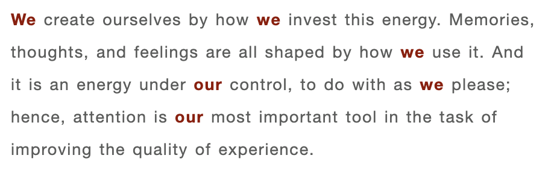
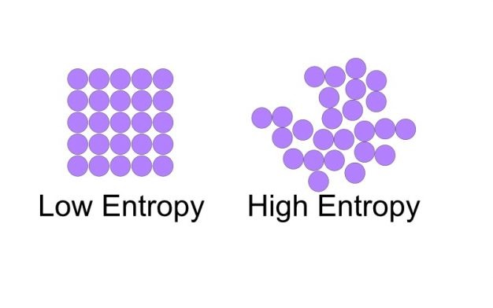

#Chapter 2 The Anatomy of Consciousness
* The Limits of Consciousness 
* Attention as Psychic Energy 
* **Enter the Self **
* **Disorder in Consciousness: Psychic Entropy**
* Order in Consciousness: Flow 
* Complexity and the Growth of the Self 

**说在前面**：
继续阅读第二章的第三和四小节。
Enter the self, 进入自我。 他人眼中的我，我自己眼中的我，有着本质的区别。
对the self和新名词心理熵的理解

But what do those first-person pronouns refer to in the lines above, those we s and our s that are supposed to control attention? Where is the I, the entity that decides what to do with the psychic energy generated by the nervous system? Where does the captain of the ship, the master of the soul, reside?
但是上面几行中的第一人称代词指的是什么，难道那些"we"和"our"应该用来控制注意力？"I"(我)去哪里呢？，决定如何利用神经系统产生的精神能量的实体去哪里呢？船长，灵魂的主人，你在哪里？

As soon as we consider these questions for even a short while, we realize that the I, or the self as we shall refer to it from now on, is also one of the contents of consciousness. It is one that never *strays* very far from the focus of attention. Of course my own self exists *solely* in my own consciousness; in that of others who know me there will be versions of it, most of them probably unrecognizable likenesses of the “original”—myself as I see me.
只要我们思考这些问题一小会儿，我们就会意识到，从现在起我们所指的我，或自我，也是意识的内容之一。这是永远不会*偏离*焦点的。当然，我的自我*只*存在于我自己的意识中；其他人看待我，会有"我"的其他版本，其中大部分版本可能跟"原生态"(我自己看待"我"的自我)有着无法识别的相似之处。

The self is no ordinary piece of information, however. In fact, it contains everything else that has passed through consciousness: all the memories, actions, desires, pleasures, and pains are included in it. And more than anything else, the self represents the hierarchy of goals that we have built up, bit by bit, over the years. 
然而，意识中的「自我」并不是普通的信息。事实上，它包含了所有通过意识的其他东西：所有的记忆、行为、欲望、快乐和痛苦都包含在其中。更重要的是，自我代表了我们多年来一点一点建立起来的目标层次。

At any given time, we are usually aware of only a tiny part of it, as when we become conscious of how we look, of what impression we are making, or of what we really would like to do if we could.
在任何时候，我们通常只意识到「自我」中的一小部分，比如当我们意识到自己的长相，意识到自己给人的印象，如果可能的话，意识到我们真正想做什么。

 We most often associate our self with our body, though sometimes we extend its boundaries to identify it with a car, house, or family. Yet however much we are aware of it, the self is in many ways the most important element of consciousness, for it represents symbolically all of consciousness’s other contents, as well as the pattern of their interrelations.
我们经常把「自我」与身体联系在一起，尽管有时我们会扩展自我的界限，把它与汽车、房子或家庭联系在一起。然而无论我们意识到多少，自我在许多方面上是意识的最重要的元素，因为它象征性地代表了意识的所有其他内容，以及它们之间相互关系的模式。

The patient reader who has followed the argument so far might detect at this point a faint trace of circularity. If attention, or psychic energy, is directed by the self, and if the self is the sum of the contents of consciousness and the structure of its goals, and if the contents of consciousness and the goals are the result of different ways of investing attention, then we have a system that is going round and round, with no clear causes or effects. 
到目前为止，一直关注这一论点的有耐心的读者可能会发现一个微弱的循环痕迹。如果注意力或精神能量是由自我引导的，如果自我是意识内容和目标结构的总和，如果意识内容和目标是不同的注意力投入方式的结果，那么我们就有一个周而复始的系统，没有明确的因果关系。

At one point we are saying that **the self directs attention, at another, that attention determines the self**. In fact, both these statements are true: consciousness is not a strictly linear system, but one in which circular causality obtains. Attention shapes the self, and is in turn shaped by it.
在某一点上，我们说的是自我引导注意力，在另一点上，注意力决定自我。事实上，这两种说法都是正确的：意识不是一个严格的线性系统，而是一个循环因果关系的系统。注意力塑造自我，并反过来被它塑造。

At this point, almost all the components needed to understand how consciousness can be controlled are in place. We have seen that experience depends on the way we invest psychic energy—on the structure of attention. This, *in turn*, is related to goals and intentions. 
在这一点上，几乎所有理解意识如何被控制所需的成分都已就位。我们已经看到，经验取决于我们将精神能量投入——注意力，这*反过来*又与目标和意图有关。

These processes are connected to each other by the self, or the dynamic mental representation we have of the entire system of our goals. These are the pieces that must be *maneuvered* if we wish to improve things. 
这些过程通过自我相互连接，或者说是通过我们对整个目标系统的动态心理表征相互连接。如果我们想改进的话，这些都是我们必须*处理*的部分。

Of course, existence can also be improved by outside events, like winning a million dollars in the lottery, marrying the right man or woman, or helping to change an unjust social system. But even these *marvelous* events must take their place in consciousness, and be connected in positive ways to our self, before they can affect the quality of life.
当然，也可以通过外部事件来改善存在，比如赢得彩票中的一百万美元，娶合适的男人或女人，或者帮助改变一个不公平的社会体系。但即使是这些*奇妙的*事件也必须在意识中发生，并以积极的方式与我们自身联系起来，才能影响生活质量。

The structure of consciousness is beginning to emerge, but so far we have a rather static picture, one that has *sketched* out the various elements, but not the processes through which they interact. interact. We need now consider what follows whenever attention brings a new bit of information into awareness. Only then will we be ready to get a *thorough* sense of how experience can be controlled, and hence changed for the better.
意识的结构开始呈现，但到目前为止，我们有一个相当静态的画面，它*勾勒*出各种元素，但还没有互动起来。互动，我们现在需要考虑的是，当注意力将新的信息带入意识时，接下来会发生什么。只有到那时，我们才准备对如何控制经验有一个*透彻的*认识，从而使经验变得更好。

### DISORDER IN CONSCIOUSNESS: PSYCHIC ENTROPY 
意识中的紊乱：心理熵

One of the main forces that affects consciousness *adversely* is **psychic disorder**—that is, information that conflicts with existing intentions, or distracts us from carrying them out. We give this condition many names, depending on how we experience it: pain, fear, rage, anxiety, or jealousy. 
影响意识的主要因素之一是**精神紊乱**，即与现有意图冲突的信息，或分散我们不执行它们的信息。我们给予这种状态很多名字，取决于我们如何体验：痛苦、恐惧、愤怒、焦虑或嫉妒。

All these varieties of disorder force attention to be diverted to undesirable objects, leaving us no longer free to use it according to our preferences. **Psychic energy becomes unwieldy and ineffective**.
所有这些混乱的种类迫使注意力转移到不受欢迎的物体上，让我们不再根据自己的喜好自由地使用它。精神能量变得*笨拙*和*无效*。

The basic pattern is always the same: some information that conflicts with an individual’s goals appears in consciousness. Depending on how central that goal is to the self and on how severe the threat to it is, some amount of attention will have to be mobilized to eliminate the danger, leaving less attention free to deal with other matters. 
基本模式始终相同：某些与我们个人目标冲突的信息会出现在意识中，取决于目标对自我的重要性和对自我的威胁的严重程度，我们必须调动一定的注意力以消除危险，而将较少的注意力转移到其他事情上。

Whenever information disrupts consciousness by threatening its goals we have a condition of inner disorder, or psychic entropy, a disorganization of the self that impairs its effectiveness. 
Prolonged experiences of this kind can weaken the self to the point that it is no longer able to invest attention and pursue its goals.
每当信息通过威胁个人目标而扰乱意识时，我们就有一种内在紊乱的状态，或者说是心理熵，即削弱其有效性的自我紊乱。长时间的这种经历会削弱自我，使自我无法再投入注意力并追求目标。 

The outside event appears in consciousness purely as information, without necessarily having a positive or negative value attached to it. It is the self that interprets that raw information in the context of its own interests, and determines whether it is harmful or not. 
外部事件在意识中纯粹作为信息出现，而不一定具有正面或负面的价值。正是自我从自身利益的角度来解释原始信息，并决定它是否有害。

Every piece of information we process gets evaluated for its bearing on the self. Does it threaten our goals, does it support them, or is it neutral? News of the fall of the stock market will upset the banker, but it might reinforce the sense of self of the political activist. A new piece of information will either create disorder in consciousness, by getting us all worked up to face the threat, or it will reinforce our goals, thereby freeing up psychic energy.
我们处理的每一条信息都会被评估其对自我的影响。它是威胁我们的目标，还是支持我们的目标，还是中立？股市下跌的消息会让银行家感到不安，但这可能会增强政治活动家的自我意识。一条新的信息要么会在意识上制造混乱，让我们都努力去面对威胁，要么会强化我们的目标，从而释放精神能量。

