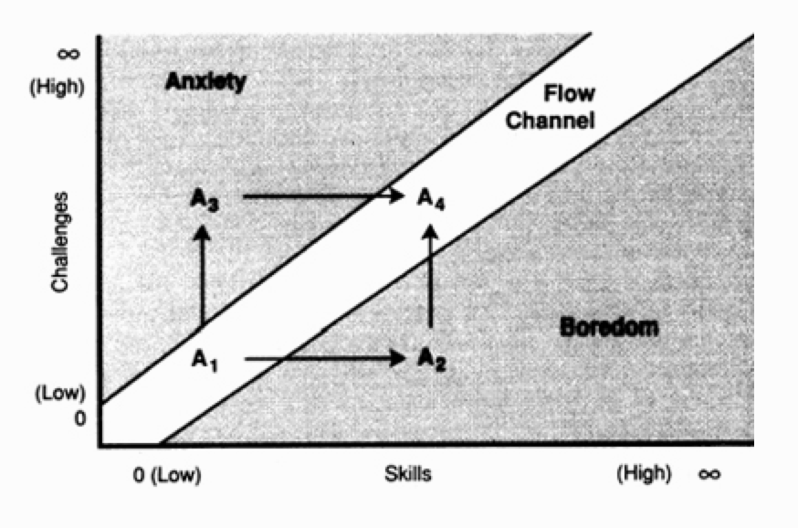

### Chapter 4 The conditions of flow
* **Flow activities**  
* Flow and culture
* The autotelic personality
* The people of flow

**说在前面**：
第一小节——Flow activities，心流活动。 这一节主要回答了这几个问题，心流活动的特征是什么？与日常生活不同的心流活动大体分几类？为什么意识的复杂性因心流活动增加而增加？

**01**
When describing optimal experience in this book, we have given as examples such activities as making music, rock climbing, dancing, sailing, chess, and so forth. What makes these activities *conducive* to flow is that they were designed to make optimal experience easier to achieve. 
当在本书中描述最佳体验时，我们举了一些例子，如制作音乐、攀岩、跳舞、航海、下棋等等。使这些活动有利于心流体验的是，它们的设计使最佳体验更容易实现。

They have rules that require the learning of skills, they set up goals, they provide feedback, they make control possible. They *facilitate* concentration and involvement by making the activity as distinct as possible from the so-called “paramount reality” of everyday existence. 
它们有需要学习技能的规则、设定目标、提供反馈、使控制成为可能，它们通过使这些活动尽可能不同于所谓的“最重要的现实"的日常生活来*促进*专注和参与。

For example, in each sport participants dress up in eye-catching uniforms and enter special enclaves that set them apart temporarily from ordinary mortals. For the duration of the event, players and spectators cease to act in terms of common sense, and concentrate instead on the peculiar reality of the game.
例如，在每一项运动中，参与者都穿着引人注目的制服，进入特殊的飞地，使他们暂时与普通人分开。在比赛期间，运动员和观众不再按照常识行事，而是专注于比赛的特殊现实。

**02**
Such flow activities have as their primary function the provision of enjoyable experiences. Play, art, pageantry, ritual, and sports are some examples. Because of the way they are constructed, they help participants and spectators achieve an ordered state of mind that is highly enjoyable.
这种心流活动的主要功能是提供愉快的体验。游戏、艺术、庆典、仪式和运动都是一些例子。由于它们的构造方式，它们帮助参与者和观众达到一种非常愉快的有序的精神状态。

**03**
Roger Caillois, the French psychological anthropologist, has divided the world’s games (using that word in its broadest sense to include every form of pleasurable activity) into four broad classes, depending on the kind of experiences they provide. **Agon** includes games that have competition as their main feature, such as most sports and athletic events; **alea** is the class that includes all games of chance, from dice to bingo; **ilinx, or vertigo**, is the name he gives to activities that alter consciousness by scrambling ordinary perception, such as riding a merry-go-round or skydiving; and **mimicry** is the group of activities in which alternative realities are created, such as dance, theater, and the arts in general.
法国心理人类学家罗杰·凯略斯（Roger Caillois）根据游戏提供的体验类型，将世界游戏（用最广义的词来包括各种形式的愉悦活动）分为四大类。**Agon**包括以竞争为主要特征的游戏，如大多数体育和运动项目；**alea**是包含所有机会(概率)游戏的类，从骰子到宾果游戏；**ilix**或**vertigo**是他给通过扰乱普通感知来改变意识的活动命名，如骑旋转木马或跳伞；而模仿是一组活动，在这些活动中可以创造出不同的现实，如舞蹈、戏剧和一般艺术。

**04**
Using this scheme, it can be said that games offer opportunities to go beyond the boundaries of ordinary experience in four different ways. 
使用这个框架，可以说游戏提供了四种不同方式超越普通体验的机会。

*第一类游戏——agonistic games*
In agonistic games, the participant must *stretch* her skills to meet the challenge provided by the skills of the opponents. The roots of the word “**compete**” are the Latin *con petire*, which meant “**to seek together**.” What each person seeks is to actualize her potential, and this task is made easier when others force us to do our best. 
在竞技游戏中，参与者必须*充分发挥*自己的技能，以应对对手的技能所带来的挑战。“竞争”这个词的词根是拉丁语的con-petire，意思是“一起寻找”。每个人所寻求的是实现自己的潜能，当别人强迫我们尽力而为时，这项任务就变得更容易了。

Of course, competition improves experience only as long as attention is focused primarily on the activity itself. If extrinsic goals—such as beating the opponent, wanting to impress an audience, or obtaining a big professional contract—are what one is concerned about, then competition is likely to become a distraction, rather than an incentive to focus consciousness on what is happening.
当然，只有当注意力主要集中在活动本身时，竞争才能改善体验。如果一个人所关心的是外在的目标，比如击败对手、想给观众留下深刻印象、或者获得一份大的专业合同，那么竞争很可能会成为一种干扰，而不是一种激励，让人们把意识集中在正在发生的事上。

**05**
*第二类游戏——aleatory games*
Aleatory games are enjoyable because they give the illusion of controlling the inscrutable future. 
休闲游戏是令人愉快的，因为它们给人一种控制不可预知未来的错觉。

The Chinese interpreted the pattern in which sticks fell, and the Ashanti of East Africa read the future in the way their sacrificed chickens died. *Divination* is a universal feature of culture, an attempt to break out of the constraints of the present and get a glimpse of what is going to happen. 
中国人解释棍子掉落的模式，东非的阿散蒂人用牺牲的鸡的死亡方式解读未来，*占卜*是文化的一个普遍特征，是试图突破当下的束缚，窥见未来。

Games of chance draw on the same need. The sticks of the I Ching become playing cards, and the ritual of divination becomes gambling—a secular activity in which people try to *outsmart* each other or try to *outguess* fate.
机会游戏有着同样的目的，易经的棍子变成扑克牌，占卜仪式变成赌博——一种世俗的活动，人们试图*超越*其他人或*试图*超越命运。

**06**
*第三类游戏——vertigo games*
Vertigo is the most direct way to alter consciousness. Small children love to turn around in circles until they are dizzy; the whirling dervishes in the Middle East go into states of ecstasy through the same means. Any activity that transforms the way we perceive reality is enjoyable, a fact that accounts for the attraction of “consciousness-expanding” drugs of all sorts, from magic mushrooms to alcohol to the current Pandora’s box of hallucinogenic chemicals. 
Vertigo类游戏是改变意识最直接的方式。小孩子喜欢绕圈子转，直到头晕为止；中东旋转的苦行僧也通过同样的方式进入狂喜状态。任何改变我们感知现实方式的活动都是令人愉快的，这一事实解释了各种“扩大意识”药物的吸引力，从神奇的蘑菇到酒精，再到目前潘多拉的迷幻药盒。

But consciousness cannot be expanded; all we can do is shuffle its content, which gives us the impression of having broadened it somehow. The price of most artificially induced alterations, however, is that we lose control over that very consciousness we were supposed to expand.
但是意识是不能被扩展的，我们所能做的就是改变意识的内容，这给我们在以某种方式扩展意识的印象。然而，人为地引起的改变的代价是，我们失去了对我们本应扩展的意识的控制。

**07**
*第四类游戏——mimicry*
Mimicry makes us feel as though we are more than what we actually are through fantasy, pretense, and disguise. 
模仿让我们觉得通过幻想、伪装和伪装后的自己比实际生活中的我们更好。 

Our ancestors, as they danced wearing the masks of their gods, felt a sense of powerful identification with the forces that ruled the universe. 
当我们的祖先戴着他们的神的面具跳舞时，他们感受到了一种与统治宇宙的力量的强烈认同感。

The little girl playing with her doll and her brother pretending to be a cowboy also stretch the limits of their ordinary experience, so that they become, temporarily, someone different  and more powerful—as well as learn the gender-typed adult roles of their society.
玩弄洋娃娃的小女孩和她假装是牛仔的哥哥也拓展了她们平常经历的局限性，使她们暂时成为一个不同的、更强大的人，并学习他们社会中性别类型的成人角色。

**08**
In our studies, we found that every flow activity, whether it involved competition, chance, or any other dimension of experience, had this in common: It provided a sense of discovery, a creative feeling of transporting the person into a new reality. It pushed the person to higher levels of performance, and led to previously *undreamed-of* states of consciousness. 
在我们的研究中，我们发现每一个心流活动，无论是竞争、机会，还是任何其他方面的经验，都有一个共同点：它提供了一种发现的感觉，一种将人带入新现实的创造性的感觉，它将人推到更高的表现水平，并到达了先前无法想象的意识状态。

In short, it transformed the self by making it more complex. In this growth of the self lies the key to flow activities.
简而言之，它通过变得更加复杂而改变了自我， 自我的成长是心流活动的关键。

**09**
**Why the complexity of consciousness increases as a result of flow experiences?**
为什么意识的复杂性因心流活动增加而增加？

A simple diagram might help explain why this should be the case. Let us assume that the figure below represents a specific activity—for example, the game of tennis. The two theoretically most important dimensions of the experience, *challenges* and *skills*, are represented on the two axes of the diagram.
一个简单的图表可能有助于解释为什么会出现这种情况。让我们假设下图代表一种特定的活动，例如打网球。理论上最重要的两个经验维度，*挑战*和*技能*，在图表的两个轴上表示。

The letter A represents Alex, a boy who is learning to play tennis. The diagram shows Alex at four different points in time. 
字母A代表Alex，一个正在学打网球的男孩，图表显示亚历克斯在四个不同的时间点。

**10**
When he first starts playing (A1), Alex has practically no skills, and the only challenge he faces is hitting the ball over the net. This is not a very difficult feat, but Alex is likely to enjoy it because the difficulty is just right for his *rudimentary* skills. So at this point he will probably be in flow. 
当他第一次开始打球（A1）时，Alex几乎没有任何技术，他面临的唯一挑战就是把球打过网。这不是一个非常困难的壮举，但Alex很可能会喜欢，因为这个困难正好适合他的“基本”技能。所以在这一点上，他可能是在流动。

After a while, if he keeps practicing, his skills are bound to improve, and then he will grow bored just batting the ball over the net (A2). Or it might happen that he meets a more practiced opponent, in which case he will realize that there are much harder challenges for him than just lobbing the ball—at that point, he will feel some anxiety (A3) concerning his poor performance.
过一段时间，如果他继续练习，他的技术一定会提高，然后他只是击球过网，会变得无聊（A2）。或者他遇到了一个更有经验的对手，在这种情况下，他会意识到，对他来说，挑战远比在那一点上投球难，他会对自己糟糕的表现感到焦虑（A3）。

**11**
Neither boredom nor anxiety are positive experiences, so Alex will be motivated to return to the flow state. How is he to do it? Glancing again at the diagram, we see that if he is bored (A2) and wishes to be in flow again, Alex has essentially only one choice: to increase the challenges he is facing. (He also has a second choice, which is to give up tennis altogether—in which case A would simply disappear from the diagram.) By setting himself a new and more difficult goal that matches his skills—for instance, to beat an opponent just a little more advanced than he is—Alex would be back in flow (A4).
无聊和焦虑都不是积极的体验，所以Alex会有动力回到心流状态。他怎么做？再看一眼图表，我们发现如果他感到无聊（A2）并希望再次流动，亚历克斯基本上只有一个选择：增加他所面临的挑战。（他还有第二个选择，那就是完全放弃网球，在这种情况下，A会从图表中消失。）给自己设定一个新的、更难的进球，与他的技术相匹配，例如，击败一个比他稍微厉害一点的对手，Alex就会恢复正常（A4）。

**12**
If Alex is anxious (A3), the way back to flow requires that he increase his skills. Theoretically he could also reduce the challenges he is facing, and thus return to flow where he started (in A1), but in practice it is difficult to ignore challenges once one is aware that they exist.
如果亚历克斯很焦虑（A3），那么他需要提高自己的技能。理论上，他也可以减少他所面临的挑战，从而回到他开始的地方（在A1），但在实践中，一旦人们意识到挑战的存在，就很难忽视这些挑战。

**13**
The diagram shows that both A1 and A4 represent situations in which Alex is in flow. Although both are equally enjoyable, the two states are quite different in that A4 is a more complex experience than A1. It is more complex because it involves greater challenges, and demands greater skills from the player. 
图表显示，A1和A4都表示Alex处于心流状态的情况。虽然两者都同样令人愉快，但这两种状态是完全不同的，因为A4比A1更复杂。它更复杂，是因为它涉及到更大的挑战，并要求球员更大的技能。

**14**
It is this dynamic feature that explains why flow activities lead to growth and discovery. One cannot enjoy doing the same thing at the same level for long. **We grow either bored or frustrated**; and then the desire to enjoy ourselves again pushes us to stretch our skills, or to discover new opportunities for using them.
正是这个动态特性解释了为什么心流活动会导致成长和发现。一个人不能享受在同一水平上做同样的事情太久。我们要么感到无聊，要么感到沮丧；然后，再次享受自我的欲望驱使我们扩展自己的技能，或者发现使用技能的新机会。

**15**
It is important, however, not to fall into the mechanistic fallacy and expect that, just because a person is objectively involved in a flow activity, she will necessarily have the appropriate experience. 
然而，重要的是，不要陷入机械论的谬误，不要期待仅仅因为一个人客观地参与了一种心流活动，她就一定会有适当的经验。

It is not only the “real” challenges presented by the situation that count, but those that the person is aware of. It is not skills we actually have that determine how we feel, but the ones we think we have. 
重要的不仅仅是形势所带来的“真正”挑战，而是人们意识到的那些挑战。决定我们感受的不是我们实际拥有的技能，而是我们对我们拥有的技能是怎么看的。

How we feel at any given moment of a flow activity is strongly influenced by the objective conditions; but consciousness is still free to follow its own assessment of the case. 
在心流活动的任何特定时刻，我们的感受都受到客观条件的强烈影响；但是意识仍然可以自由地遵循自己对活动的评估。

To many people activities like working or raising children provide more flow than playing a game or painting a picture, because these individuals have learned to perceive opportunities in such mundane tasks that others do not see.
对许多人来说，像工作或抚养孩子这样的活动比玩游戏或画画提供更多的心流，因为这些人学会了在别人看不到的平凡任务中感知机会。

