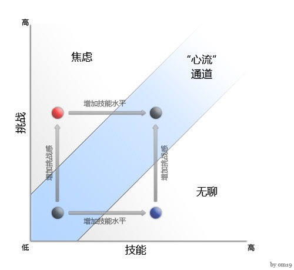

前段时间将《心流》的英文书看完了，总共XXX页，有点啰嗦，一本书真的可能只有20%的核心内容，值得多花时间去吸收的，我稍微随心地整理一下这本书的核心内容。

# 什么是心流
心流是心理学家米哈里·齐克森米哈里 (Mihaly Csikszentmihalyi)在他的著作《心流：最优心理学体验》中提出的。心流一种将个人精神力完全投注在某种活动上的感觉；心流产生时同时会有高度的兴奋及充实感

# 人为什么不开心
我们不开心是因为自然发展过程是随机的，而人类的发展是尝试找出规律让一切看起来井然有序，让一切被解释的通，但我们不知道明天就会发生什么事情来影响这样的秩序，什么新的需求和欲望会产生。

就像这次的疫情不是被设计好的，就这样随机的发生了。还有游戏设计不是为了个人成长而设计的，而是为了绑住你设计的。

幸福不是偶然发生的事情，不是好运或偶然的结果，不是金钱可以买到的东西，也不是权力可以支配的东西。它不取决于外部事件，而是取决于我们如何看待和解释它们。

谁谁说过："如果你被外在的事物所痛苦，那不是它们干扰了你，而是你自己对它们的判断，而你有能力消除这种判断。"

每个人都拥有这样的能力，并且是可以去加强的。 

我们生活中最好的时刻，往往不是被动的、容易接受的、放松的时光。

如果我们可以**充分全心地参与**生活中的每一个细节，无论是好是坏，我们都能体验到开心、幸福和成长。

这个全心参与的过程就是体验**心流**的过程。

# 精神熵
全心地去参与生活中的每一个细节，所谓地全心就是一个人的注意力的投入。

注意力来自哪里？注意力来自意识。

除了注意力，意识还包括自我、记忆、行为、欲望、快乐和痛苦等等。自我引导注意力，而**注意力可以塑造自我**。

生活的形状和内容取决于注意力的使用方式，根据注意力的投入方式的不同，将出现完全不同的现实。

但是人的正常状态下，人的意识状态就是无序的，也就是熵，笼统的说，熵是乱的程度，**精神熵**就是精神紊乱，是指痛苦、恐惧、愤怒、焦虑或嫉妒。

精神熵会迫使注意力转移到不受欢迎的物体上，注意力就变得**笨拙**和**无效**。

人很容易分心，很容易受到外界的蛊惑，是因为我们的意识是没有组织的、无序的、不具有复杂性。只有我们的意识具有复杂性了，但同时是有组织的，有序的，我们才能更加容易专注和自信。

简单地说，人只要有足够的认知，就可以很轻而易举的抵抗分心，做不到就是我们知道的太少了，经历的太少了。

体验心流，需要专注，生活中我们只有增加体验心流的机会，人的意识才会慢慢变得有序和复杂，才能给人带来成长。

# 心流产生的8个要素
首先，这种经历通常发生在我们面对任务时，知道我们**有机会去完成**它。
第二，我们必须能够**集中精力**做我们正在做的事情。
第三和第四，集中注意力通常是可能的，因为所面临的任务有**明确的目标**，并能提供**即时反馈**。
第五，当一个人的行为有着**深度参与感**但又感觉不到费力，这从意识中消除了日常生活中的烦恼和挫折。
第六，愉快的经历让我们对自己的行为有一种**控制感**。
第七，对自我的关注消失了，但自相矛盾的是，自我意识在心流体验结束后变得更强，也就是个人得到了**成长**。
最后，**时间**的持续意义被改变了，小时以分钟为单位流逝，分钟可以延伸成小时。

# 愉悦 vs 享受
书中提到愉悦和享受这两个概念，我觉得值得了解下怎么区分。

当我们想到让生活更美好的经历时，大多数人首先认为幸福在于体验愉悦：好的食物，好的性，金钱能买到的所有舒适。

愉悦是生活质量的重要组成部分，但愉悦本身并不能带来幸福。

睡眠、休息、食物和性提供了自我平衡体验，在身体的需求侵入并导致精神熵发生后，这些体验使意识恢复到正常状态。但它们不会产生心理成长，它们不会增加自我的复杂性。愉悦有助于维持秩序，但它本身不能在意识中创造新的秩序。

享受可以被描绘为：新奇感、成就感。

打一场能充分发挥自己能力、比分非常接近的飞盘比赛是令人享受的，读一本能从新的角度揭示事物的书也是如此，进行一次能让我们表达以前不知道的想法的谈话也是如此。

个人觉得任何需要涉及到创作的事情，都能体验到心流。例如写一篇文章，作一个演讲，制作一道美食，画一幅画，甚至跑个步等等都是一件令人享受的事情。

在这些经历发生的时候，没有一次是特别令人愉悦的。但之后我们回想起来说“那真的很有趣”，并希望它们能再次发生。

在经历了一件令人享受的事情之后，我们知道我们已经改变了，我们的自我也成长了：在某种程度上，我们因此变得更加复杂。

# 影响心流体验的条件

针对某一个活动，这个活动可以从两个维度去理解，一是挑战，二是技能。
如果挑战过高，技能不够，这个活动将会太难，我们会感到焦虑和沮丧。
如果挑战过低，技能足够，这个活动将会没有意思，我们会感到无聊。
但是当挑战和技能匹配时，心流就会产生，并且会导致技能提升，来应对更大的挑战。

希望我们都可以找到那个**心流通道**，将生活越过越美！

**总结如下**：
[人为什么很容易分心？](https://mp.weixin.qq.com/s/3lKgcWhZ0MbEkOgLRyL9rQ)

