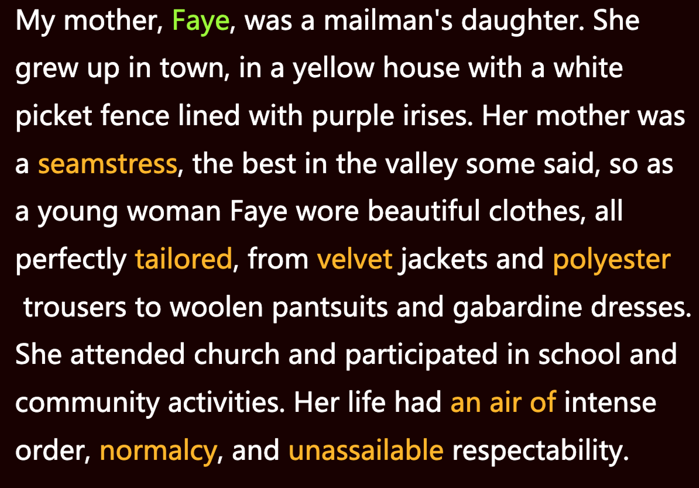
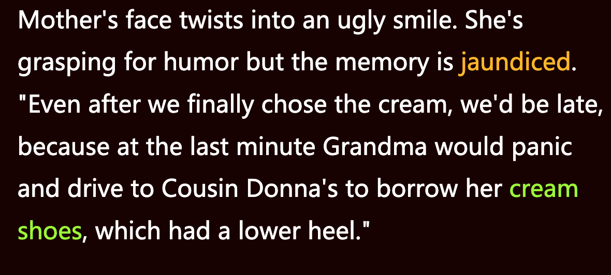
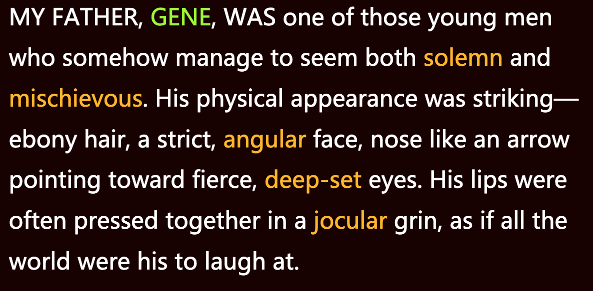
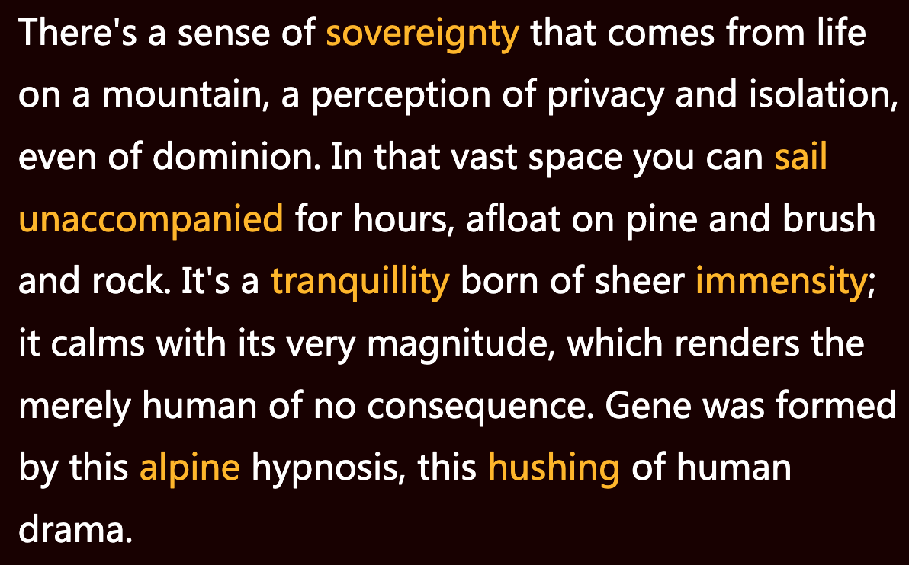
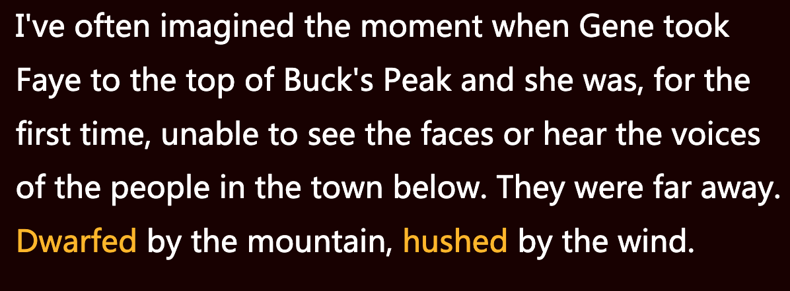
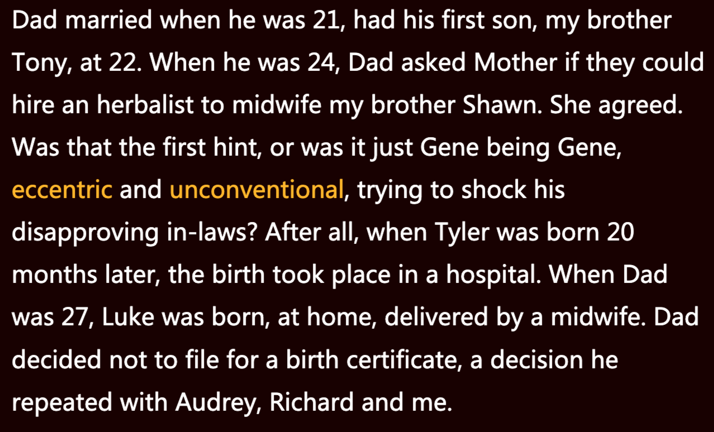
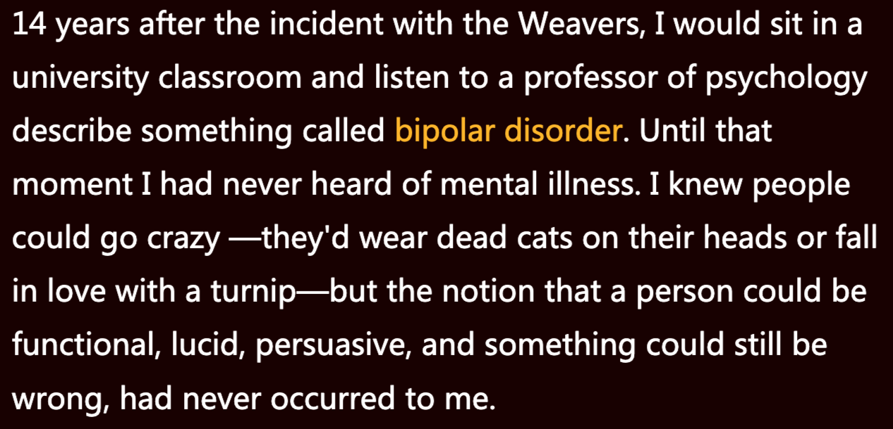
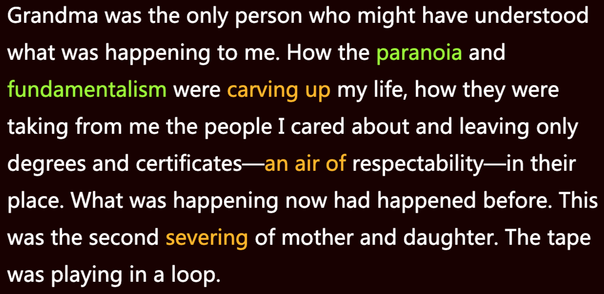

**一、阅读进度**

**二、阅读感受**
第三章 - 奶油色鞋子
主要是讲Tara父母亲的背景。之前两章都是以父亲母亲字样称呼，这章有了名字，父亲是Gene，母亲是Faye。章节名字的由来我想是来自Tara母亲的生长背景，作为镇里最优秀的裁缝外婆，Faye的穿着是各种绫罗绸缎，优雅，外婆会为了Faye去教堂穿什么颜色的鞋子而烦恼，是白色还是奶油色呢？

有区别吗？有的穿就好了，对我的小时候是这样，其实对现在的我也是这样，够穿够用就好，作为被穷养出来的孩子生活比较粗糙，不讲究，可能这也是被穷养和富养出来的其中一个区别吧。

**三、段落摘录**
01
seamstress:  noun 女裁缝
tailor: verb. customize 量身定做
velvet: adj. 天鹅绒的，柔软的
polyester:  noun. 聚酯纤维
an air of:  神气
normalcy:  noun. 正常状态
unassailable: adj. 不可置疑的

我的母亲名叫法耶，是邮递员的女儿。她在城镇里长大，住在一幢黄色的房子里，周围是白色尖桩栅栏，栅栏旁种着一排排紫色鸢尾花。她母亲据说是山谷里最好的裁缝，所以年轻时的法耶总是穿着剪裁完美的漂亮衣服，从天鹅绒夹克到涤纶长裤，从羊毛套装到华达呢裙，应有尽有。她到教堂做礼拜，也参加学校和社区活动。她过着正常有序的体面生活，可谓无懈可击。

02
jaundice: noun 黄胆病(用作动词就不太理解了)

母亲脸上挤出一丝苦笑。她想从记忆中找点儿幽默，寻到的却是偏见。“即便最终选择了奶油色那双，我们也会迟到，因为到最后关头，外婆又会慌作一团，开车到表姐唐娜家去借她那双奶油色鞋子，因为她那双鞋跟低一点。”

03
solemn: adj. 严肃的 
mischievous: adj. 淘气的
angular: adj. 有尖角的 
deep-set:  adj. 深陷的
jocular: adj 风趣的

我父亲吉恩是那种看上去既严肃又调皮的年轻人。他的外表很引人注目——乌黑的头发，棱角分明的脸，鼻子像一枚箭头一样指向凶巴巴的深邃的眼睛。他常常抿着嘴笑，像是在开玩笑，仿佛全世界都是他的笑料似的。

04
sovereignty: (supreme power) 至高无上的权力
dominion: (control)  统治
sail: (move in air) 掠过
unaccompanied: (alone, on one's own) 独自的
tranquillity: (peacefulness, calm) 平静
sheer:  (pure, utter, complete) 十足的 完全的
immensity: (large expanse) 无边无际 
alpine: (relating to high mountains) 高山上的
hush: (quiet down) 使...安静下来

山上的生活给人一种至高无上之感，一种遗世独立，甚至统治之感。在那广阔的空间里，你可以孤身一人几小时畅行无阻，漂浮在松林、灌木和岩石的海洋。那是无边无际的静谧，使人沉静，在它的广袤面前人类显得微不足道。吉恩在这种高山的催眠中长大，一切人类闹剧都仿佛安静下来。

06
dwarf: (make appear small) 使显得矮小

我经常想象吉恩把法耶带到巴克峰顶的那一刻。平生第一次，她看不见下面城镇里人们的面孔，也听不见他们的聒噪。这些都变得遥远。高山令其渺小，山风让其缄默。 

05
eccentric: ( abnormal, irregular, unconventional) 古怪的
unconventional: (out of the ordinary)不因循守旧的

我不知道照片里的那个男人是何时变成我所认识的父亲的。也许没有特定时刻。爸爸二十一岁结婚，二十二岁就有了第一个儿子——我大哥托尼。二十四岁时，他问母亲可否雇个草药师来给哥哥肖恩接生。母亲同意了。难道就是从这件事初现端倪？还是吉恩就是吉恩，脾气古怪、不合常规，故意要让对他不满的岳父母一家大跌眼镜？毕竟二十个月后有了泰勒，但他是在医院出生的。爸爸二十七岁时，卢克在家里出生，由一名助产士接生。爸爸决定不给他申请出生证明，对奥黛丽、理查德和我也坚持如此。

07
bipolar disorder: 双相型障碍
turnip: 萝卜
lucid: (sane, clear-headed) 头脑清晰的

韦弗家事件发生十四年后，我坐在大学教室里，听一位心理学教授描述一种叫作双相情感障碍的疾病。在此之前我从未听说过精神疾病这回事。我知道人会发疯——有人把死猫套在头上，有人爱上了一根萝卜——但我从未想到，一个人功能健全，头脑清晰，令人信服，却仍可能在哪方面有问题。

08
paranoia: (delusions) 偏执狂
fundamentalism: (a form of a religion, especially Islam or Protestant Christianity) 原教旨主义
sever: (cut) 割断

外婆生前可能是唯一一个了解我正在经历什么的人：偏执狂和原教旨主义如何瓜分了我的人生，它们如何把我在乎的人从我身边带走，只留下学位和证书——一种体面的虚空。现在正在发生的以前也曾发生。母女分离再度重演。磁带在循环播放。
