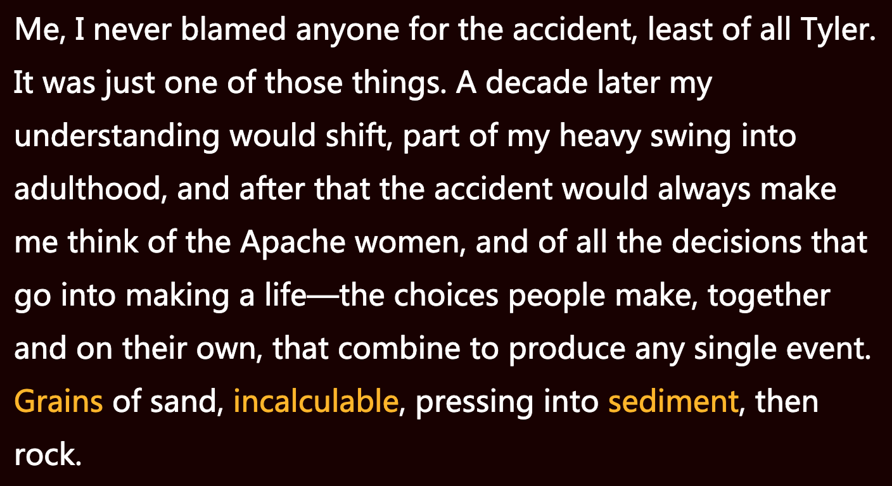

**一、阅读进度**

**二、阅读感受**
第四章：阿帕奇女人
标题来源于在去亚利桑那旅行期间奶奶讲述的一个故事，100多年前阿帕奇部落跟美国骑兵交战的故事。实际上是记录了一家人经历了一个意外车祸，以及这事对家里的每个人之后的命运轨迹的改变。

我们真可以决定自己的命运吗？我觉得并不是。就像作者说的，人们共同或者独自做出的那些决定，聚合起来，制造了人生中的每一桩单独事件。例如有些生命中的重大轨迹由家人或朋友来决定。

**三、段落摘录**
**01**
whore 名词作动词用
stare at 盯着
slam: (shut loudly) 砰的一声关上
incarnation: (embodiment) 体现
sacrilege: (desecration, irreligion) 亵渎

“医生和药片，”爸爸几乎是在吼叫，“成了他们的神，他们像婊子一样蜂拥而上。” 

母亲正盯着食物，一听到“婊子”这个词，她霍地站起身来，生气地瞪了爸爸一眼，走进她房间，砰的一声关上门。对于爸爸的观点，母亲并不总是赞同。爸爸不在的时候，我听见她说一些他——至少是他的新化身——认为是亵渎上帝的话，比如，“草药只是补充，病情严重了还是要去看医生”。

**02**
outnumber: (be more numerous than) 在数量上超过 
ledge: (on mountain, cliff) 岩架
cavalry: (mounted troops) 骑兵
mount: (climb on to) 骑上

据奶奶说，一百年前，一支阿帕奇部落曾在那些褪色的岩石上与美国骑兵交战。部落人数不占优势，战斗以他们的失利而告终。剩下能做的便是等死。战斗开始后不久，勇士们就被困在了一块岩脊上。他们不愿遭受战败的耻辱，在奋力突破骑兵队时被一个个砍死，于是骑上马背冲下了山崖。当阿帕奇的女人们在下面的岩石上找到丈夫们的碎尸时，她们放声痛哭，绝望的眼泪一落到地面，便化作了石头。

**03**
glare: (of lights, sun) 刺眼的强光
windshield: 挡风玻璃
crisscrossing: (a pattern of intersecting straight lines or paths) 纵横交错的
fissure: (opening, crevice, crack) 裂缝
gossamer: (cobwebs; silk,) 蜘蛛网
extrude: (force out, thrust out) 压制
chronicle: (historical account) 编年史
epicenter: (the central point of something, typically a difficult or unpleasant situation) 中心

清晨的阳光照在挡风玻璃上，反射出一道强光。我看见纵横交错的裂缝。这个场景很是熟悉。我在废料场见过上百块破碎的挡风玻璃，每一块都独一无二，从撞击点向外发散的独特的蛛丝网是撞击的记录。我们这块挡风玻璃上的裂缝讲述了它们自己的故事。裂缝正中心是一个向外延伸裂开的小圆圈，圆圈就在副驾驶座正前方。

**04**
power line: 电线

爸爸站在那里，看了看还通着电的电线，再看看地面，又看看母亲。他看上去很是无助。“你觉得——我该不该叫救护车？” 

**05**

没有人再提医院。做这种决定的时刻已经过去了，再谈论这些，就是重温车祸发生后的愤怒和恐惧。爸爸说反正医生也帮不上她什么忙。她的生死掌控在上帝手中。
 
**06**
a grain of sand:  一粒沙
incalculable: 不可计数
sediment: 沉淀物

而我，我从不把那次车祸归咎于任何人，尤其是泰勒。那只是众多事件之一。十年后我的理解会发生转变，我沉重地步入成年，那之后，那次车祸总会令我想起那些阿帕奇女人，想起汇而构成人一生的所有决定——人们共同或者独自做出的那些决定，聚合起来，制造了每一桩单独事件。沙粒不可计数，叠压成沉积物，然后成为岩石。
