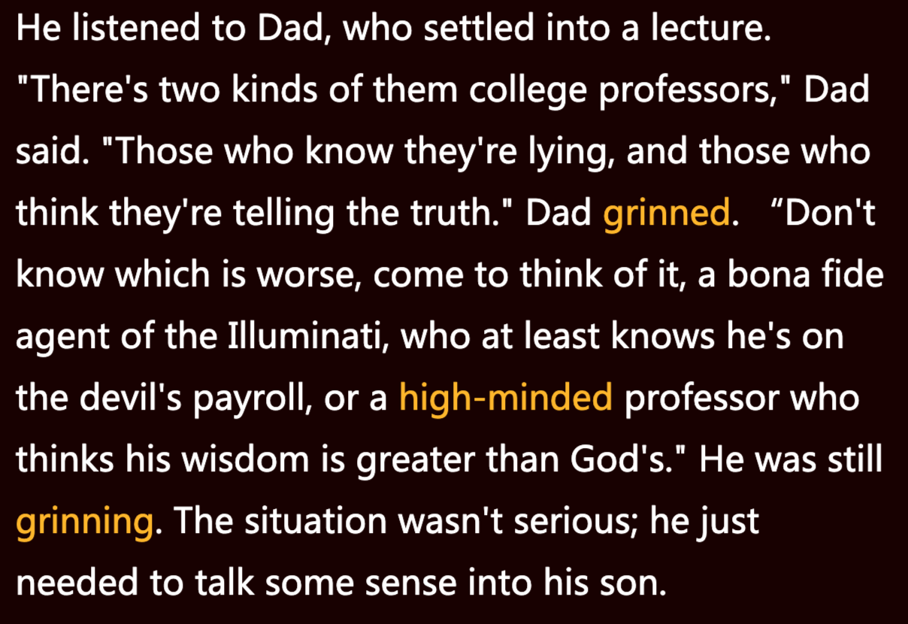
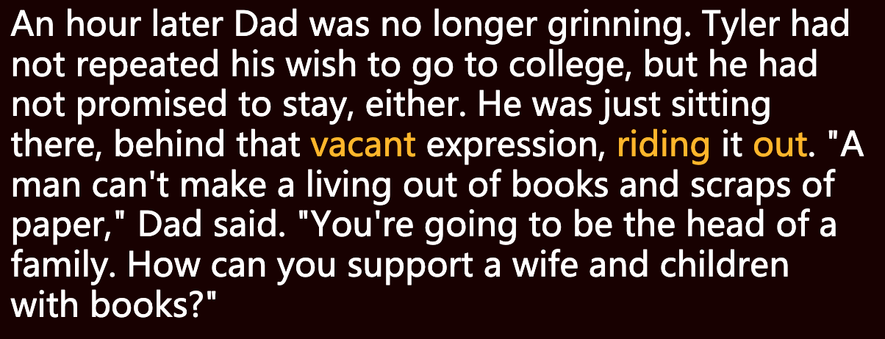
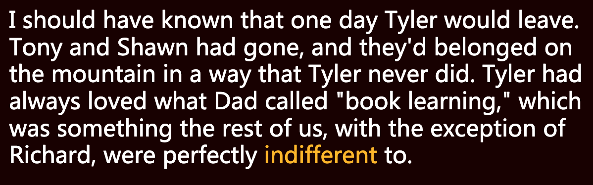
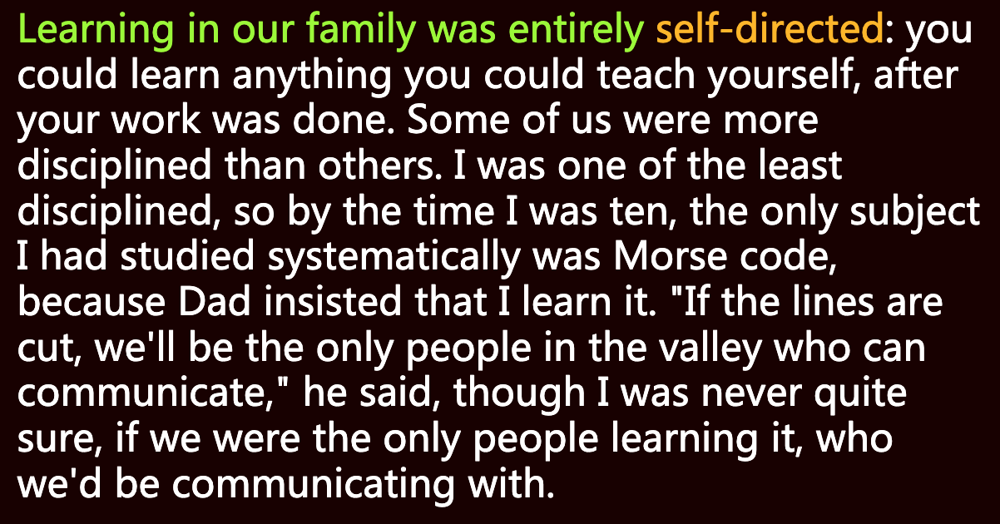
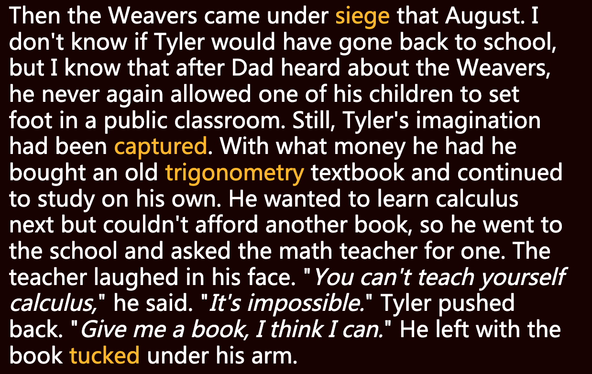
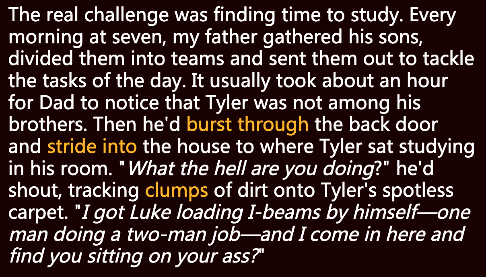
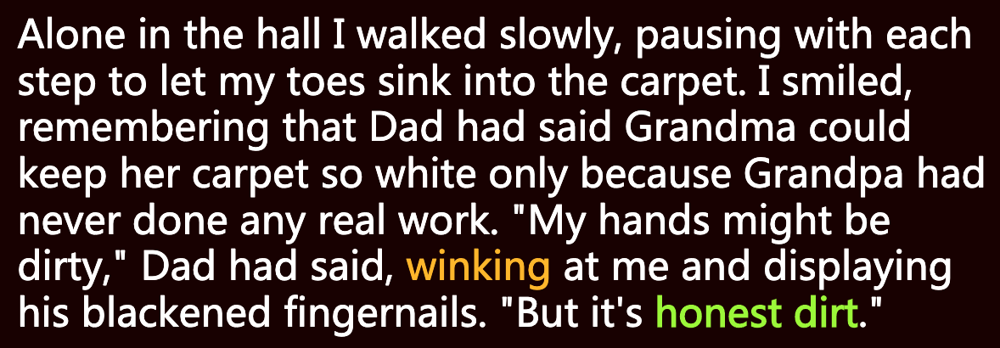
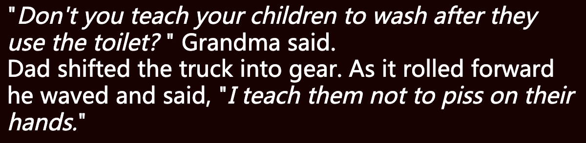

**一、阅读进度**

**二、阅读感受**
第五章 - 诚实的污垢
主要是记录了三哥Tyler离开家前后发生在家里的一些事情，以及Tyler的喜好、习惯和想法是如何影响Tara的。

里边的一个细节深有感触，小时候上厕所时从来没有被告知过要洗手。

**三、段落摘录**
**01**
settle into: 适应
grin: to grin at sb 向某人咧着嘴笑
high-minded: 高尚的

他在听爸爸发表长篇大论。“大学教授有两种，”爸爸说，“一种知道自己在说谎，另一种认为自己在说真话。”爸爸咧嘴一笑，“不知道哪种更糟糕，想想看吧，一种是光明会的金牌代理人，至少知道自己拿的是魔鬼的工资，另一种甚是傲慢，自认为比上帝更有智慧。”他依然咧着嘴笑。形势并不严峻；他只需给儿子讲一些道理。 

**02**
vacant: (unoccupied) 空着的
ride out: 安然承受，经受住

一个小时后，爸爸不再咧嘴笑了。泰勒没有再提他上大学的愿望，但也没答应留下来。他只是出神地坐在那里，安然承受。“一个男人不可能靠书本和废纸为生，”爸爸说，“你以后会成为一家之主。你靠书本怎么养活老婆孩子呢？”

**03**
indifferent: (unconcerned) 漠不关心的

我早该知道有一天泰勒会离开。托尼和肖恩走了，他们属于这座山，而泰勒从不属于这里。泰勒一直喜欢父亲所说的“书本知识”，而除理查德外，我们其他人对此毫不关心。

**04**
self-directed: 自我指导

在我们家，学习完全靠自我指导：只要干完自己的活儿，想学什么都可以自学。我们中有的孩子比其他人更有纪律性。我是最散漫的一个，到十岁时，我只系统学过一个科目——摩尔斯电码，因为爸爸坚持要我学。他说：“如果电话线路被切断，我们将是山谷里唯一能进行交流的人。”尽管我也不太确定，如果只有我们学了摩尔斯电码，我们去和谁交流呢。

**05**
siege: noun. 围困
trigonometry: 三角学
tuck: (push or fold into confined or concealed space) 把…塞进

那年八月，韦弗一家遭到围攻。假如没发生那件事，泰勒是否还会重返学校，我不得而知；但我知道，父亲在听说了韦弗一家的遭遇后，再也不允许任何一个孩子踏进学校教室。尽管如此，泰勒的想象力还是被**点燃**了。他用全部积蓄买了一本旧三角学课本，继续自学。他想接着学微积分，但又没钱再买另一本书了，于是他就到学校去找数学老师要一本。老师当面嘲笑他说：“自学微积分，这是不可能的事。”泰勒不为所动：“给我一本书吧，我想我能自学。”最后他腋下夹着一本书离开了。 

**06**
burst through:
stride into:
clump:

**真正的挑战在于找时间学习**。每天早上七点，爸爸就把儿子们召集起来，分好组，派他们去干当天的活儿。通常过了一小时爸爸才会注意到泰勒不在兄弟们中间。接着他会冲进后门，大步走进泰勒的房间，大声质问正坐在里面学习的泰勒。“你到底在干什么？”他一边吼，一边把鞋子上的泥巴踩到泰勒一尘不染的地毯上，“我让卢克去装工字梁——他一人干了两个人的活儿——我过来找你，你竟然还不挪屁股？”

**07**
blacken: (make black) 使变黑

我一个人慢慢穿过走廊，每走一步都停下来，让脚趾陷进地毯里。我笑了，想起爸爸曾说过，外婆能把地毯保持得这么白，只是因为外公从没真正干过活。“我的手可能很脏，”爸爸说着，朝我挤挤眼，露出他黑黑的指甲，“但这可是诚实的污垢。”

**08**

“难道你不教孩子上完厕所后洗手吗？”外婆说。 
爸爸挂上挡，卡车向前行驶。他挥了挥手，说：
“我教他们不要尿在手上。”

往期文章
Chapter 1: Choose the Good 
Chapter 2: The Midwife
Chapter 3: Cream Shoes
Chapter 4: Apache Women 

