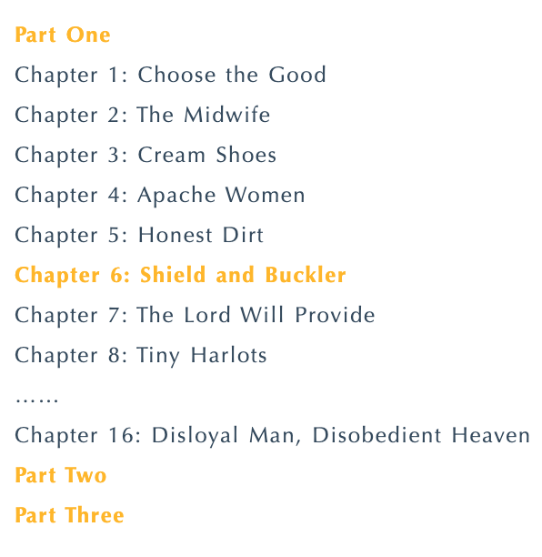
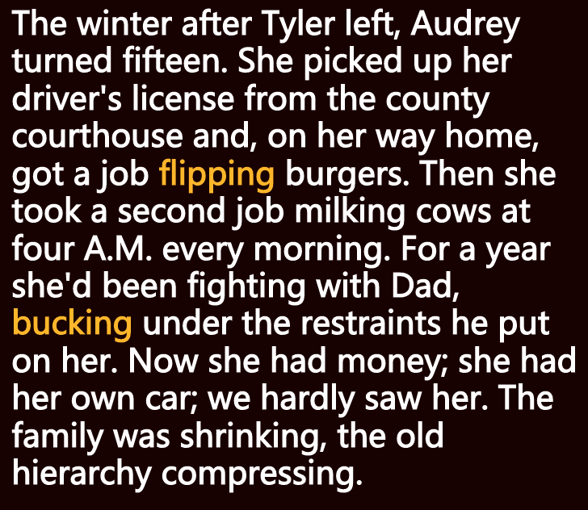
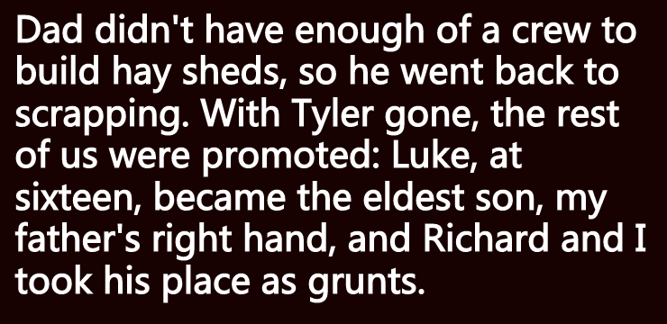
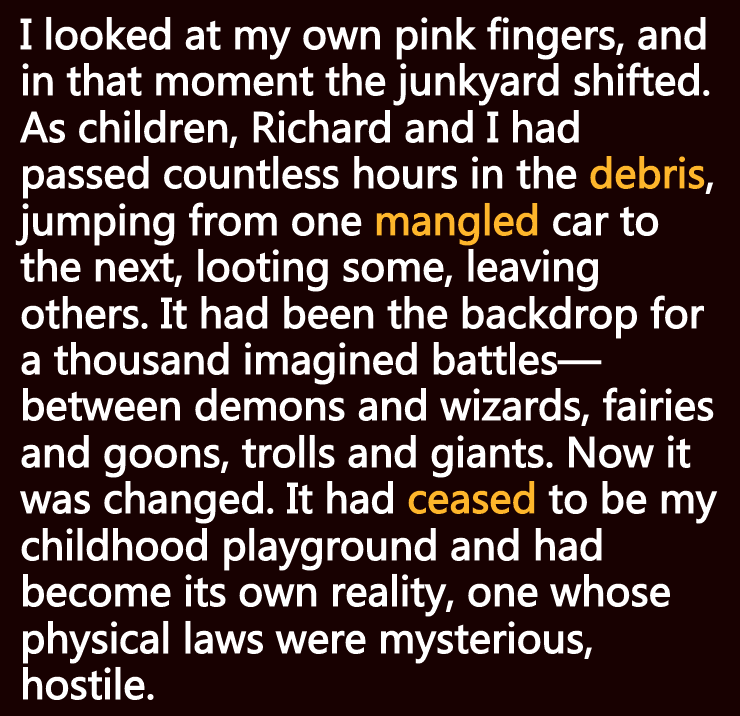
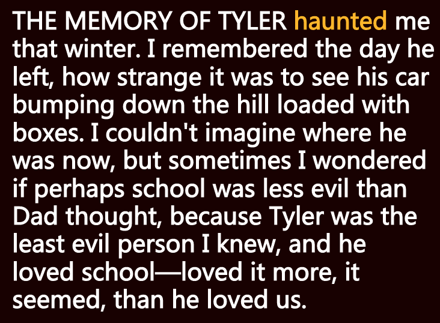
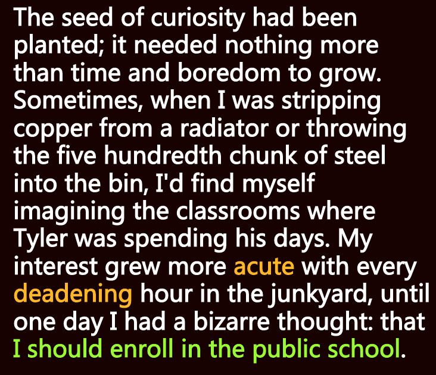
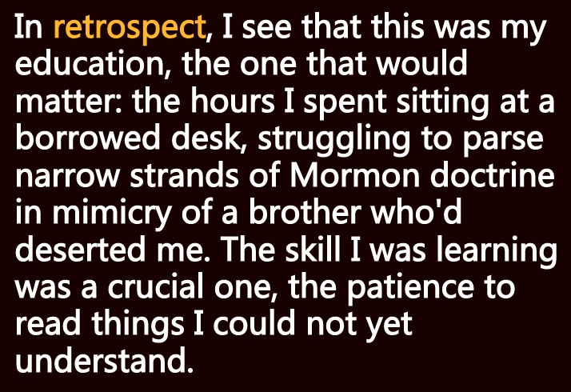
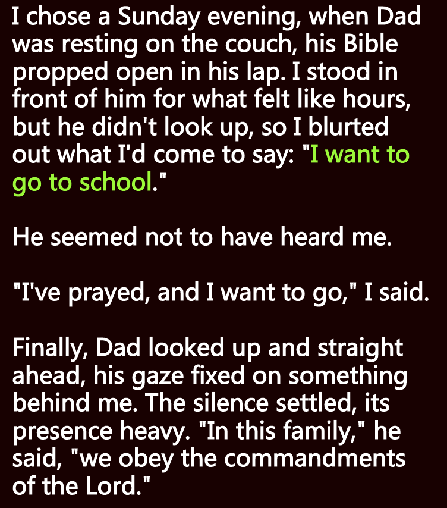
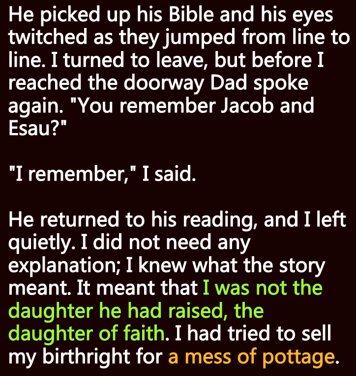

**一、阅读进度**

**二、阅读感受**
第六章 - 大小盾牌
姐姐奥黛丽靠自己在外打工养活自己，卢克、理查德和tara在垃圾场帮忙，车祸后妈妈的病情也开始好转，但是思想和信仰的东西发生了很大的变化。Tara开始跟父亲提出去上学的想法。

我的经历其实差不多类似，忍受不了家里的农活，去读书是我的出口。

**三、段落摘录**
**01**
flip：(turn) 快速翻动
buck: (oppose) 抵抗

泰勒离开后的那个冬天，奥黛丽十五岁了。她从县政府拿到了驾照，在回家路上找到了一份煎汉堡肉的工作。接着她又找了一份每天早上四点挤牛奶的工作。一年来，她一直和爸爸斗争，在他施加的种种管束下疯狂赚钱。现在她有钱了，也有了自己的车，我们几乎见不到她的人影。家里的人越来越少，旧日的等级制度开始简缩。

**02**

爸爸没有足够的人手去盖草棚了，于是干起了拆解废品的老本行。泰勒走了，我们其余人便升了级：十六岁的卢克成了长子和父亲的左膀右臂，我和理查德则代替他，成了多面手勤杂工。

**03**
debris: 废料场
mangle: (crush, mutilate) 压碎  
cease: to cease to be important 不再重要

我盯着自己发红的手指，那一刻，废料场在我眼中发生了变化。儿时我和理查德在这片废墟中度过了无数时光，从一辆破车跳上另一辆破车，搜寻其中的宝贝。在这里，我们假想了无数战斗场景——恶魔与巫师，精灵与暴徒，巨魔与巨人。现在它变了，不再是我儿时的那个游乐场，而是回归现实，有着神秘莫测、充满敌意的物理定律。 

**04**
haunt: 萦绕 缠绕

那年冬天，对泰勒的记忆一直萦绕在我心头。我记得他离开那天，看着他那辆装满箱子的车从山上颠簸而下是多么奇怪。我无法想象他现在在哪里，但有时我想，也许学校没有爸爸所想的那么邪恶，因为泰勒是我认识的最善良的人，而他喜欢学校——他对学校的爱，似乎超过了对家人的爱。 

**05**
acute: (intense) 极度的 
deaden: (reduce intensity) 缓和

好奇的种子已经播下，只需时间和厌倦让它成长。有时，当我拆下散热器上的铜，或将第五百块钢扔进分类箱时，我会发觉自己在想象泰勒的学校生活。随着在废料场度过沉闷的每一个小时，我的兴趣愈发强烈，直到有一天，一个奇怪的念头闪现：我应该去上学。

**07**
retrospect:  回顾

回首往事，我发现这就是我的教育，将产生重要影响的教育：我学着弃我而去的那个哥哥的样子，在借来的书桌前枯坐，努力而仔细地研读一条条摩门教教义。我在学习的这个技能至关重要，那就是对不懂的东西耐心阅读。

a mess of pottage:  一点点利益

我挑了一个星期日的晚上，当时爸爸正在沙发上休息，腿上放着打开的《圣经》。我在他面前感觉站了有好几个小时，但他始终没有抬头，于是我脱口而出：“我想去上学。” 
他似乎没听见我说话。 
“我祈祷过，我想去。”我说。 
最后，爸爸抬起头，直直地向前看，目光聚焦在我身后的什么东西上。静默降临，让人倍感压抑。“在这个家，”他说，“我们遵守上帝的戒律。” 
他拿起《圣经》，转动眼珠从一行跳到另一行。我转身要走，但还没走到门口，爸爸开口了：“你还记得雅各和以扫的故事吗？”  
“记得。”我说。 他继续读经文，我静静地离开了。无须任何解释。我知道这个故事的意思。他的意思是说，我不是他养育出的女儿，他的女儿秉持虔诚的信仰。我竟然为了一碗破汤而试图出卖自己与生俱来的权利。

**往期文章**：
Chapter 1: Choose the Good 
Chapter 2: The Midwife
Chapter 3: Cream Shoes
Chapter 4: Apache Women 
Chapter 5: Honest Dirt 
