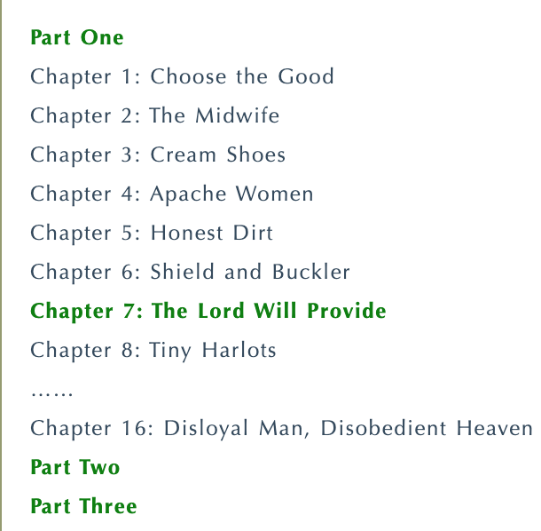
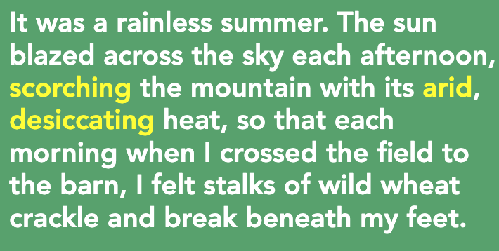
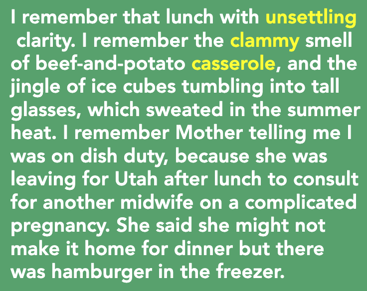
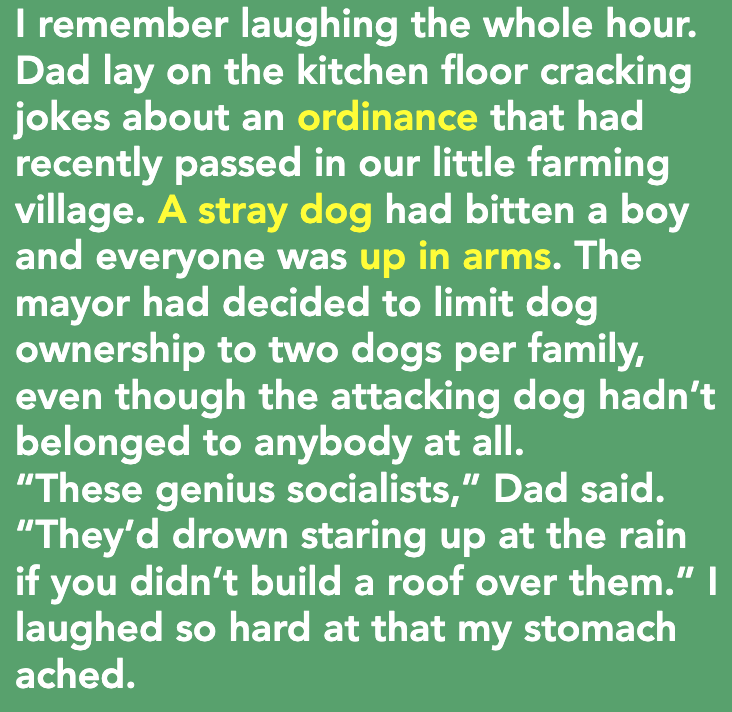
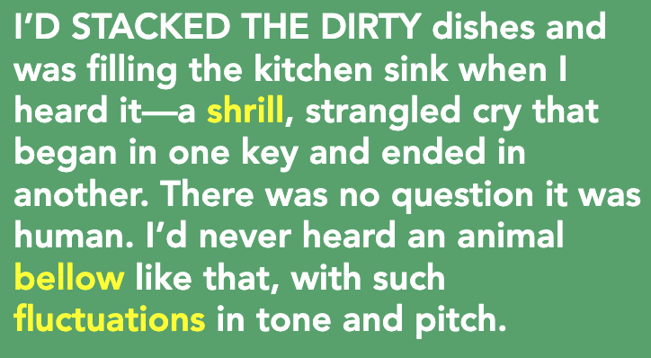
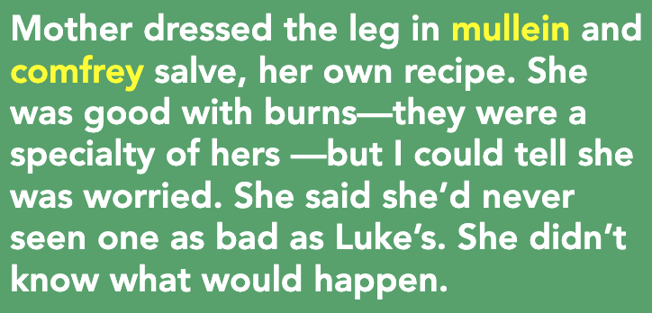
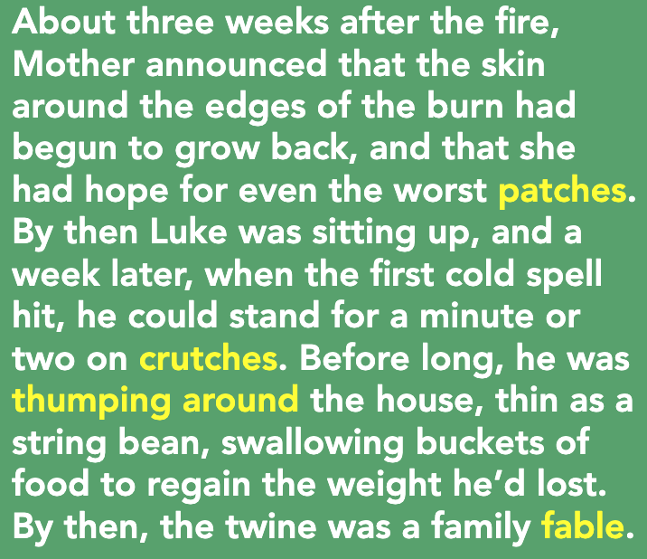
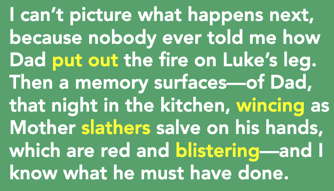

**一、阅读进度**

**二、阅读感受**
第七章 - 耶和华必预备
亚伯拉罕给那地方起名叫*耶和华以勒*(意思就是‘耶和华必预备’)，直到今日人还说：‘在耶和华的山上必有预备。’”(《创世记》22:14）神要亚伯拉罕将儿子*以撒*献上当作祭物，以试验他的顺从和忠心。亚伯拉罕照做，于是神预备了羔羊代替以撒作为祭物，*以撒*便不必死。这句话是说生活中要顺从神，要有信心和忠心，神必为我们预备一切。

哥哥Luke大夏天被烧伤的故事，不能去医院，只能在家里被照顾着。

**三、段落摘录**
**01**
scorch: 把…烧焦 
arid: 干旱的
desiccate: 使…干燥

那是个干旱少雨的夏天。每天下午，火辣辣的太阳灼烤着大山，空气炙热而干燥。每天早上穿过田野去谷仓时，我都能感到野麦茎在脚下噼啪折断。

02
unsettling: 令人不安的
clammy:  湿腻的
casserole: 炖锅菜 

我记得那顿午餐，那么明晰，令人不安。我记得砂锅牛肉土豆湿黏的味道，记得冰块倒入高脚杯叮当作响，杯身在夏日的高温下沾满水珠。我记得母亲让我洗盘子，因为她饭后要去犹他州，咨询另一位助产士有关一例妊娠并发症的问题。她说她可能不回来吃晚饭了，冰箱里还有汉堡。

**03**
ordinance: 法令
a stray dog: 流浪狗
up in arms: (protesting vigorously about something) 奋力反抗

我记得笑了整整一个小时。爸爸躺在厨房地板上讲笑话，关于我们这个小村镇最近通过的一项法令。一个男孩被一条流浪狗咬了，所有人都气愤至极。市长于是决定限制每家养狗的数量，不能超过两条，问题是，咬人的狗根本就不是家养的。 
“这些政府官员真是天才，”爸爸说，“如果你不给他们盖个屋顶，他们会呆呆地看着天下雨，直到淹死。”我笑得肚子都疼了。

**04**
shrill: 刺耳的 
bellow: 吼叫
fluctuations: 波动

我正把脏盘子堆进厨房水槽，突然听见了一声颤抖、窒息、首尾不同调的尖叫。毫无疑问，是人发出的声音。我从没听过哪种动物用如此起伏的音调嚎叫。

**05**
mullein: 毛蕊花
comfrey: 紫草
salve: 药膏 

母亲在他腿上敷上自制的毛蕊花和紫草药膏，包扎好。她对处理烧伤很在行——那些都是她的特制药——但我看得出来，她很担心。她说她从没见过像卢克这样严重的烧伤。她不知道情况会怎样。

**06**
patch: (for repair in clothes, tyre, airbed) 补丁
crutch:  腋杖 
thump: (whack) 重击
fable:  寓言

大火之后约莫三周，母亲宣布，烧伤边缘的皮肤开始长出来了，就连最严重的地方也有希望长出新皮肤。这时卢克能坐起来了，一个星期后，当第一次寒流来袭时，他能拄着拐杖站一两分钟了。没过多久，他就在屋子里踮着脚转悠了。他瘦得像根豆芽菜，为了恢复体重，狼吞虎咽地吃了一桶又一桶食物。到那时，麻绳已成为全家人的谈资。

**07**
wince: (in pain) 龇牙咧嘴 
slather: 胡说
blister: (on skin) 水疱

接下来发生了什么我无法想象，因为没人告诉过我，爸爸是如何把卢克腿上的火扑灭的。然后一个回忆浮现出来——那天晚上在厨房，母亲在他红肿起泡的手上涂上厚厚一层药膏，爸爸疼得龇牙咧嘴——我知道他肯定干了什么。