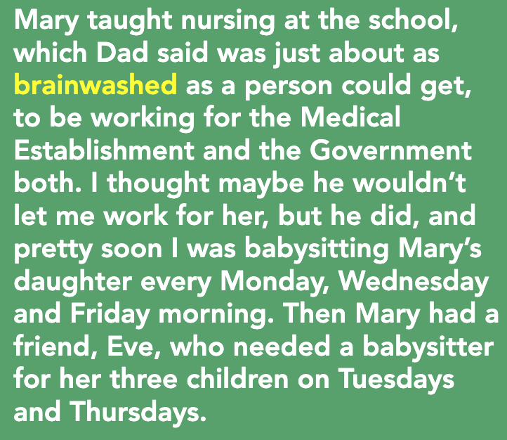

**一、阅读进度**

**二、阅读感受**
第八章 - 小妓女
11岁的Tara开始通过照顾小孩，帮忙打包来挣钱，并通过认识的人来学习钢琴和跳舞，真了不起，虽然跳舞惹到父亲很生气，但是后来通过唱歌获得了父亲的认可，最后父亲愿意支持Tara去镇里竞选试唱。

看到这里，我并没有觉得Tara父亲有多么地不讲道理，每个人都可以有自己的信仰，改变一个人的观念其实很难的。

**三、段落摘录**
**01**
round up: (assemble) 聚集 round up sb

要想离开废料场，办法只有一个，那就是像奥黛丽一样找份工作，这样爸爸召集全员干活时我就不在家了。问题是，我才十一岁。

**02**
brainwash: 给...洗脑

玛丽在学校教护理。爸爸说过，同时为医疗机构和政府工作，这是被洗脑最严重的了。我原以为他不会允许我给她打工，没想到他却同意了。很快我便在每周一三五上午去照顾玛丽的女儿。玛丽有个朋友叫伊芙，也正好需要一个保姆在周二和周四照顾她的三个孩子。

**03**
eager: adj (filled with longing) 渴望的 
cashew: 腰果

“至少有一个孩子没去。”默娜说，“我想她也很愿意帮忙。”她指着我的卡片说。很快我就在周一到周五上午八点至中午之间照看小孩，然后去兰迪的店里打包腰果，一直干到晚饭时间。薪水不算多，但以前我从未挣过钱，所以感觉钱也不少。

**04**
prance: 欢蹦乱跳
sequin: 亮片
scarlet: (colour) 猩红色 
aisle: 走道
sheer: 轻薄的 

在卡洛琳打电话给母亲后的星期三，我提前几分钟到了杰伊老爹加油站。小班刚下课，到处是六岁左右的小女孩，头戴红色天鹅绒帽，裙子上闪烁着深红色亮片，*欢蹦乱跳*地找她们的母亲。我看着她们扭动着腰肢，蹦蹦跳跳地穿过走廊，纤细的腿上只穿着透明紧身连裤袜。我觉得她们看上去像小妓女。

**05**
leotard: 紧身连衣裤
modest: (demure) 端庄的

下课后，卡洛琳让我去买一套紧身连衣裤，一双舞鞋。 
“我买不了。”我说。 
“哦。”她看上去很不自在，“也许哪个女孩能借给你一套。” 
她误解我了，以为我没钱。“这个不端庄。”我说。她惊讶地张大了嘴。这些来自加利福尼亚的莫伊尔家的人啊， 我想。

**06**
glare at: (stare angrily) 怒目而视 
flicker off: (shine unsteadily) 闪烁

音乐结束。离开舞台时，女孩们都对我怒目而视——我毁了整个节目——但我几乎没去看她们。房间里只有一个人对我而言是真实的，那就是爸爸。我朝观众席望去，一眼就看到了他。他站在后面，舞台灯光反射在他的方框眼镜上。他表情僵硬而冷漠，但我能看出其中的愤怒。

**07**

开车回家路程只有一英里，可是感觉有一百英里。我坐在后座上，听父亲大喊大叫。母亲怎么能允许我如此公开地犯罪呢？这就是她一直向他隐瞒演奏会的原因吗？母亲听了一会儿，咬着嘴唇，双手往空中一摊，说她不知道演出服会如此不端庄。“我真生卡洛琳·莫伊尔的气！”她说。

**08**
boom box: 噪音盒

在演奏会后，母亲一定是颇感内疚，因为接下来的几个星期，她努力寻找其他我能做的而父亲也不会禁止的事。她注意到我经常用泰勒的旧音箱听摩门教礼拜合唱团的音乐，于是开始给我找声乐老师。几周后老师找到了，她又花了几周时间说服那位老师教我。这些课程比舞蹈课贵多了，但是母亲用卖精油赚来的钱付了学费。

**09**
hymn: (song) 圣歌 
congregation: (in church) 礼拜会众

几次课后，她宣布我可以在教堂唱歌了。已经安排好了，她说。那个星期天我要在教堂会众面前唱赞美诗。

**10**
pew:  (seat) 教堂长椅 
floral:  (made of flowers) 用花做的
clasp: (hold tightly) 握紧 
bishop: 主教

歌唱完了，我回到座位上。最后是祈祷仪式，之后人们朝我涌来。穿碎花裙子的女人微笑着和我握手，穿方格黑西装的男人过来拍拍我的肩膀。合唱团主管邀请我加入唱诗班，戴维斯兄弟请我为扶轮社 [11] 唱歌，主教——在摩门教中相当于牧师——说，他想请我在一场葬礼上唱歌。我答应了所有人的请求。

11

我从未见过父亲的这一面，但之后又见了许多次——每次都是在我唱歌后。不管他在废料场工作了多久，不管他有多累，他都会开车翻山越岭去听我唱歌。

12

不管怎样，我还是练习这些歌，因为我喜欢。一天晚上，我正在房间里唱“明天太阳会出来”，爸爸回到家吃晚饭。他嚼着肉饼，静静地听着。
 “我会弄到钱的，”那天晚上上床睡觉时，他对母亲说，“你带她去参加试唱吧。”