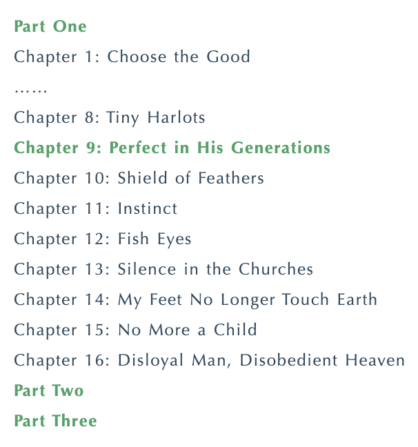
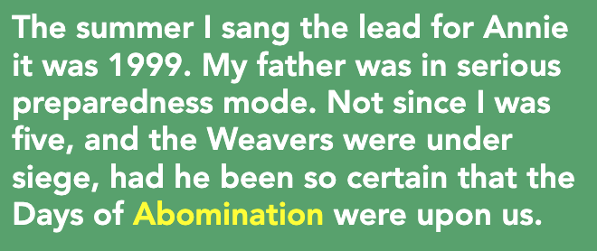
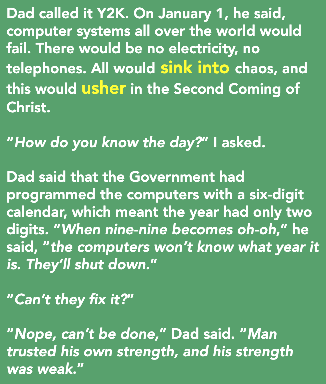
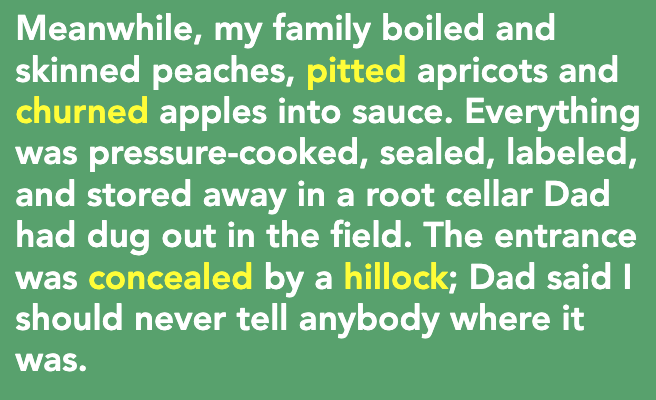
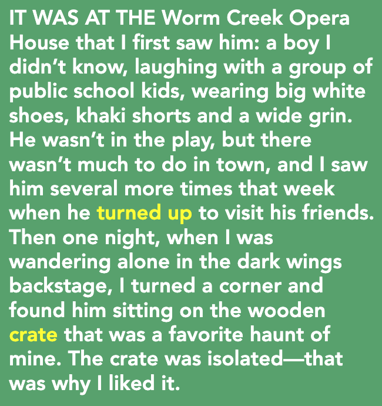
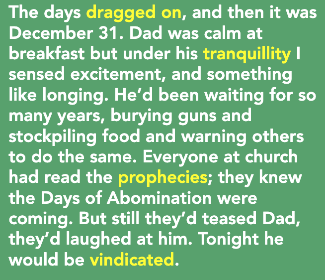
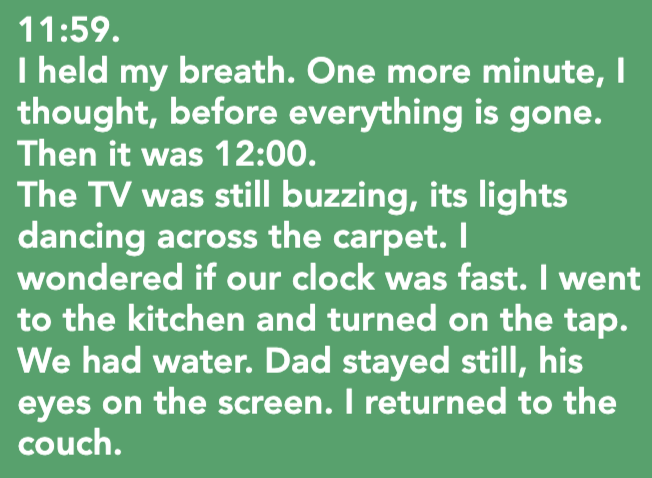
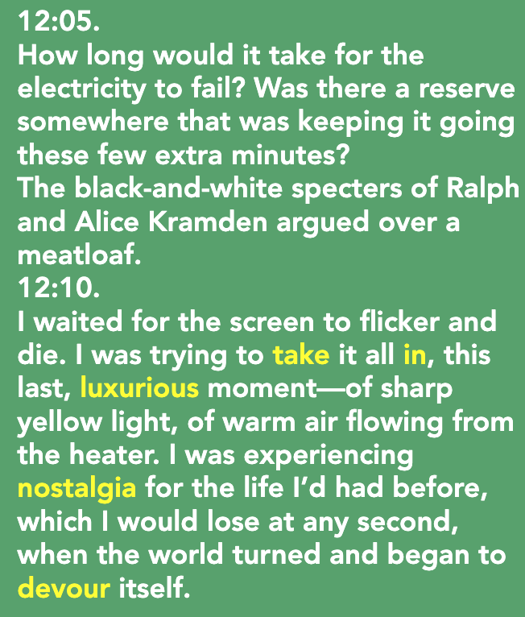
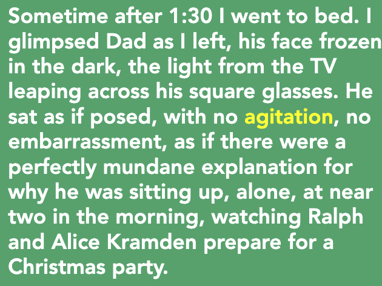
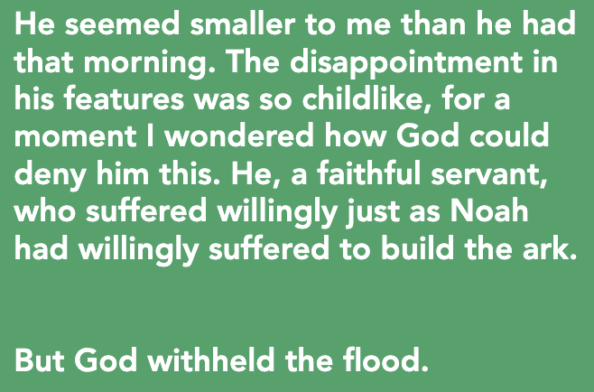

**一、阅读进度**

**二、阅读感受**
第九章 - 他的时代里的完美
Tara是作品Annie的主唱，在剧场遇到一个小男孩，但一想到家里的环境，但是当她想到带刚认识的朋友到家里去玩时，会觉得很不舒服，甚至自卑到停止发展更深的交往。

父亲的"千年虫"观，认为2000年来不了，做好一切准备来迎接这一天，1999年12月31号白天那天父亲表面是安静的，但内心是兴奋的，甚至带了点渴望，但是当2000年到来是，那种无声的绝望让他看起来比以往矮小了许多。

**三、段落摘录**
**01**
abomination: uncountable (loathing) 憎恶

一九九九年夏天，我在《安妮》一剧中担任主唱。父亲处于严阵以待的状态。自从我五岁时韦弗一家被围攻，他从未像现在这样肯定，世界末日马上要降临了。

**02**
sink into: 陷入
usher: (lead, conduct)引导

爸爸称之为“千年虫”。到一月一日，他说，全世界的计算机系统都将崩溃。到时候没有电，没有电话，一切都会陷入混乱，而这将预示基督的第二次降临。 
“你怎么知道是这一天？”我问。 
爸爸说，政府编程的电脑日历以六位数显示，这意味着年份只有两位数。“当99变成了00，”他说，“电脑就不知道是哪一年了，它们会瘫痪。” 
“他们不能修好它吗？” 
“修不好，”爸爸说，“人只相信自己的力量，而人力量微弱。”

**03**
pit: (remove stone from) 去除…的核
apricot: / ˈaprəˌkät/ (fruit) 杏子
churn: verb 翻搅
concealed: adj (obscured from view) 隐藏的
hillock: 小丘

与此同时，我们一家人将桃子煮熟去皮，给杏去核，把苹果搅成酱。一切都被高压烹熟，密封，贴上标签，储存于爸爸在牧场挖的地窖里。地窖入口很隐蔽，被一个小丘遮挡，爸爸警告我们绝不能把位置告诉任何人。

**04**
crate: (wooden container) 木箱

第一次见到他是在虫溪剧场：一个我不认识的男孩，和一群公立学校的孩子一起笑着，穿一双白色大鞋，卡其短裤，笑容灿烂。他没参演戏剧，但城里又没什么地方可以消遣。那个星期，他来看望他的朋友，我又见过他几次。一天晚上，我一个人在后台黑暗的角落闲逛时，一转弯，发现他坐在我最喜欢坐的木箱上。箱子孤零零的——这正是我喜欢它的原因。

**05**
drag on:  continue, go on, carry on 拨进
tranquillity: /ˈtræŋkwɪlətɪ/ 宁静
profhecy: /'prɑfəsi/ 预言
vindicate:  /'vɪndɪ.keɪt/ 证实

日子一天天过去，转眼到了十二月三十一日。早餐时爸爸很平静，但在他的宁静中我感受到兴奋与类似渴望的东西。他等了这么多年，埋藏枪支，囤积食物，还告诫别人也这么做。教堂里的每个人都读过预言书，他们知道世界末日将要到来。尽管如此，他们还是对爸爸冷嘲热讽。今晚将证明他是正确的。

**06**
specter: (ghost) 幽灵
take in: (observe) 注意到
luxurious: /lʌɡ'ʒʊriəs/ 豪华的
nostalgia: 怀旧
devour:   耗尽

11:59。 
我屏住呼吸，心想：再过一分钟，一切就都烟消云散了。
接着到了十二点。电视仍在嗡嗡作响，发出的光在地毯上舞动。我在想我们的时钟是不是走快了。我来到厨房，打开水龙头。还有水。爸爸一动不动，眼睛盯着屏幕。我又回到沙发上。
12:05。
还有多长时间电力才会中断？是不是哪个地方有额外储备用电，还能多持续几分钟？
电视上拉尔夫和爱丽丝·卡拉门登的黑白影像如幽灵一般，正为一个烘肉卷争吵。 
12:10。
我等待电视屏幕突然一闪后熄灭。我努力记住这一切，记住这最后的奢侈的时刻——记住强烈的黄色光线，记住流动在电热器周围的温暖空气。世界将化为乌有，我的人生随时会终结，我正体验着对过往生活的怀旧之情。

**07**
agitation: US [.ædʒɪ'teɪʃ(ə)n] 焦虑不安

一点半过后，我上床睡觉了。离开时我瞥了一眼父亲，他的脸在黑暗中凝固，电视光线在他的方框眼镜上闪烁。他摆姿势一般坐着，既不激动，也不尴尬。至于为什么在接近凌晨两点时还独自坐在那里，看着电视上的拉尔夫和爱丽丝·卡拉门登为圣诞晚会做准备，他仿佛有再平常不过的理由。

**08**

在我看来，与那天早上相比，他更矮小了。他脸上的失望是如此孩子气，一时间我疑惑上帝怎么能不遂他的心愿。他是那样虔诚的信徒，心甘情愿地受苦，就像挪亚心甘情愿去建造方舟一样。
但上帝并未让洪水泛滥。

**往期文章**