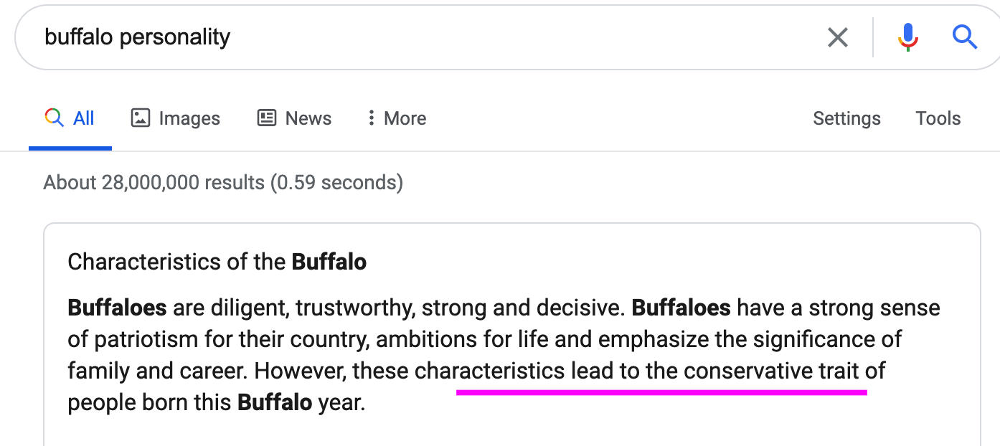

### 英文书精读整理系列
**书名**：Educated 你当像鸟飞往你的山
**副标题**:  A Memoir 一部回忆录
**作者**： [美] 塔拉·韦斯特弗

### 一、阅读进度
Part One
Part Two
***Part Three***
Chapter 30: Hand of the Almighty 
......
Chapter 38: Family 
***Chapter 39: Watching the Buffalo***
Chapter 40: Educated
### 二、阅读感受
第三十九章 - 守望野牛
Tara回到爱达荷，但是只能远远地看着巴克峰，发消息给目前出来见她，但是母亲不愿意。欢迎她回家，但是Tara还没有准备好见固执的父亲。
城里奶奶得了阿尔茨海默症，城里外公更加信任自己的女儿。父亲开除了为母亲工作的安琪阿姨，Tara和她的关系越来越好，值得城里奶奶去世，Tara一直住在安琪阿姨家。所有的亲戚，除了安琪阿姨，还有曾帮助过她的黛比阿姨。
葬礼那天，Tara站在角落里，看着我的兄弟姐妹们陆续走进来。
Tara意识到除了理查德和泰勒，我所有的兄弟姐妹都在经济上依赖着我父母。
我的家人从中间一分两半——三个离开了大山，四个留了下来。三个获得博士学位，四个没有高中文凭。裂痕已经出现，而且越来越深。
- - - - - - 
我特意查了下Buffalo的性格特点，一个缺点是特别固执和保守。

我想Buffalo这里应该是暗指她的父亲吧，只能远远地守望，不敢靠近，也不想靠近。

###三、段落摘录
**01**
drop-off:  停车的地方
basin: (area lower than the surrounding area) 盆地
*patchwork*: 拼凑之物
e.g: from the plane, the landscape was just a patchwork of fields
从飞机上俯瞰，满目尽是阡陌交错
expectant: (eager, excited) 期盼的
luminous: (brilliant, radiant) 发光的
>It was spring when I arrived in the valley. I drove along the highway to the edge of town, then pulled over at the *drop-off* overlooking the Bear River. From there I could look out over the *basin*, a *patchwork* of *expectant* fields stretching to Buck’s Peak. 
>The mountain was crisp with evergreens, which were *luminous* set against the browns and grays of shale and limestone. 
>The Princess was as bright as I’d ever seen her. She stood facing me, the valley between us, radiating permanence.

我到达山谷时已是春天。我开车沿着高速公路来到城镇的边缘，然后在可以俯瞰贝尔河的地方停下。从那里我可以眺望盆地，那是一片错落有致的田野，一直延伸到巴克峰。
山上的常青树绿意盎然，在褐色、灰色的页岩和石灰岩的映衬下，显得格外明亮。
公主和从前一样明净。她站在我面前，我们之间的山谷散发着永恒的光芒。

**02**
>TYLER AND STEFANIE LIVED a hundred miles north of Buck’s Peak, in Idaho Falls. It was there I planned to go next, but before leaving the valley, I wrote my mother. It was a short message. I said I was nearby and wanted her to meet me in town. I wasn’t ready to see Dad, I said, but it had been years since I’d seen her face. Would she come?

泰勒和斯蒂芬妮住在巴克峰以北一百英里的爱达荷州福尔斯市。接下来我打算去那里，但在离开山谷之前，我给母亲发了一条短信。我说我就在附近，想让她来城里见我。我说，我还没准备好见爸爸，但我已经多年没看见过她的脸庞了。她会来吗？

**03**
party: 参与
blatant:  ['bleɪt(ə)nt]  明目张胆的 公然的
>I waited for her reply in the parking lot at Stokes. I didn’t wait long. 
>It pains me that you think it is acceptable to ask this. A wife does not go where her husband is not welcome. I will not be *party* to such *blatant* disrespect.

我在斯托克斯的停车场等着她回复。我没等多久。 
你竟然觉得问出这样一个问题合情合理，这让我感到心痛。妻子从来不到丈夫不受欢迎的地方去。我是不会参与这种明目张胆的不敬行为的。

**04**
amount to: 合计 相当于
ultimatum: 最后通牒
to recant: 公开宣布放弃（原先的信仰、观点等）
>Mother’s message *amounted to* an *ultimatum*: I could see her and my father, or I would never see her again. She has never *recanted*.

母亲的信息相当于最后的通牒：要见就见她和父亲两个，否则我将再也不能见到她。她从未反悔。

**05**
to trickle: 小股流淌；慢慢走；
>The funeral was the next day. I stood in a corner and watched my siblings *trickle* in.

葬礼在第二天举行。我站在角落里，看着我的兄弟姐妹们陆续走进来。

**06**
to allude: 暗指；(婉转)提到；
>There were *Tyler* and *Stefanie*. They had decided to homeschool their seven children, and from what I’d seen, the children were being educated to a very high standard. 
>*Luke* came in next, with a brood so numerous I lost count. He saw me and crossed the room, and we made small talk for several minutes, neither of us acknowledging that we hadn’t seen each other in half a decade, neither of us *alluding* to why. 
>Do you believe what Dad says about me? I wanted to ask. Do you believe I’m dangerous? But I didn’t. 

*泰勒和斯蒂芬妮*来了。他们决定在家教育七个孩子，而据我所见，孩子们所受的教育程度非常高。
*卢克*紧随其后，带着一大群孩子，我没能数清。他见了我，穿过房间，跟我短暂地聊了几分钟。我们两个谁都没提我们已有五年没见面，也都没提为什么。
我很想问他，你相信爸爸说的关于我的话吗？你相信我很危险吗？ 但我没有问。

**07**
>*Richard*, who was finishing a PhD in chemistry, had come down from Oregon with Kami and their children. He smiled at me from the back of the chapel. 
>A few months before, Richard had written to me. He’d said he was sorry for believing Dad, that he wished he’d done more to help me when I needed it, and that from then on, I could count on his support. We were family, he said.

理查德当时正在攻读化学博士学位，他和卡米以及他们的孩子们从俄勒冈州赶来。他从教堂后面对我微笑。几个月前，理查德给我写过信。他说他很抱歉相信了爸爸的话，说他希望在我需要帮助时能提供给我更多帮助，说从此以后，我可以依靠他的支持。我们是一家人，他说。

**08**
>*Audrey* and *Benjamin* chose a bench near the back. Audrey had arrived early, when the chapel was empty. She had grabbed my arm and whispered that my refusing to see our father was a grave sin. “He is a great man,” she said. “For the rest of your life you will regret not humbling yourself and following his counsel.” These were the first words my sister had said to me in years, and I had no response to them.

奥黛丽和本杰明选择了后面的长椅。奥黛丽很早就来了，当时教堂空无一人。她抓住我的胳膊，低声说，我拒绝跟父亲见面是严重的罪过。“他是一个了不起的人，”她说，“不虚心听他的劝告，你会后悔一辈子的。”这是多年来姐姐对我说的第一句话，而我没有回应。

**09**
>*Shawn* arrived a few minutes before the service, with Emily and Peter and a little girl I had never met. It was the first time I had been in a room with him since the night he’d killed Diego. I was tense, but there was no need. He did not look at me once during the service.

葬礼开始前几分钟，肖恩、埃米莉、彼得以及一个我从未见过的小女孩来了。自他杀死迭戈的那晚以来，这是我首次与他共处一室。我很紧张，但其实没有这个必要。整个葬礼期间他都没看我一眼。

**10**
>My oldest brother, *Tony*, sat with my parents, his five children fanning out in the pew. Tony had a GED and had built a successful trucking company in Las Vegas, but it hadn’t survived the recession. Now he worked for my parents, as did Shawn and Luke and their wives, as well as Audrey and her husband, Benjamin. 
>Now I thought about it, I realized that all my siblings, except Richard and Tyler, were *economically dependent on* my parents. 
>My family was splitting down the middle—the three who had left the mountain, and the four who had stayed. The three with doctorates, and the four without high school diplomas. 
>A chasm had appeared, and was growing.

我的大哥托尼和我父母坐在一起，他的五个孩子分散坐在长椅上。托尼拿到了普通同等学力证书，曾在拉斯维加斯开过一个成功的货运公司，但公司未能在经济萧条中挺住。现在他为父母打工，肖恩、卢克和他们各自的妻子，以及奥黛丽和她的丈夫本杰明都是如此。
现在想来，我意识到除了理查德和泰勒，我所有的兄弟姐妹都在经济上依赖着我父母。
我的家人从中间一分两半——三个离开了大山，四个留了下来。三个获得博士学位，四个没有高中文凭。裂痕已经出现，而且越来越深。

**11**
>A YEAR WOULD PASS before I would return to Idaho.
> A few hours before my flight from London, I wrote to my mother—as I always did, as I always will do—to ask if she would see me. Again, her response was *swift*. She would not, she would never, unless I would see my father. To see me without him, she said, would be to disrespect her husband.

一年之后，我才再次回到爱达荷州。 
从伦敦起飞前几个小时，我写信给母亲——像往常一样，以后我也将一如既往地这样做——问她是否愿意见我。她再一次迅速回复。她不会见，永远不会，除非我愿意见父亲。她说，单独见我，是对丈夫的不尊重。

### 往期文章
[Chapter 32 & 33](https://mp.weixin.qq.com/s/QcQ9ceDlnnQHeC61ARu8Yg)
[Chapter 34 & 35](https://mp.weixin.qq.com/s/MOj7IQnIfugYlZ3yXwaqtw)
[Chapter 36: Four Long Arms, Whirling](https://mp.weixin.qq.com/s/MOj7IQnIfugYlZ3yXwaqtw)
[Chapter 37: Gambling for Redemption](https://mp.weixin.qq.com/s/-ErFXuONj1DsFX-LzKDkYg)
[Chapter 38: Family](https://mp.weixin.qq.com/s/isXOzXesUHNZslNWOPb5QA)

后台回复"**Tara**"来获取《Educated》电子版的资源
