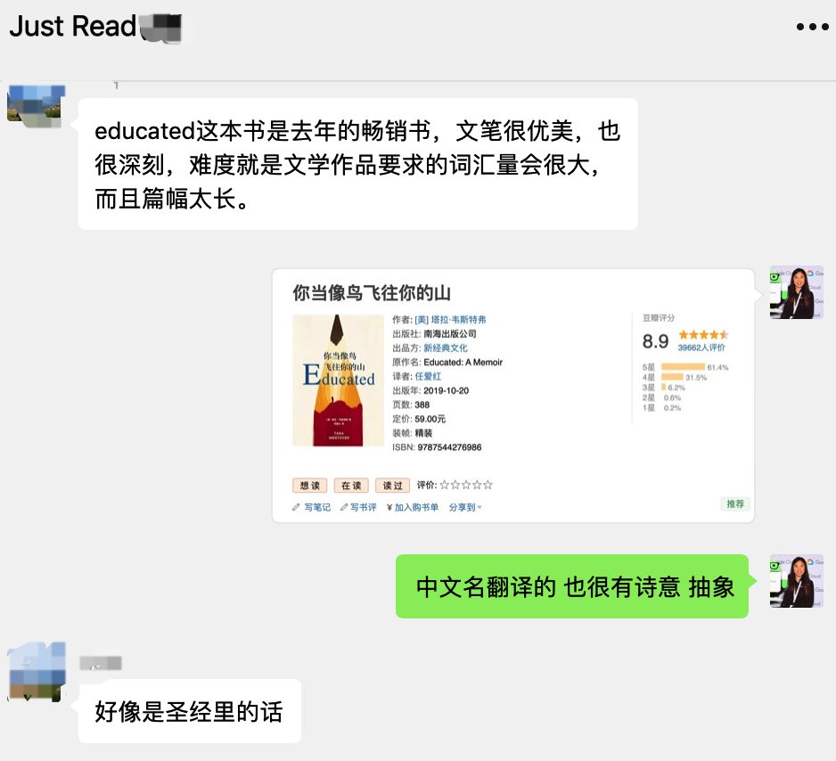
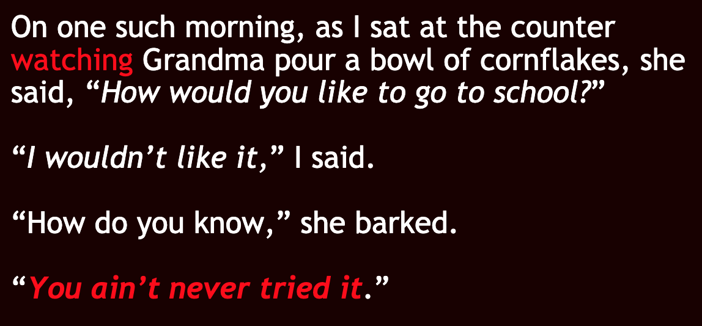
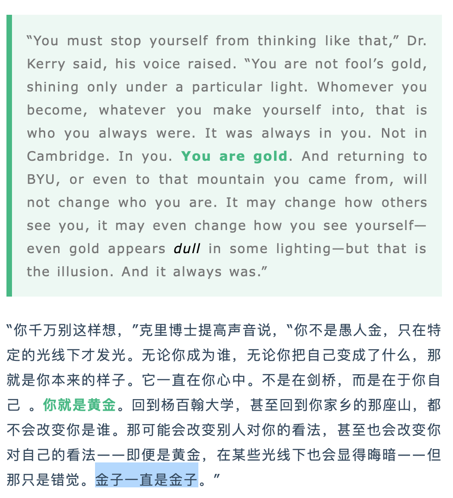
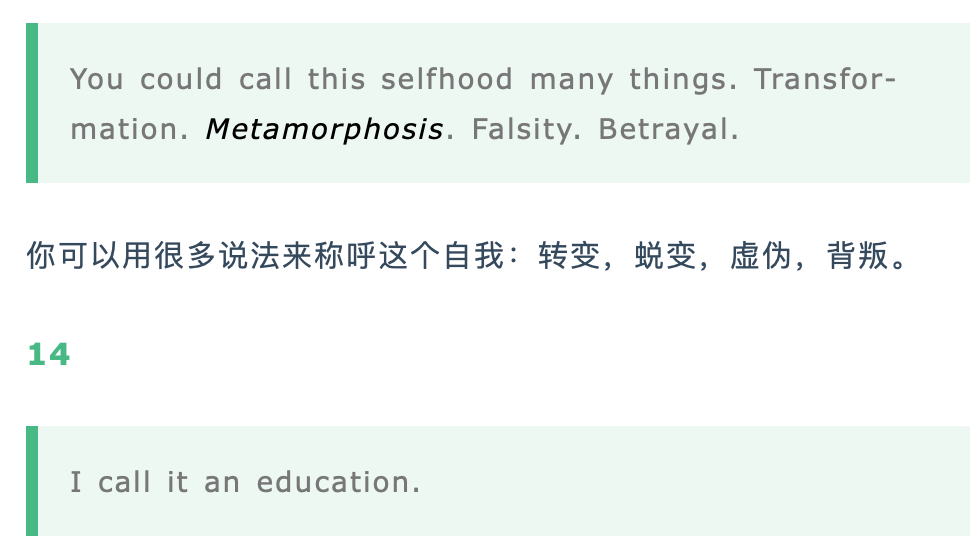

今天的文章是我最近阅读过的英文书的一个小总结，我大概用了50天的时间完成阅读《Educated》，中文是《当你像鸟飞往你的山》。因为我需要整理公众号(Lets English)的文章，我的习惯是先读英文版本，然后再读中文版本，平均下来每天阅读一个章节，最后截取这章节里重要的段落来学习，一般是生词和词组整理，再稍微总结下这个章节的内容。这样的阅读习惯，已经成了我的习惯，所以阅读反而成了我每天所有事情里最简单的事情，因为去阅读就好了。

我为什么读这本书？很简单，微信群在讨论下一本读什么，有人推荐《Educated》，当即我就搜了下，中文字面意思是受教，但中文书的名字是《当你像鸟飞往你的山》，这名字本身就引起了我的兴趣。作者选择“你当像鸟飞往你的山”这句话来自《圣经》。它既有逃离的意思，又有救赎的意思。

这本书讲了啥？

首先这本书的作者是Tara Westover，她是美国历史学家、作家。1986年生于爱达荷州的山区，17岁前从未上过学，通过自学考取杨百翰大学；2008年获文学学士学位，随后获得盖茨剑桥奖学金；2009年获剑桥大学哲学硕士学位；2010年获得奖学金赴哈佛大学访学；2014年获剑桥大学历史学博士学位；2018年出版处女作《Educated》，中文版是《你当像鸟飞往你的山》；2019年她因为此书被《时代周刊》评为“年度影响力人物”。

这本书是一本关于Tara的自传，包括从她出身后到出第一本书的经历。但同其他自传类的书有点不同，这本书更像是小说，只是其故事情节都是真实的，有着非常详细的丰富的心理活动，画面感很强，虽然有些心理活动是通过回忆或者根据作者记录的日记来添加的，我想有些甚至是虚构的，但并不影响故事的真实性和感人的细节。

在美国生活了将近3年的我，真的有点不敢相信这样的故事会发生在美国爱达荷州。Tara从出生开始反ZF，没有合法的身份登记，到了年龄不会被送去学校读书，她所有的生活围绕着她家乡里的大山和废料场，几乎没有同龄的朋友，她的homeschooling也很缺乏，小时候被父亲教育上厕所时只要不尿在手上就不需要洗手，17岁以前没有上过学。为什么？

因为父亲在Tara小时候就开始念叨ZF是一个邪恶的地方，一个让人背离上帝的地方，政府设立的学校不能去，政府设立的医院不能去，出现任何意外事故例如车祸、摔到脑出血和烧伤等等不能去医院治疗，因为所有的药品里都含有撒旦的药毒水，只能用母亲的草药来救命。

因为父亲的躁狂抑郁性精神病(bipolar disorder) ，他生活在自己臆想出来世界里，也给他的孩子们营造了一个严密且自洽的世界。如同人没有见过阳光，以为自己喜欢的是黑暗。不只是父亲，家里的哥哥Sean心理同样有病，从小暴力Tara，认为Tara因为化点妆就是whore，更加残忍的是父母亲不相信哥哥Sean打人了，以为所有的打人经历都是Tara臆想出来的。

但是，即使生活在这样的环境，Tara通过哥哥Tyler的正确引导以及自己的努力，开始走上教育和救赎的道路，通过ACT，考上了杨百翰大学，再去剑桥大学留学，突破了一层层束缚，发现了更大的世界，慢慢改变她以前的认知，一次次找到不同的角度去解读自己经历过的的事情。

书里边的很多场景都让我深深认同一个道理，一个能吃苦和愿意努力的人，一定可以改变自己的现状，**人的状态是可变的**！

我现在脑海中出现的一些场景有这些，Tara为了考试通过ACT，利用天亮之前的时间来复习；小时候除了在废料场帮父亲干活之外，在家的附近又找了好几份兼职，每一天都被排满满的；在杨海翰大学，除了学习的时间，利用睡觉的时间作学校的janitor来打工挣钱。
Tara的奶奶跟她说：“你不试试怎么知道呢？”

她的教授和和她说：
“你不是愚人金，只有在特定的光线下才发光。无论你成为谁，无论你把自己变成什么样，那就是你本来的样子。它一直在你心中。不是在剑桥，而是在你自己。即便是黄金，在某些光线下也会显得晦暗，但那是错觉，金子就是金子”
    

你可以用很多说法来称呼Tara这个全新的自我：转变，蜕变，虚伪，背叛。而她称之为：教育。

教育意味着获得不同的视角，理解不同的人、经历和历史。

不管原生家庭给你我带来多么可怕的负面影响，我们都能够去改变自己，塑造不一样的自我，我想这就是教育赋予我们的能力吧。

