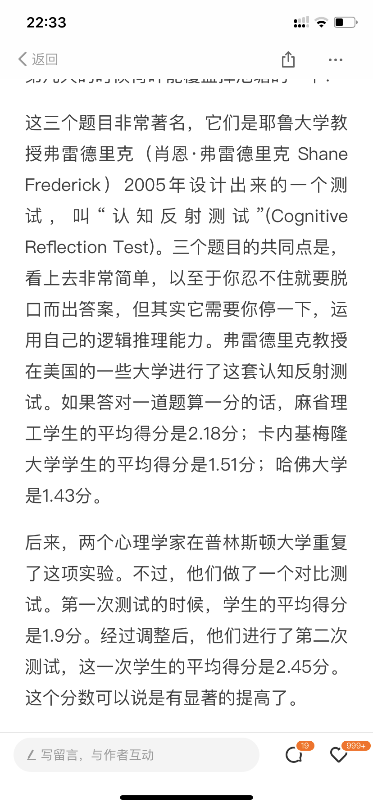

英文书精读整理系列之《Thinking, Fast and Slow》，阅读进度**11**%。

这篇文章是对Part I 第五章——**Cognitive Ease认知放松**的内容整理。 
- - - - - 
### 00 必要难度
认知放松的对立面试认知紧张。认知紧张是一个什么样的状态，了解这个词之前，请先看这个两个问题。
* If it takes 5 machines 5 minutes to make 5 widgets, how long would it take 100 machines to make 100 widgets? 
* If it takes 48 days for the patch to cover the entire lake, how long would it take for the patch to cover half of the lake? 

这是Shane Frederick’s Cognitive Reflection Test中的两题，你的答案是什么？

研究人员召集了40名普林斯顿大学的学生来做这个认知反应测试，其中有一半问卷使用的是*浅灰色*的小字。拿到这部分问卷的学生可以辨认出上面是些什么字，但这样的字体会导致他们认知紧张。当问卷上的字体清晰时，**90%**的学生至少会犯一个错误；但当字体勉强能够辨认时，他们的错误率却降到了**35%**。
是的，你没有看错：字体模糊不清时，学生的表现更好。

Cognitive strain, whatever its source, mobilizes(鼓动) System 2, which is more likely to **reject** the intuitive answer suggested by System 1. 
这是因为，无论认知紧张是由什么原因造成的，它都更有可能激发系统2来**抑制**系统1所给出的直觉性答案。

### 01 曝光效应 
It appears to be a feature of System 1 that cognitive ease is associated with good feelings.
 
As expected, easily pronounced words evoke a favorable attitude.
 正如所料，朗朗上口的单词会唤起人们的正面态度。

repetition induces cognitive ease and a comforting feeling of familiarity.
重复能引发放松状态和令人舒心的熟悉感

The famed psychologist Robert Zajonc dedicated much of his career to the study of the link *between* the repetition of an arbitrary stimulus *and* the mild affection that people eventually have for it.
著名心理学家Robert Zajonc曾潜心关注**重复**某种刺激和这一刺激最终带来的轻微情感波动之间的关系，Zajonc称之为**曝光效应**(mere exposure effect) 

有这么一个实验，在几个星期的时间里，一个类似广告的板块出现在校报的头版上，上面写着以下某个土耳其语单词: kadirga，saricik，biwonjni，nansoma，iktitaf。这些词语重复的频率各不相同，其中一个只出现过一次，另外一些分别出现过2次、5次、10次和25次。
结果令人惊奇：相比只重复了一两次的词，**受试者对那些重复次数较多的词更有好感**。
通过使用汉字、人脸和任意形状的多边形所做的实验也都再次证实了这一发现。 

曝光效应并不依赖对熟悉程度有意识的体验，事实上，曝光效应完全脱离了意识，当重复的单词或图片迅速闪过，快到观察者根本没有意识到看见它们时，观察者同样还是更为喜欢重复率高的单词或图片。

Indeed, the **mere exposure effect** is actually stronger for stimuli that the individual never consciously sees.
事实上，当人们完全没有意识到自己看见了刺激物时，其曝光效应会更强。

 
### 02  不顺利会让你更顺利?
这个章节的结论就是：
Cognitive ease is both a cause and a consequence of a pleasant feeling.

有这么一个实验，实验人员向受试者展示一连串三个为一组的词语，这些组词语中有50%是组内的词语有一定联系的(比如*潜水、灯光、火箭*)，而其余50%的组内词语则没有什么联系(例如*梦、球、书*)。但在展示之前，他们首先让受试者花几分钟时间回想一下自己生活中那些快乐或是悲伤的片段，这个回想的过程使一些受试者感到快乐，而让另外一些人感到悲伤。然后，实验人员要求受试者快速按下两个键中的一个来表明词语是否有共同联系，按键时间限定在两秒以内。如此短的时间内，这些受试者根本无法找到问题的答案。

这个实验带来了很多惊人的发现。
* 第一个令人惊讶的地方是，参与上述实验的受试者猜测所给问题答案的准确率要比他们随便选出答案的准确率高很多。 
* 另一个重大发现是，人的心情在这项直觉性任务中产生了重要影响。
心情显然能够影响系统1的运行：当我们不舒服和不开心时，就会丧失自己的直觉。

A happy mood loosens the control of System 2 over performance: when in a good mood, people become more intuitive and more creative but also less vigilant and more prone to logical errors. Here again, as in the mere exposure effect, the connection makes biological sense.
这些发现进一步证实，好心情使系统2放松对行为的控制：
当人们心情好时，直觉和创造力会增强，但也会放松警惕，易犯逻辑性错误，这种关联与曝光效应一样，在生理上也讲得通。

 A good mood is a signal that things are generally going well, the environment is safe, and it is all right to let one’s guard down. 
好心情是事情进展顺利的信号，周围的环境是安全的，卸下防备并没有什么影响；

A bad mood indicates that things are not going very well, there may be a threat, and vigilance is required. 
坏心情则说明事情进展不那么顺利，有可能存在威胁，必须要保持警觉。

Cognitive ease is both a cause and a consequence of a pleasant feeling.
认知放松与愉快的感觉互为因果。

我们为什么要搞懂这些东西呢？
其中一个点是，如果我们稍微增加必要难度，反而有助于我们更加集中注意力， 进而增加对事情的理解。

- - - - - 
[什么样的信息更容易让人信服](https://mp.weixin.qq.com/s/r0bX5x-VTu95XL4vILBADQ)
[你听说过「启动效应」吗？](https://mp.weixin.qq.com/s/fEMaqPtAoj6-ymWiz3jPEg)
[若注意力是种货币，那你要买些什么样的产品呢](https://mp.weixin.qq.com/s/rNA7JC2EvY4Xqqrf8lbCCg)
[封面图中的两根线一样长吗？](https://mp.weixin.qq.com/s/p2m1JIds49NOp3qUAJ1b0A)
[直觉思维真的不准确吗？](https://mp.weixin.qq.com/s/n6zxKsNZpYGvps5SUyU-hg)

后台回复"**TFS**"获取《思考快与慢》中英电子书资源。

