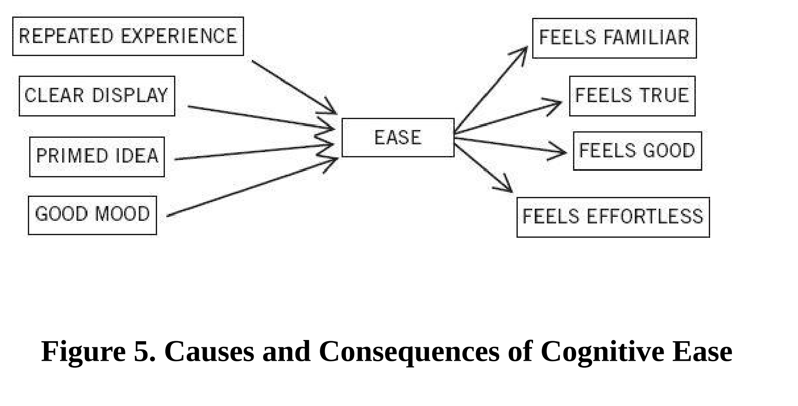
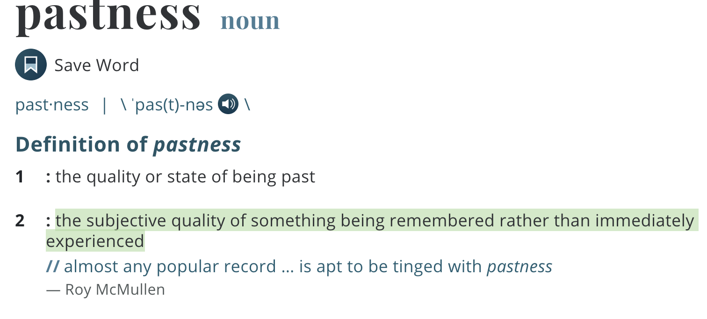
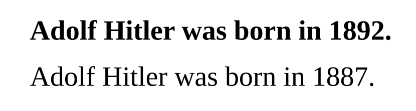

英文书精读整理系列之《Thinking, Fast and Slow》，阅读进度**11**%。

- - - - - 
这篇文章是对Part I 第五章——**Cognitive Ease认知放松**的内容整理。 
**Cognitive Ease**, otherwise known as Cognitive Fluency, is quite simply the ease with which our brain processes information; this quality impacts how **positively** (or **negatively**) we feel about something.

# 第五章 你的直觉有可能只是错觉
- - - - - 
在头脑清醒的时候——甚至在思绪并不那么清晰的时候——你的大脑一直在进行着多重运算，这些运算可以保留和更新一些关键问题的答案。例如：
Is anything new going on? 
Is there a threat? 
Are things going well? 
Should my attention be redirected? 
Is more effort needed for this task?

* 反复的体验
* 清楚的示范
* 预知的想法
* 好心情
* 感到熟悉
* 感觉真实
* 感觉良好
* 感觉毫不费力

Hearing a speaker when you are in a good mood, or even when you have a pencil stuck crosswise in your mouth to make you “smile,” also induces **cognitive ease**.
听别人说话时，如果心情好，或者**咬一支笔迫使自己“笑”**，都能使认知放松。 (在整理这段时，我已经模拟这个动作好几次了，还是很有效果的，你也可以试试呀)。
认知放松状态下，人们会更加倾向喜欢亲眼所见的事，相信亲耳所闻，相信直觉。当时的状态是舒适而熟悉的。当然，当下的的想法也可能是相对随意、肤浅的。

Conversely, you experience **cognitive strain** when you read instructions in a poor font, or in faint colors, or worded in complicated language, or when you are in a bad mood, and even when you frown.
反之，若说明书印刷模糊，颜色浅，句子冗长，语言晦涩，也许心情也不好，甚至在皱眉，这些情形都会使人处于认知紧张状态。
认知紧张状态下，人们更加警惕和多疑，会对手头上的事情投入更多精力，感觉局促，较少犯错，但人的直觉和创造力相较平时会下降。

### 01 Illusions of Remembering  由记忆造成的错觉 
错觉这个词会让人马上联想到视错觉，因为我们都很熟悉那些令人产生误解的图片。不过，并不是只有视觉才会产生错觉，记忆也容易产生错觉，并且这种现象更加普遍。

Jacoby nicely stated the problem: “The experience of familiarity has a simple but powerful quality of ‘**pastness**’ that seems to indicate that it is a direct reflection of prior experience.”

Jacoby巧妙地阐述了这个问题：“熟悉感有着简单而又强烈的‘不可复返性’，这种‘不可复返性’似乎说明这种感觉是对过往经历的一种直接反应。”。

This quality of pastness is an illusion.
这一特性便是错觉

In short, you experience greater cognitive ease in perceiving a word you have seen earlier, and it is this sense of ease that gives you the impression of familiarity. 
简而言之，当你指认一个早已见过的词语时，会感到更加放松。正是这种放松使你产生了那种熟悉的感觉。

As figure 5 indicates, the various ways of inducing cognitive ease or strain are interchangeable; you may not know precisely what it is that makes things cognitively easy or strained. This is how the illusion of familiarity comes about. 
正如上面那个图指出的那样，引发认知放松和认知紧张的各种方法是可以相互转换的。你可能并不十分清楚是什么让认知更为放松或更为紧张。这也是熟悉感造成错觉的原因。 

### 02 Illusions of Truth  什么样的信息更容易让人信服 
 *“New York is a large city in the United States.” 
“The moon revolves around Earth.” 
“A chicken has four legs.” *
大部分人读完这几个句子，马上就知道了答案，前两个是true，最后一个是false

Note, however, that the statement “A chicken has **three** legs” is more obviously false than “A chicken has **four** legs.” 
然后，如果将最后一句*四*改成*三*，答案会更加显而易见。因为我们知道很多动物都是四条腿，鸡是动物，这过程产生了熟悉的感觉。

系统1让人产生熟悉感，系统2依靠系统1产生的这种熟悉感来作出正误判断。
 
If a judgment is based on an impression of cognitive ease or strain. Anything that makes it easier for the associative machine to run smoothly will also bias beliefs.
如果某个判断是基于认知放松或认知紧张作出的，那就一定会造成错觉。任何能使联想机制运行更轻松、更顺利的事物都会使我们心生偏见。

那么，**有没有什么方法可以让信息更加容易让人信服呢**？

**方法1：** 重复
A reliable way to make people believe in falsehoods is **frequent repetition**, because familiarity is not easily distinguished from truth. 
想让人们相信谬误有个可靠的方法，那就是不断重复，因为人们很难对*熟悉感*和*真相*加以区别。
 
**方法2：**使用更加清晰的字迹，使用亮蓝色或红色标记
The general principle is that anything you can do to reduce cognitive strain will help, so you should first **maximize** legibility(清晰度). Compare these two statements:
这些建议总的原则是，任何缓解认知紧张的做法都会对你有所帮助，所以，你首先应该让字迹更清晰。

Both are **false** (Hitler was born in 1889), but experiments have shown that the first is more likely to be believed.
 
More advice: 
* if your message is to be printed, use high-quality paper to maximize the contrast between characters and their background. 
* If you use color, you are more likely to be believed if your text is printed in bright blue or red than in middling shades of green, yellow, or pale blue.

**方法3：**用简单句，别用复杂句
If you care about being thought credible and intelligent, do not use complex language where simpler language will do. 
如果你很在意自己在别人眼里是否值得信赖、是否聪明睿智，那么说话时就**言简意赅**吧，能用简单句的时候就别用复杂句。

**方法4：** 使句子押韵
In addition to making your message simple, try to make it memorable. Put your ideas in verse if you can; they will be more likely to be taken as truth. Participants in a much cited experiment read dozens of unfamiliar aphorisms, such as: 
* Woes unite foes. Little strokes will tumble great oaks. A fault confessed is half redressed.
* 危难时，敌人团结。水滴石穿，绳锯木断。亡羊补牢，为时不晚。
* Woes unite enemies. Little strokes will tumble great trees. A fault admitted is half redressed.
 * 危险团结敌人。再轻的击打也能放倒一棵大树。承认错误就相当于得救了一半。 

由上可见，押韵的格言比没有韵脚的格言显得更加深刻。 
- - - - - 
### TFS往期文章
[你听说过「启动效应」吗？](https://mp.weixin.qq.com/s/fEMaqPtAoj6-ymWiz3jPEg)
[若注意力是种货币，那你要买些什么样的产品呢](https://mp.weixin.qq.com/s/rNA7JC2EvY4Xqqrf8lbCCg)
[封面图中的两根线一样长吗？](https://mp.weixin.qq.com/s/p2m1JIds49NOp3qUAJ1b0A)
[直觉思维真的不准确吗？](https://mp.weixin.qq.com/s/n6zxKsNZpYGvps5SUyU-hg)
[如果你今年只能读一本书，就读这一本吧](https://mp.weixin.qq.com/s/OPFALfhnPDOzSxoQ2-CkIg)

后台回复"**TFS**"获取《思考快与慢》中英电子书资源。

