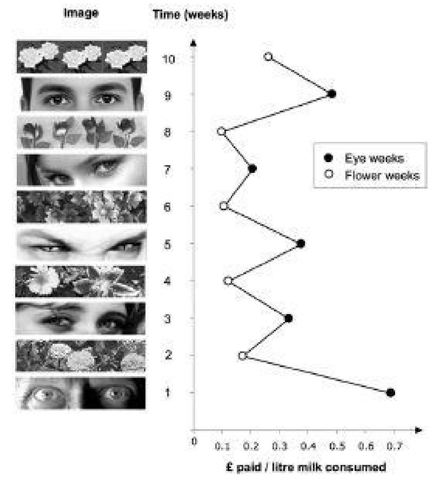

英文书精读整理系列之《Thinking, Fast and Slow》，上次更新是2020年6月21号，快两个月，从今天起，恢复阅读习惯。虽然这段时间状态不太好，压力比较大，但如果想要安排时间出来阅读和整理，肯定是有时间的，我就是**懒**！OK，我TFS的阅读进度**11**%。

- - - - - 
这篇文章是对Part I 第四章——**The Associative Machine联想机器**的内容整理。’

当你看到这两个单词时，脑海中是不是不自觉已经有了些画面？这是系统1中的自动联系的功能，这功能到底给我们生活中的行为和想法有多大的影响。

- - - - - 
### 01  The Associative Machine
看到vomit, 各种恶心的画面大脑中涌现，面部做出看不下去的表情。所有的一切都发生的很迅速。

All this happens quickly and all at once, yielding a self-reinforcing(自我强化) pattern of cognitive, emotional, and physical responses that is both diverse and integrated—it has been called **associatively coherent(连贯一致的)**.

The mechanism that causes these mental events has been known for a long time: **it is the association of ideas**.
自动联想是各种想法的结合。

In An Enquiry Concerning Human Understanding, published in 1748, the Scottish philosopher David Hume reduced the principles of association to three: resemblance, contiguity in time and place, and causality.
苏格兰哲学家大卫·休谟(David Hume)在1748年发表的《关于人类理解的探究》中将**联想**原则简化为三个：相似性、时间和地点的连续性以及因果关系。

Furthermore, only a few of the activated ideas will register in consciousness; most of the work of associative thinking is silent, hidden from our conscious selves. 
此外，只有少数被激活的思想会在意识中注册；联想思维的大部分工作是无声的，隐藏在我们的意识自我中。

The notion that we have limited access to the workings of our minds is difficult to accept because, naturally, it is alien to our experience, but it is true: 
**you know far less about yourself than you feel you do.**
我们对思维活动的了解是有限的，这是很难接受的，因为这自然与我们的经历格格不入，但这是真的：**您对自己的了解远不如你所想。**

### 02 The Marvels of Priming
If you have recently seen or heard the word EAT, you are temporarily more likely to complete the word fragment *SO_P* as SOUP than as *SOAP*.
如果你刚刚听到了一个单词EAT, 如果让你去完成填空这个单词SO_P, 你会填写什么？

We call this a **priming effect** and say that the idea of EAT **primes** the idea of SOUP, and that WASH **primes**(启动) SOAP. 

> **Priming** is a phenomenon whereby exposure to one stimulus influences a response to a subsequent stimulus, without conscious guidance or intention
> 启动是一种现象，暴露在一个刺激下会影响对后续刺激的反应，并且不需有意识的引导或意图

给人看一些老年主题的词(forgetful, bald, gray, or wrinkle)，甚至都没看old类似的单词，人走出实验室时会比较慢。
As Bargh had predicted, the young people who had fashioned a sentence from words with an elderly theme walked down the hallway significantly more slowly than the others.

The ideomotor link also works in reverse. 
意识形态的联系也反过来起作用。

在德国一所大学进行的一项研究与Bargh和他的同事在纽约进行的早期实验如出一辙。学生们被要求以每分钟30步的速度在房间里走5分钟，这大约是他们正常速度的三分之一。在这段短暂的经历之后，受试者更快地识别出与老年有关的词汇，如健忘、老年和孤独( forgetful, old, and lonely)。

**Reciprocal**(相互的) **priming** **effects** tend to produce a coherent reaction: if you were primed to think of old age, you would tend to act old, and acting old would reinforce the thought of old age.
相互的启动效应往往会产生一个连贯的反应：如果你被引导去思考老年，你会倾向于表现出变老，而变老会强化对老年的想法。

Reciprocal links are common in the associative network. For example, being amused tends to make you smile, and smiling tends to make you feel amused.

Simple, common gestures can also unconsciously influence our thoughts and feelings.
简单和普通的姿势也会不知不觉地影响我们的思想和情感。在一次演示中，人们被要求通过新的耳机听信息。他们被告知实验的目的是测试音频设备的质量，并被要求反复移动头部以检查声音是否有任何扭曲。一半的参与者被要求上下点头，其他人则被要求左右摇晃。他们听到的信息是电台社论。点头的人倾向于接受他们听到的信息，而摇头的人则倾向于拒绝。

You can see why the common admonition to “**act calm and kind regardless of how you feel**” is very good advice: you are likely to be rewarded by actually feeling calm and kind. 
你可以理解为什么“不管你的感受如何，都要表现得冷静和友善”这句俗语是很好的建议：你很可能会因为真正感到平静和善良而得到回报。 

###03 Primes That Guide Us
对primming的研究是从最初的一些例子中得出的：提醒人们年老会使他们走得更慢。我们现在知道，primming的影响可以渗透到我们生活的每一个角落。
We now know that the effects of priming can reach into every corner of our lives.

在一项实验中，参与者被诱导在电话或电子邮件中对假想的人撒谎。在随后的一项对各种产品可取性的测试中，在电话里撒谎的人比肥皂更喜欢漱口水，在电子邮件中撒谎的人更喜欢肥皂而不是漱口水。当我向听众描述primming研究时，反应往往是不可信的。

The evidence of priming studies suggests that reminding people of their mortality increases the appeal of authoritarian ideas, which may become reassuring in the context of the terror of death. 
其他实验证实了弗洛伊德关于符号和隐喻在无意识联想中的作用的见解。例如，考虑模糊的单词片段W_uh和S_up。最近被要求思考一个他们感到羞耻的行为的人更有可能完成这些片段作为WASH和SOAP，而不太可能看到WISH和SOUP。此外，仅仅是想刺伤同事的后背，人们更倾向于购买肥皂、消毒剂或洗涤剂，而不是电池、果汁或糖果。感觉自己的灵魂被玷污，似乎触发了净化自己身体的欲望，这种冲动被称为“Lady Macbeth effect(麦克白夫人效应)”

Priming phenomena arise in System 1, and you have no conscious access to them.
在一所英国大学的一间办公室厨房里针对启动效应做的一个实验完美阐释了这个观点。许多年来，该办公室的工作人员都会把钱投到“Honesty Box”里，为他们白天自助购买的茶或咖啡买单。有一天，在价目表的正上方有一张横幅海报，没有任何警告或解释。在长达十周的时间里，每周都会出现一幅新的图像，无论是花朵还是眼睛，似乎都在直视观察者。没有人对新的装饰品发表评论，但对诚实盒子的贡献却发生了显著变化。

在实验的第一周，海报中的两只睁大眼睛盯着喝咖啡或喝茶的人，他们的平均贡献是每升牛奶70便士。在第二周，海报上会有鲜花，平均捐款下降到15便士左右。这种趋势还在继续。平均而言，厨房用户在“眼周”中的贡献几乎是“花周”的三倍。显然，一个纯粹象征性的被观察提醒会促使人们改善行为。

心理学家蒂Timothy Wilson写过一本书，书名叫《Strangers to Ourselves》，You have now been introduced to *that stranger in you*, which may be in control of much of what you do, although you rarely have a glimpse of it. 

**System 1** provides the impressions that often turn into your beliefs, and is the source of the impulses that often become your choices and your actions. 
系统1提供的印象往往变成你的信念，是冲动的来源，而这些冲动往往成为你的选择和行动。

It offers a tacit(心照不宣的) interpretation of what happens to you and around you, linking the present with the recent past and with expectations about the near future. It contains the model of the world that instantly evaluates events as *normal* or *surprising*. 
它为你和你周围发生的事情提供了一个默契的解释，将现在与最近的过去联系起来，并与对不久的未来的期望联系起来。它包含了一个世界模型，可以立即将事件评估为正常或意外。

- - - - - 
很多时候，我们的行为和想法被周边的各种各样信息所影响，并且很多时候还没能意识到处在一个你不想要的信息洪流中。所以如果不想被牵着鼻子走，主动为自己创建一些想看的画面和信息圈子。
- - - - - 
### TFS往期文章
[若注意力是种货币，那你要买些什么样的产品呢](https://mp.weixin.qq.com/s/rNA7JC2EvY4Xqqrf8lbCCg)
[封面图中的两根线一样长吗？](https://mp.weixin.qq.com/s/p2m1JIds49NOp3qUAJ1b0A)
[直觉思维真的不准确吗？](https://mp.weixin.qq.com/s/n6zxKsNZpYGvps5SUyU-hg)
[如果你今年只能读一本书，就读这一本吧](https://mp.weixin.qq.com/s/OPFALfhnPDOzSxoQ2-CkIg)

后台回复"**TFS**"获取《思考快与慢》中英电子书资源。