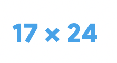
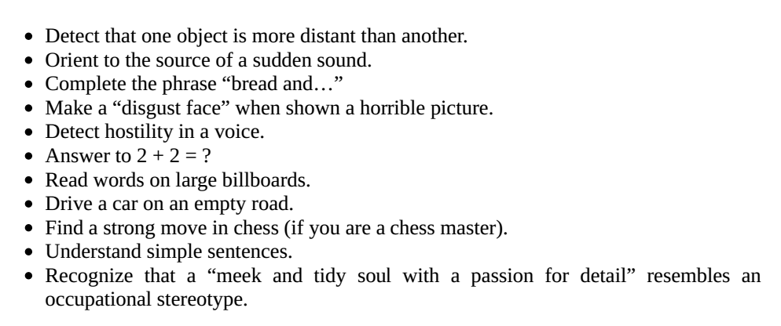
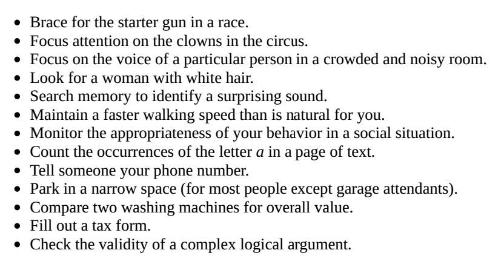
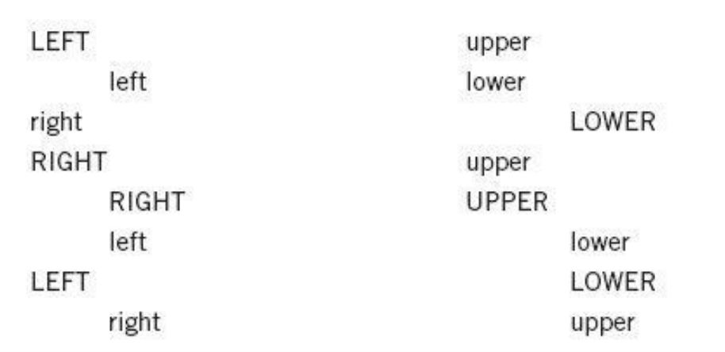
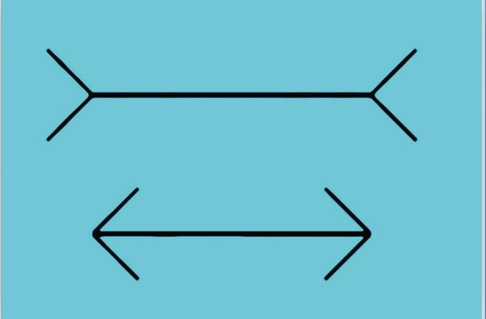

英文书精读整理系列之《Thinking, Fast and Slow》，阅读进度**7%**。
- - - - - 
这篇文章是对第一章——**The Characters of the Story**的内容整理。主要是学习和认识大脑中的两个系统，什么情况下用到系统1？什么情况下用到系统2？系统1和系统2是怎么合作的？文章中提供了一个好玩的小游戏，可以去试玩下。
重点英文段落，如果可以请大声阅读一遍：
**System 1 has biases**, however, systematic errors that it is prone to make in specified circumstances. As we shall see, it sometimes answers easier questions than the one it was asked, and **it has little understanding of logic and statistics**.

- - - - - 
### 系统1 和 系统2 
请看下面这个图，你脑海中想到了什么？

你可能迅速地确定她的头发是深色的，她看起来很生气，并且你可能会推测她马上要说一些刻薄话，也许声音又大又刺耳等等。
这张照片跟你的过去没有任何关系，但对这照片可以迅速产生这些印象，这是快思考的例子。

再看下面这个算式：

你能立刻知道这是一道乘法题，也许你还会想到若有纸笔，就能算出答案。如果按部就班的运算过程便是慢思考，这种计算不仅是大脑活动，身体也会参与其中，在计算时你的肌肉会紧张，血压会上升，心跳会加速。

> When we think of ourselves, we identify with **System 2**, the conscious, reasoning self that has beliefs, makes choices, and decides what to think about and what to do. Although System 2 believes itself to be where the action is, the automatic System 1 is the hero of the book.

系统1的运行是无意识且快速的，不怎么费脑力，没有感觉，完全处于自主控制状态。其诸多能力当中包括一些与生俱来的能力，这些能力与其他动物的本能一样。我们生来就能感知周围的世界，能够认识事物，可以集中注意力，会规避风险，会害怕蜘蛛，思维时快时慢。

系统2将注意力转移到需要费脑力的大脑活动上来，例如复杂的运算。其运作通常与行为、选择和专注等主观体验相关联，高度多样化，但所有这些运作方式都有一个共同特征：都需要集中注意力，如若注意力分散，运作也会随之中断。

在上述各种场景中，我们都必须集中注意力。若是没有准备好或者没有将注意力集中到正在做的事情上，表现就会差强人意。

就像我们不能一边开车向左转入路线复杂的道路，一边计算“17×24”一样，两者无法兼做。

但我们可以同时做几件事情，但前提是这些事简单易懂，我们可以在空旷的高速公路上一边开车一边和别人交谈而不出事故。

### 系统1遇到麻烦，系统2会出面解决
> System 1 continuously generates suggestions for System 2: impressions, intuitions, intentions, and feelings. If endorsed by System 2, impressions and intuitions turn into beliefs, and impulses turn into voluntary actions. When all goes smoothly, which is most of the time, System 2 adopts the suggestions of System 1 with little or no modification. You generally believe your impressions and act on your desires, and that is fine—usually.

系统1不断为系统2提供印象、直觉、意向和感觉等信息。如果系统2接收了这些信息，则会将印象、直觉等转变为信念，将冲动转化为自主行为。

> When System 1 runs into difficulty, it calls on System 2 to support more detailed and specific processing that may solve the problem of the moment.

当系统1的运行遇到阻碍时，便会向系统2寻求支持，请求系统2给出更为详细和明确的处理方式来解决当前问题。系统2还会起到**持续监督**你自身行为的作用——有了它，你在生气时也能保持应有的礼节；有了它，你在夜晚开车时也能保持警惕。

>**System 1 has biases**, however, systematic errors that it is prone to make in specified circumstances. As we shall see, it sometimes answers easier questions than the one it was asked, and **it has little understanding of logic and statistics**.

系统1存在成见，在很多特定的情况下，这一系统易犯系统性错误。你会发现这个系统有时候会将原本较难的问题作简单化处理，对于逻辑学和统计学问题，它几乎一无所知。系统1还有一个更大的局限，即我们无法关闭它。

###  两系统之间的冲突
>You experienced a conflict between a task that you intended to carry out and an automatic response that interfered with it.

为了理解系统2的另一个作用，先看下面的图，试图完成这2个小任务：
第一个任务，浏览下面图中的文字，说出每个单词是大写还是小写；第二个任务，说出每个单词的位置，如果单词位置偏左，就说“left”，偏右就说“right”。

这是个英文游戏，因为左右是left和right，大小写是lowercase和uppercase。理论上，第一个任务确认大小写的时候，右边列的单词会更难些，第二个任务确认左右的时候，左边那列的单词会更难些。

通常情况下，可以正确地完成任务，但战胜脑中两种相互冲突的反应会造成压力，使你的速度减缓。

我们差不多都有过这样的经历：在餐厅里，自己的邻座是一对穿着怪异的夫妻，但我们会尽量不去盯着他们看。

>One of the tasks of System 2 is to overcome the impulses of System 1. In other words, System 2 is in charge of self-control.

系统2的众多任务中就包括抑制系统1产生的这些冲动。换句话说，**系统2负责人们的自我控制**。

### 怎么避免直觉错觉
为了理解系统1的自主性以及印象和信念的区别，请你仔细看这个图：

两条不同长度的水平线，两端有朝向不同方向的箭头，并且上面一条线明显比下面那条线长。这是大部分人看到的东西。

如果你曾经见过这幅图，就会认出这便是那幅著名的缪勒–莱耶错觉图，要证实这一错觉很简单，只要找把尺子量一量，就会发现其实两条水平线是等长的。

>To resist the illusion, there is only one thing you can do: you must learn to mistrust your impressions of the length of lines when fins are attached to them. 
>To implement that rule, **you must be able to recognize the illusory pattern** and recall what you know about it. If you can do this, you will never again be fooled by *the Müller-Lyer illusion*. But you will still see one line as longer than the other.

脑海中多了一个信念：这两条线是等长的。但肉眼看到的就是上面那条线更长。想要消除这种错觉，就必须要学会怀疑自己的感觉。

系统1是自主运行的，我们无法阻止，因此直观思维所导致的错误常常难以避免。系统2可能对系统1产生的错误可能也毫无所知，即使有，也需要时刻保持警惕，这样不太实际，这样的生活也不好玩。

>The best we can do is a **compromise**: learn to recognize situations in which mistakes are likely and try harder to avoid significant mistakes when the stakes are high. The premise of this book is that it is easier to recognize other people’s mistakes than our own.

最好的解决办法就是妥协：学会区别常会出现重大错误的情境，多多阅人阅书，因为发现别人的错误总比发现自己的错误更容易。

