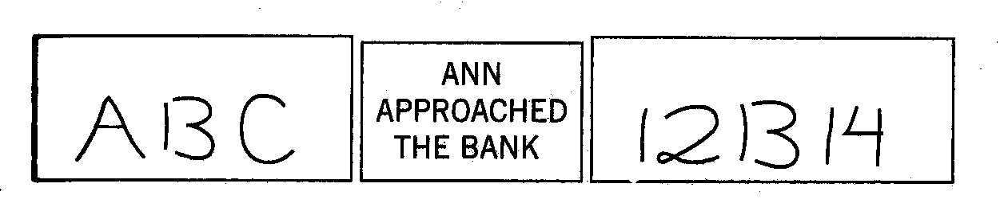

英文书精读整理系列之《Thinking, Fast and Slow》，阅读进度**11**%。

这篇文章是对Part I 第六章——**A Machine for Jumping to Conclusions**的部分内容整理。 
# A Machine for Jumping to Conclusions 
#过早下结论的机器
* Neglect(忽视) of Ambiguity and Suppression of Doubt
* A Bias to Believe and Confirm
* Exaggerated Emotional Coherence (Halo Effect)
* What You See is All There is (Wysiati)

- - - - - - 

三个方框的内容有何共同点？答案是，**它们全都有歧义**。
你几乎可以确定地读出左边方框内所呈现的内容是“ABC”，右边是“121314”，但这两个方框的中间那部分内容是一模一样的。你本可以将它们看做是“*A13C*”和“*12B14*”的，但你却没有这样做。这是为什么呢？

The same shape is read as a letter in a context of letters and as a number in a context of numbers. The entire context helps determine the interpretation of each element. The shape is ambiguous, but you jump to a conclusion about its identity and do not become aware of the ambiguity that was resolved.
那是因为，同样的形状在字母的环境下就容易被看做是字母，在数字的环境下就容易被看做是数字。完整的环境能帮助你理解其中的每一个因素。那个形状是会引发歧义的，但你过早地对它的“身份”下了结论，并且根本意识不到你已经赋予了某种歧义以解释。

“Ann approached the bank.”这个句子同样有歧义。第一种解释是，Ann正走入银行。如果在这个句子之前有“他们沿着这条河缓缓地漂向下游”这样一句话，你就会想到一个完全不同的场景。当你一直在想河流的问题时，“bank”(这个单词有“岸边”和“银行”两个意思)这个单词就与钱没什么联系了。

**在没有清晰情境的情况下，系统1会自行建立一个可能的情境**。

你作了一个确切的选择，但自己却没有意识到自己这样做了。

 Only one interpretation came to mind, and you were never aware of the ambiguity
你的脑海中出现的只有一种解释，而且你从未意识到这些问题会有歧义。

System 1 does not keep track of alternatives that it rejects, or even of the fact that there were alternatives. 
系统1不会记得自己放弃的几个选项，甚至都不记得曾有过多种选择。

Conscious doubt is not in the repertoire of System 1; it requires **maintaining incompatible interpretations** in mind at the same time, which demands **mental effort**. Uncertainty and doubt are the domain of System 2.
有意识的怀疑需要同时在脑中**记住多种互不相容的解释**，需要付出**努力**，而这并不是系统1的长项。易变和怀疑是系统2的职责范围。
 
###1 是什么让你相信了那些荒谬之词？ 
**1.1、先知道，再怀疑**
心理学家Daniel Gilbert因著有《哈佛幸福课》一书而广为人知。
>Gilbert proposed that understanding a statement must begin with **an attempt to believe it**: 
>you must first know what the idea would mean if it were true. Only then can you decide whether or not to unbelieve it. 

Gilbert提出，在理解一个陈述之前，一定会先试图相信它。只有这样，你才能决定是否“怀疑”它。

The initial attempt to believe is an automatic operation of System 1, which involves the construction of the best possible interpretation of the situation.
吉尔伯特认为，即使是一个毫无意义的陈述也会唤起人们最初的信任。你试试他给出的例子：
>Whitefish eat candy 白鱼吃糖果

你有可能意识到一个关于鱼和糖果的模糊印象，这个印象的产生过程，就是联想记忆自动搜索“鱼”和“糖果”这两个概念之间各种联系的过程，这一过程会使这种很荒唐的说法看起来竟有些道理了。

**1.2、系统2有点懒**
>System 1 is gullible(易受骗的) and biased to believe, System 2 is in charge of doubting and unbelieving, but System 2 is sometimes **busy**, and often **lazy**. 
>Indeed, there is evidence that people are more likely to be influenced by empty persuasive messages, such as commercials, when they are tired and depleted.

有证据显示，当人们劳累或是精力耗尽时，更容易受那些空洞却有说服力的信息影响，例如广告。
 
**1.3、确认偏误**
The operations of associative memory contribute to a general **confirmation bias**. 
联想记忆的运作是导致“确认偏误”的原因之一。 

When asked, “*Is Sam friendly*?” different instances of Sam’s behavior will come to mind than would if you had been asked “*Is Sam unfriendly*?”
如果有人问你：“Sam友好吗？”你就会想到山姆的各种行为举止；而如果有人问你：“Sam是不是很不友好？”你就很难想起他的许多举动。

The confirmatory bias of System 1 favors uncritical acceptance of suggestions and exaggeration of the likelihood of extreme and improbable events. 
系统1产生的确认偏误不加批判地接受了建议，夸大了极端的可能性以及不可能的事件。

If you are asked about the probability of a *tsunami* hitting California within the next thirty years, the images that come to your mind are likely to be images of tsunamis, in the manner Gilbert proposed for nonsense statements such as “whitefish eat candy.” You will be prone to overestimate the probability of a disaster.
如果被问及*海啸*在今后30年内袭击加州的可能性有多大，你脑中所呈现的图像很有可能就是海啸，**你会更容易高估出现灾难的可能性**。这就如同看到同吉尔伯特提出的那些类似“白鱼吃糖果”这种无意义的陈述时产生的反应一样。

### 2 光环效应与群体的智慧
**2.1、 什么是光环效应**
The tendency to like (or dislike) everything about a person—including things you have not observed—is known as the halo effect.
喜爱（或讨厌）某个人就会喜爱（或讨厌）这个人的全部—包括你还没有观察到的方面—这种倾向就叫做光环效应。

Solomon Asch的一个实验堪称心理学实验中不朽的经典。他对两个人进行了描述，并要求其他人对这两人的个性进行评论。你认为艾伦和本这两人怎么样？
>Alan: intelligent—industrious—impulsive—critical—stubborn—envious 
>Ben: envious—stubborn—critical—impulsive—industrious—intelligent

艾伦：聪明—勤奋—冲动—爱挑剔—固执—忌妒心强
本：忌妒心强—固执—爱挑剔—冲动—勤奋—聪明

如果你像我们一样，你就会更喜欢艾伦一些。前几条列出的性格特征会改变后面出现的特征的含义。我们认为聪明人有理由固执，并且还会尊重他这一点。然而，一个忌妒心强又固执的人如果还很聪明的话，他身上就带有一些危险性。

**2.2、光环效应可以化解歧义**
The halo effect is also an example of suppressed ambiguity: like the word bank, the adjective stubborn is ambiguous and will be interpreted in a way that makes it coherent with the context.
如同“bank”这个单词一样，“固执”这个形容词也是有歧义的，但将它放在一定情境中歧义便会被化解。我们对一个人性格特征的观察顺序是随机的。然而，顺序的确很重要，因为光环效应注重**第一印象**，而后续信息在很大程度上都被消解掉了。

**2.3 如何消除光环效应中带来的偏见**
为了避免光环效应中化解歧义现象，我们可以遵循一个普遍原则：**消除错误的关联(decorrelate error! )**！

To understand how this principle works, imagine that a large number of observers are shown glass jars containing pennies and are challenged to estimate the number of pennies in each jar.
为了了解这一原则的工作原理，我们设想一下：向大量观察者展示一些装有硬币的玻璃罐，让他们估计一下每一个罐里硬币的数量。James Surowiecki在他最为畅销的著作《群体的智慧》一书中解释道：
>Some individuals greatly overestimate the true number, others underestimate it, but when many judgments are averaged, the average tends to be quite accurate.
>一个人单独完成这个任务的效果并不理想，但**一群人共同作出判断时准确率就很高**。

企业高管需要花大量时间主持会议，独立判断原则(及解除错误关联)可以直接应用到这些工作中。
一条简单的规则就能发挥作用：
>Before an issue is discussed, all members of the committee should be asked to write a very brief summary of their position.
>在开始讨论某个问题之前，先让与会的每一位成员各自写下简短的意见阐明自己的观点。

这个过程很好地利用了小组里不同知识和见解的价值。而开放性讨论这一常规做法总会注重那些发言早而又强势的人的意见，使得其他人一味附和他们的观点。 

### 眼见为实的想法往往让我们仓促作出决定
>“Will Mindik be a good leader? She is intelligent and strong…” 
>Mindik会是一个出色的领导吗？她聪明又坚强……

你的脑海中一定会马上闪现出一个答案—“当然会”。你根据非常有限的信息选择了一个最佳答案，但是你却行动过早。试想一下，如果紧随其后的两个形容词是“腐败“和”严酷“，你该怎么办？

Jumping to conclusions on the basis of limited evidence is so important to an understanding of intuitive thinking, and comes up so often in this book, that I will use a cumbersome(笨重的) abbreviation for it: **WYSIATI**, which stands for **what you see is all there is**. 
在**证据不足**的情况下过早下结论对我们理解直觉性思考非常有帮助，本书也常提到这样的情况，我将会用一个冗长的缩写来代表这种情形：WYSIATI，意思为“What you see is all there is”，即眼见即为事实。

System 1 is radically insensitive to both the quality and the quantity of the information that gives rise to impressions and intuitions.
系统1基本上对于引起印象和直觉的信息的质量和数量都**不敏感**。

WYSIATI *facilitates* the achievement of coherence and of the cognitive ease that causes us to accept a statement as true. 
眼见即为事实的理念*有助于*达成连贯性和认知放松的状态，从而使我们相信某个陈述是真实的。然而，信息匮乏是常事，一旦出现这种情况，系统1则会仓促作出结论。 这些结论往往存在偏见，背后的原因有：
* **过于自信(Overconfidence)** ：我们经常考虑不到自己有可能尚未掌握对判断起决定性作用的那份证据，却总是认为眼见即为事实
* **框架效应(Framing effects)**：“手术后一个月内的存活率是90%”的说法要比“手术后一个月的死亡率是10%”更令人安心。
* **比率忽略(Base-rate neglect)**：回忆一下那个本性怯懦、做事井井有条常被看做图书管理员的史蒂夫，尽管事实是男性农民比男性图书管理员多，但这事实很容易被忽略。

- - - - - 
[简的钱包是怎么丢的呢？](https://mp.weixin.qq.com/s/9sCeCLwd7x487ts8M78XnA)
[不顺利会让你更顺利?](https://mp.weixin.qq.com/s/_dumE8sgctQXKTqUuUmYEg)
[什么样的信息更容易让人信服](https://mp.weixin.qq.com/s/r0bX5x-VTu95XL4vILBADQ)
[你听说过「启动效应」吗？](https://mp.weixin.qq.com/s/fEMaqPtAoj6-ymWiz3jPEg)
[若注意力是种货币，那你要买些什么样的产品呢](https://mp.weixin.qq.com/s/rNA7JC2EvY4Xqqrf8lbCCg)

后台回复"**TFS**"获取《思考快与慢》中英电子书资源。