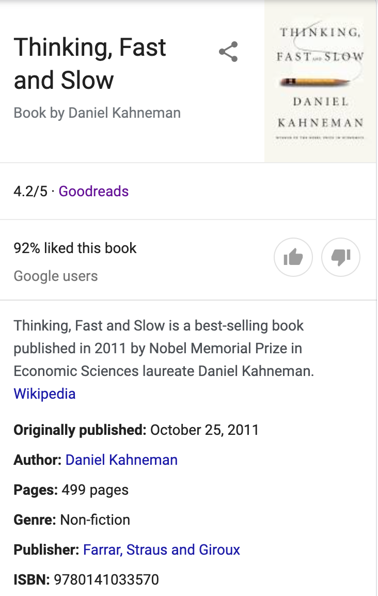
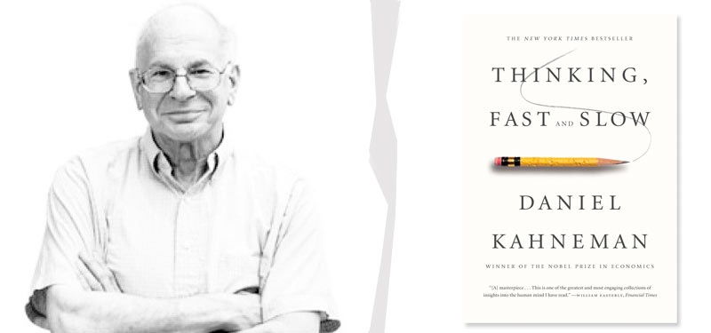
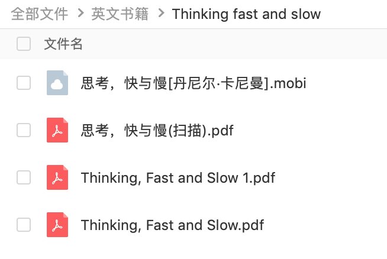

英文书精读整理系列之《Thinking, fast and slow》
>**Thinking, Fast and Slow** is a best-selling book published in 2011 by Nobel Memorial Prize in Economic Sciences laureate Daniel Kahneman. It was the 2012 winner of the National Academies Communication Award for best creative work that helps the public understanding of topics in behavioral science, engineering and medicine.
> 
>The book summarizes research that Kahneman conducted over decades, often in collaboration with Amos Tversky. It covers all three phases of his career: 
> 1) his early days working on **cognitive biases**, 
> 2) his work on **prospect theory**, 
> 3) and his later work on **happiness**. [not verified in body]

###  内容目录
英文书籍全书是499页，包括5个部分，共38个章节，我计划是2个月来完成这本书的阅读。
*Part I. Two Systems*
第一部分 系统1，系统2
*Part II. Heuristics and Biases*
第二部分 启发法与偏见
*Part III. Overconfidence*
第三部分 过度自信与决策失误
*Part IV. Choices*
第四部分 选择与风险
*Part V. Two Selves*
第五部分 两个自我

### 谁写的

Daniel Kahneman(丹尼尔·卡尼曼)是位格外令人兴致盎然的思想家。作为一名心理学家，他因其与Amos Tversky(阿莫斯·特沃斯基)在决策制定上的研究而荣获了2002年度的诺贝尔经济学奖。下面是美国哈佛大学心理学教授史蒂文·平克对他及《思考，快与慢》的评价：
>丹尼尔·卡尼曼是历史上最有影响力的心理学家之一，也必然是现今在世的最重要的心理学家。他在揭示人类思维的显著特征方面很有天赋，多数研究成果成为了经典的教材和引用频率很高的至理名言。他的研究打开了社会心理学、认知科学、对理性与幸福的研究，以及他和他的合作者阿莫斯?特沃斯基共同推动的行为经济学的新局面。《思考，快与慢》的问世是个重磅事件。

### 讲了啥
在书中，卡尼曼会带领我们体验一次思维的终极之旅。他认为，我们的大脑有快与慢两种作决定的方式。常用的无意识的“系统1”依赖情感、记忆和经验迅速作出判断，它见闻广博，使我们能够迅速对眼前的情况作出反应。但系统1也很容易上当，它固守“眼见即为事实”的原则，任由损失厌恶和乐观偏见之类的错觉引导我们作出错误的选择。有意识的“系统2”通过调动注意力来分析和解决问题，并作出决定，它比较慢，不容易出错，但它很懒惰，经常走捷径，直接采纳系统1的直觉型判断结果。

为了使读者真切体会到系统1和系统2这两个主角的特点，卡尼曼介绍了很多经典有趣的行为实验，指出我们在什么情况下可以相信自己的直觉，什么时候不能相信；指导我们如何在商场、职场和个人生活中作出更好的选择，以及如何运用不同技巧来避免那些常常使我们陷入麻烦的思维失误。

### 为什么要读
50 年前，人们以为我们能驾驭自己的思想。但事实上，我们的行为常常受到许多无法看见的因素所影响。我们虽然身处生活这场游戏之中，但对游戏的机制却不理解，偏见常常导致我们追求错误的东西。我们的感知和记忆并不可靠，对于自己心理状态的感知和记忆尤其不可靠。

关于人类自身还有许多未知之谜，对于自己，我们了解得其实不多。卡尼曼就如思想的拓荒者，他的研究成果为我们认识自我提供了重要的支点。卡尼曼对于人类思考和选择的理解所作出的贡献，无人能出其右。作为历史上最重要的一位心理学家，卡尼曼重塑了认知心理学、理性和因果关系分析，重新诠释了风险，重新阐释了幸福和财富的关系，写就了这部杰作。如果你今年只能读一本书，就读这一本吧。

### 他们怎么说
这是社会思想的一部里程碑式著作，堪与亚当•史密斯的《国富论》和西格蒙德•弗洛伊德的《梦的解析》相媲美。
——纳西姆•尼古拉斯•塔勒布，《黑天鹅》作者

本书是一位智慧巨人的力作，可读性强，睿智，深刻。赶紧买，慢慢读，而且要反复读。这本书会改变你的思考方式，读了它，你对工作、世界还有自己的生活的看法都会改变。
——理查德•H.•泰勒，芝加哥大学经济学教授，《助推》作者

本书堪称杰作——由我们这个时代最伟大、最深邃的一位思想家推出的恢弘巨作，闪耀着智慧的光芒。卡尼曼在获得诺贝尔奖之后应该再得一个普利策奖才对。
——丹尼尔•吉尔伯特，哈佛大学心理学教授，《哈佛幸福课》作者

丹尼尔•卡尼曼是我们这个时代最有独创性、最有趣的思想家之一。也许我们这个星球上再无第二个人比他更懂我们怎样作出选择、为什么这样选择了。在这本精彩绝伦的书中，他用一种简单而又吸引人的方式为我们展示了令人受益一生的智慧。尽管方式简单，其内容却十分深刻。本书是所有怀有好奇之心的人的必读之作。
——史蒂文•列维特，芝加哥大学杰出经济学教授，《魔鬼经济学》与《超爆魔鬼经济学》作者

一本杰出的著作，细节清晰，文笔优美，诠释精准，娓娓道来。它适合于所有系统2还没有完全失效的人阅读。
——《卫报》

意义深远。就像哥白尼否定地心说、达尔文提出生物进化论一样，卡尼曼向我们展示了，我们并没有自己想象的那么理性。
——《经济学人》

历时五十载，通过对人类判断、决策和选择的研究，卡尼曼写就了这部令人称道的作品。他的优雅有力的观点和极具说服力的证据，为我们理解自我和思维提大有裨益。
——《华尔街日报》

### 免费电子书资源
我为了找到优质的英文和中文版本的电子书资源，我用了将近3个小时，谷歌百度都用上了。有包括非扫描版的英文书PDF、扫描版的中文书PDF和中文书的mobi。

请在公众号后台回复**TFS**获取。

