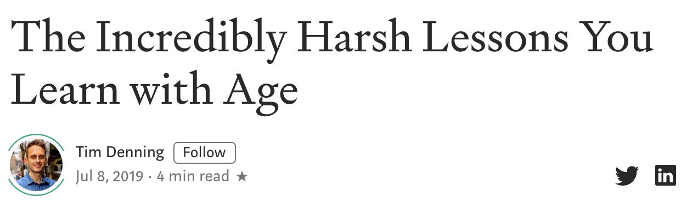

Aging is when you get wrinkles, a few grey hairs and your memory is not as sharp. None of these things sound good, which is why it is easy to *dread*(非常恐惧) getting older. The good thing about aging is you become wiser.

Life throws you around and teaches you lessons that make it more enjoyable as you get older.

I wouldn’t appreciate love if I didn’t get dumped 59 times.
I wouldn’t value money if I didn’t lose a tonne of it.
I wouldn’t understand business if I didn’t screw up so many.

You may be able to learn all of these lessons by the time you are nineteen, but for most of us, **we have to age to learn the harshest lessons that simultaneously make us wise and appreciate how precious life is**.

When you get older and *reflect on* the harsh lessons you learned, you will almost definitely see a few of these in your list.

Here are a few of my harshest lessons learned from aging:
### 01 Nothing is ever “done”
没有所谓的“完成”

**When you finish one thing, there is always another**. Nothing is ever truly perfect so if you *deem*(认为) something as finished, what you are really saying is it is good enough for this moment in time.

Learn to be satisfied with good enough for now, and you’ll avoid the trap of perfection which you can’t humanly achieve. Ever.
### 02 Success increases with your ability to be vulnerable
成功随着你脆弱的能力而增加

People won’t really know who you are until you learn to be vulnerable. In short, that means giving yourself permission to look like an idiot or share something that could embarrass you.
允许自己看起来像个白痴或者分享一些让你尴尬的事情。

We are all so focused on our own struggles to be human that any vulnerable moment you may share, will probably be short-lived in people’s memories.
我们都是如此专注于我们自己的struggles成为一个更好的人，以至于任何你分享的脆弱时刻，都可能只在人们的记忆中短暂存在。

It’s when you reach a level in life that you become okay (not comfortable) with being vulnerable that you start to unlock selflessness.
当你的生活达到一个水平，你会对自己的脆弱感到满意(不舒服)，你就会开始释放无私。

### 03 There is always another struggle coming next
总是会有另一个问题出现

When you’re a teenager, all you want to do is finish school and graduate. You tell yourself that the struggle will be over and finally you can enjoy life.

Around the same time, you’ll probably start experimenting with love and realizing it is much harder than you think. You land a quality relationship and think you’re done and get it. Until it ends or you experience ‘relationship problems.’

Then you graduate and feel the struggle to save money and buy a car or save for a holiday. Next comes the struggle to move out on your own and *fend for yourself*(照料自己). Often, what comes next is the struggle to find work you like doing or start a business and work for yourself. As you age, you then have to deal with the idea of kids, marriage and maybe buying a home.

>Just when you think you’ve overcome the struggle, another one pops up or the same one you already think you solved comes back again.
>就在你认为你已经克服了这个困难的时候，另一个又来了，或者你认为你已经解决了的问题又回来了。

For most of us, the last harsh lesson we learn as we get older is that of death. Aging increases your chances of coming face-to-face with a near-death situation that either you or someone you care about is involved with.
对我们大多数人来说，随着年龄的增长，我们学到的最后一个残酷教训就是死亡。

No matter what, **there is always another struggle coming your way until you die**. (Note the sequence can obviously change. The sequence doesn’t matter.) 
无论如何，总是会有下一个问题出现，直到死亡出现。

### 04 You always have more to learn
总是有很多可以去学习

You’d think learning stops when you finish your schooling. The school of life, though, never ends.

We are always learning through books, podcasts and blog posts even if we don’t want to admit it. Our human nature to learn doesn’t soften as we get older; it increases.

There is never any end to any form of learning. You will never know everything about spaceships or sex or machine learning. 

There is always more to learn and that is something that prevents boredom and keeps us curious if we embrace it.
总有更多的东西要学习，防止无聊，让我们保持好奇心。

### 05 Being uncomfortable feels the best
感到「不舒服」，是个好事情

The more you struggle and deal with how uncomfortable it feels as you grow old, the more you learn to value it.

Being comfortable actually leads to boredom. If you find yourself feeling bored, maybe you need to get uncomfortable. 
舒适实际上会导致无聊。如果你觉得无聊，也许你需要感到不舒服。

Jump into a freezing cold lake, go to a country you’ve never been, take up a new hobby or do something that scares the crap out of you like public speaking.

As you age and you understand the struggle never ends, you learn to move closer to uncomfortable situations because that’s where progress is unlocked and fulfillment can be found.

It is difficult to be bored when you are uncomfortable.
当你感到不舒服时，很难感到无聊。

### Conclusion
Aging is not the horrible experience it is made out to be. With age, you become wise. With wisdom, you unlock your capacity to give something to someone other than yourself.

Age brings us closer to death and that makes us grateful. Don’t fear aging; use it to your advantage and enjoy its benefits.
