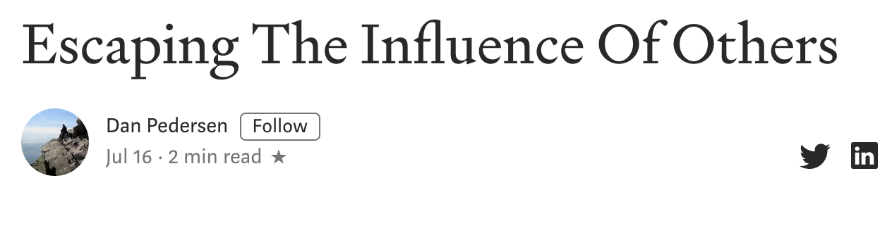

Much of our stress is caused by too many thoughts dancing around in our head — worries about the future, regrets about the past, what people think of us, what’s going on in the news, etc. Stop and listen to the birds for awhile. Be **selective** about what you expose yourself to.
我们的压力很大程度上是由太多的想法在我们的脑海中飞舞而来——对未来的担忧，对过去的后悔，人们对我们的看法，新闻里发生的事情等等。停下来听一会儿鸟儿歌唱，对自己暴露在什么样的环境中要有选择。

There’s a lot out there to confuse us and stress us out if we allow it into our life. But very little of what is happening outside of our own home needs to be brought into our thoughts. **More information does not always make for a more informed person.**
如果我们允许它进入我们的生活，会有很多事情让我们困惑和压力。但是，很少有我们自己家之外发生的事情需要我们去思考。更多的信息并不总是使人更有见识。

Those whose job it is to have an opinion will always have one, even if it is uninformed. People who always have to be saying something have little time to listen. **Listening is where real learning begins**. The one who can sit and listen, and think, is the one we should want to hear from. You can be that person for yourself if you want to be.
那些以发表意见为己任的人总是会有自己的观点，即使这观点是无知的。总是要说些什么的人很少有时间去听，倾听是真正学习的开始。一个能坐下来倾听和思考的人，才是我们应该倾听的人。如果你愿意的话，你可以为自己做那个人。

The influence of culture has a greater impact on us than we usually realize. We identify ourselves too much with the rest of society. Especially our peers. Once we recognize this, we are able to prevent some of our poorer decisions from taking place. When we stop and ask ourselves what we really want, we realize that we would be **better off** without many of the things society says we should want.
文化对我们的影响比我们通常意识到的要大。我们通过社会认可来给予自己认同感，尤其是从同龄的人身上。一旦我们认识到这一点，我们就能够阻止一些更糟糕的决定发生。当我们停下来问自己我们真正想要什么时，我们意识到，如果没有社会所说的许多我们应该想要的东西，我们会过得更好。

Nassim Taleb sums up my thoughts on this quite nicely:
>“I believe that I cannot have power over myself as I have an ingrained desire to integrate among people and cultures and would end up resembling them; by withdrawing myself entirely I can have a better control of my fate. I am currently enjoying a thrill of the classics I have not felt since childhood. I am now thinking of the next step: 
>to recreate a low-information, more deterministic ancient time, say in the nineteenth century, all the while benefiting from some of the technical gains, all of the medical breakthroughs, and all the gains of social justice of our day. I would then have the best of everything. This is called **evolution**.”

Nassim Taleb很好地总结了我的想法：
>“我相信我不能控制自己，因为我有一个根深蒂固的愿望，就是要融入不同的民族和文化，最终会和他们相像；通过完全抽离自己，我可以更好地控制自己的命运。我现在正享受着儿时从未感受过的经典的刺激。我现在正在考虑下一步：
>重建一个低信息更具确定性的古代，比如说在19世纪，同时受益于一些技术上的进步，所有的医学上的突破，以及我们这个时代所有社会正义的成果。我会得到最好的一切。这叫做进化论。”