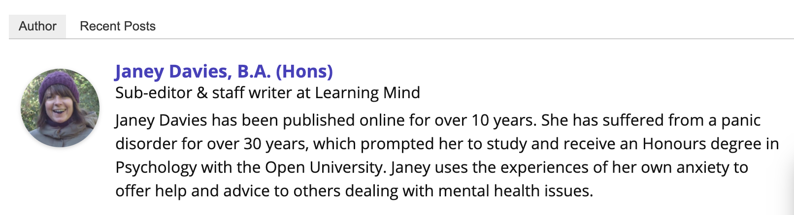

### 12 English Slang Words That Instantly Make You Sound Uneducated

I love the English language. The way you can use words to express a thought or paint a picture is something that makes us human. However, some words do us no favors. I’m talking about English slang words.

Don’t get me wrong, I use a few of the following examples myself, but I’m all too aware of how they make me sound. Now, no one is suggesting that anyone should criticize another person’s speech. But unfortunately, the things we do and say make an impression on other people. 
 
People judge us by what we are wearing, by our body language, and crucially by what we say. Yes, it’s unfair, but it’s also a fact of life.

Now, I’m not talking about regional accents or dropping your t’s and h’s from words. I want to talk about actual slang words in English that undermine our intelligence.

See if you agree with the following examples of English slang words.

### 1 ‘Ain’t’
Unless you are starring as Eliza Doolittle on some London theatre stage in My Fair Lady, you should not say ‘ain’t’. Even spellcheck doesn’t recognize it.

It is a contraction of ‘am not’ or ‘is not’ and is a lazy way of saying either of the two. Although it was popular a century ago, nowadays it sounds common and uneducated

### 2 ‘Whatever!’
This dismissive term is best reserved for stroppy teenagers going through puberty. If you are older than 13, then you should have some sort of opinion and be able to vocalize it.

Saying ‘whatever’ is suggesting that you don’t care about the other person’s opinion and you are not prepared to give your time or effort to them. It is glib and rude.

###3 ‘No worries’
Do you live in Australia? Then why are you talking like an Australian? You might think this phrase has nothing to do with English slang words, but you’d be wrong. It’s becoming more commonplace in the UK than you realize.

If you think it is acceptable to say ‘no worries’ in place of ‘You’re welcome’ or ‘No problem’, would you also change ‘G’day mate!’ for ‘Good morning’ or ‘fair dinkum’ for ‘honest’?

Now, do you see how it sounds? It sounds a little pretentious, especially if you top it off with a slight Aussie twang and add ‘mate’ at the end.

### 4 ‘Awesome’
Before you describe something as ‘awesome’, really look at it and think, is it awesome? If you are having trouble deciding whether this is the right word then here are some synonyms for awesome:

> Breath-taking, overwhelming, remarkable, splendid, outstanding, magnificent, incredible, inspiring.

Now, take another look at that sandwich you just said was awesome. It could be tasty, delicious, moist, flavorsome, peppery, or filling, but is it really awesome?

### 5 ‘Like’
When did it become acceptable to use the word ‘like’ as a form of punctuation in our speech? Like, I was going to like, try and explain, like, what this English slang word, like, sounds like.

If you want to sound as if you don’t know your subject well, then this is probably one of the worst English slang words you can use. It instantly makes you appear hesitant and devoid of any decent vocabulary.

### 6 ‘Totes!’
Again, how old are you? Nobody over the age of ten should ever say the word ‘totes’ unless they are buying or selling shopping bags. And don’t even think about adding the word ‘emosh’ at the end.

That phrase is reserved for the use of love-struck teenage girls at sleepovers. Not for adults.

### 7 ‘Epic’
This is another one of the overused slang words in English like ‘*awesome*’. People say it without really paying attention to the gravity of the word.

Epic is heroic, larger than life, grand, an extravaganza, impressive. Use the word epic to describe events or circumstances of that nature. Not your night out on the town.

### 8 ‘Double negative’
These English slang words were a pet peeve of my father. He would shout ‘Double negative!’ at me from an early age, then explain what I had said wrong.

‘If you haven’t got nothing, you must have something’, he’d explain. Frequent use of double negatives shows a basic lack of understanding of English grammar rules.

### 9 ‘OMG/LMAO/BRB’
Whilst it’s fine to use abbreviations like these with friends, it’s never acceptable in the workplace. Particularly in letters or emails. In fact, any kind of text speak or misspelling in written communication will instantly highlight a lack of education.

Leave text speak for friends and family.

### 10 ‘My truth’
This is a phrase that has come out of the US recently and has no place in the world. What exactly does ‘my truth’ mean? It means you can’t ask questions, you can’t probe this person. It’s a little like religion and faith. Because it’s ‘their truth’ it’s untouchable.

But you can’t have two different versions of the truth. There is THE truth and that’s it. Suggesting there is ‘your’ truth is subjective. The truth always needs to be objective.

### 11 ‘Guesstimate’
An estimate is a reasonable evaluation based on the available data to hand. So what is the point of a guesstimate? You are just going to say whatever comes into your mind?

Why not stick with an estimate in that case? Guessing is supposing, conjuring, or assuming. It doesn’t take evidence or facts or knowledge into account. So why bother?

### 12 ‘Literally’
Ah, our old friend ‘literally’! I literally couldn’t wait to get to this word. Many of us use this word to emphasize what we are doing. We use literally to make what we are doing sound more dramatic.

‘She literally flew into the house.’

The problem is that the word ‘literally’ means actually or in a literal sense.

For example:
>‘The hurricane was so strong it literally uprooted several trees.’

A hurricane can be strong enough to uproot trees, so in this sense the word ‘literally‘ is correct.

But we have started to use the word literally to intensify or exaggerate a word.

For example:
>‘He was literally in floods of tears at the tragic news.’

A person might be upset but could never produce ‘floods’ of tears, so in this case, ‘literally’ is being used as an intensifier and is wrong.

### Final Thoughts
None of us likes to think that others see us as uneducated. One way we can avoid this is to stop using the above English slang words.

What words make you stop and wonder about a person? Let me know in the comments section.