继续搬运medium的付费文章，这10句生活智慧警句，你认同吗？
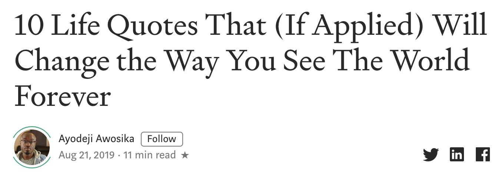

I’m a writer, which means I love quotes. But I also understand how simultaneously insightful and useless they can be. You can do one of two things with a quote — use it as inspirational fluff to post on Instagram or use the insight to change your life. The wisdom of quotes is extremely powerful when applied.
我是个作家，这意味着我喜欢带着名言警句。但我也明白他们是多么的有见地和毫无用处。你或许可以用一句引语把它当作鼓舞人心的帖子po在Instagram上，或者用它来改变你的生活。如果将这些名言警句在生活中应用起来是非常强大的。

I’ve collected quotes I come back to time and time again when my life isn’t aligned, I need a reminder, or simply want to reflect on the beauty of life itself.
我收集了一些我经常引用的句子，当我的生活不一致时，我需要一个提醒，或者只是想反思生活本身的美丽。

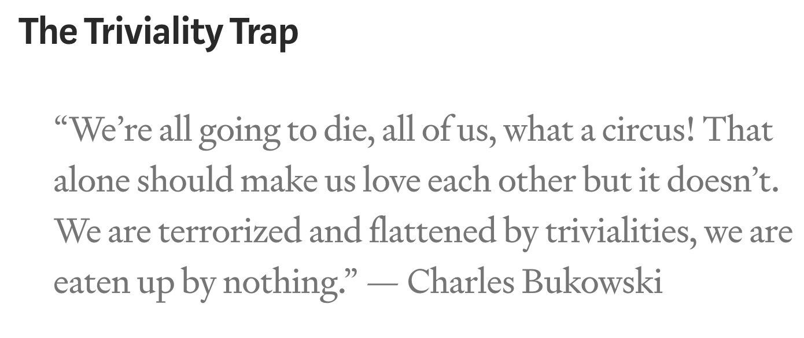

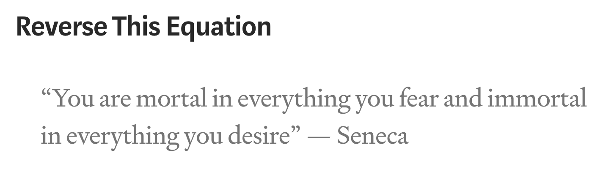

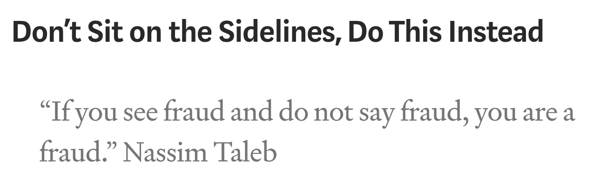

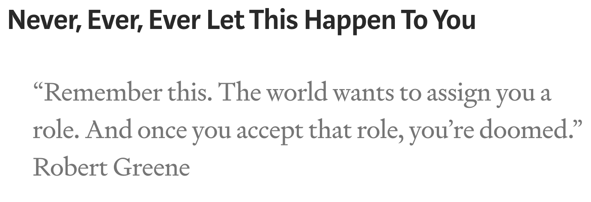

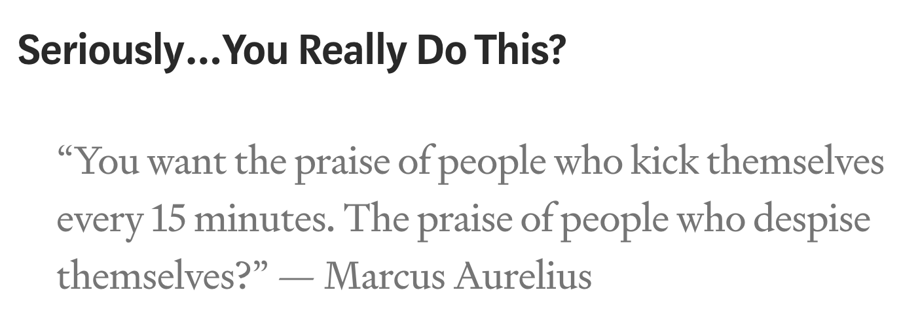

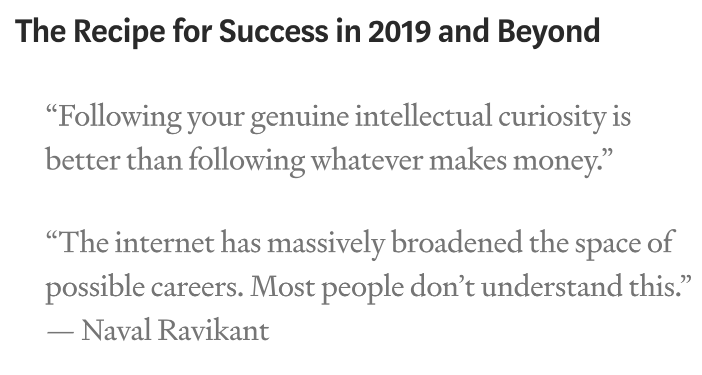

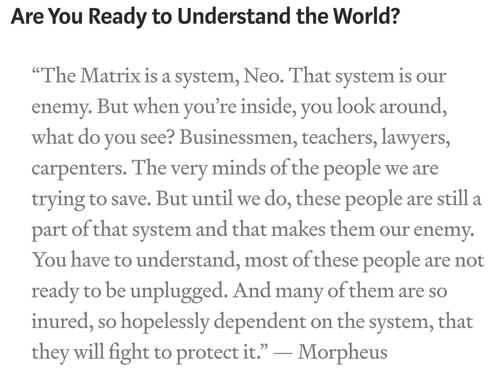

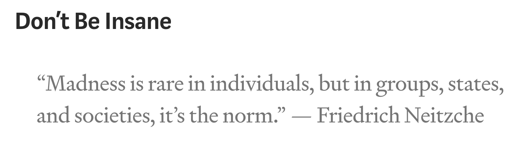

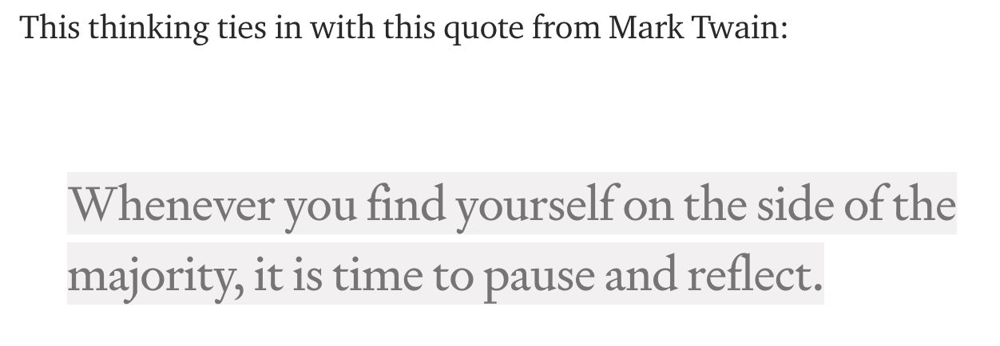

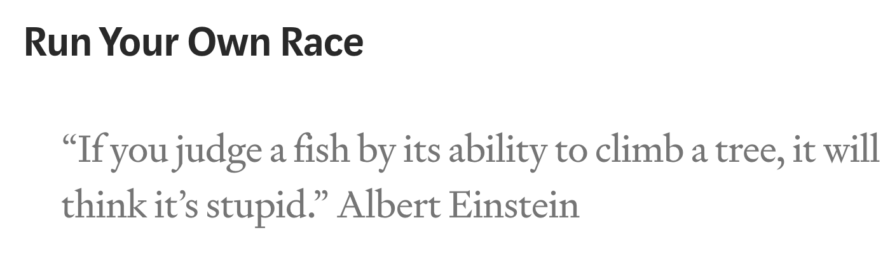

Let me *lighten up the tone* here a little bit. Without knowing you, I genuinely think you’re capable of doing something great with your life. What that something is? I don’t know. Many factors come into play — your strengths, your circumstances, your current career, your belief systems, so it goes.
让我把语气放轻松一点，在不认识你的情况下，我真的认为你有能力在生活中做一些伟大的事情。那是什么东西？我不知道。很多因素都会起作用-你的优势，你的环境，你现在的职业，你的信仰体系等等。

You can *align* your life *with* the “you” that you once knew. The one that was excited and curious about life. The one that loved to write, paint, crack jokes, make paper airplanes, do math problems for fun (yes, these people exist), pretend to be a broadcaster on Sunday afternoons, whatever.
你可以让你的生活与你曾经认识的“你”保持一致。一个对生活充满兴奋和好奇的人。喜欢写作，画画，开玩笑，做纸飞机，做数学题来取乐（别不信，真有），在周日下午假装成一个播音员。

You have a skill, a talent, a perfectly suited spot for you in this universe. Finding it and doubling down on it for the rest of your life is pretty much the only success tip you need.
你有一种技能，一种天赋，一个非常适合你在这个宇宙中的位置。找到它并在你的余生加倍努力，这几乎是你唯一需要的成功秘诀。