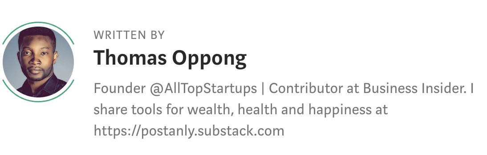

超级学习者的6个习惯
 
Becoming a super learner is one of the most important skills you need to succeed in the 21st century. 

在技术变革的时代，**保持领先**(Staying ahead)取决于持续不断的**自我教育**。

Many polymaths(博学家) (people who have excelled in diverse pursuits) — including Charles Darwin, Leonardo da Vinci and the Nobel prize-winning physicist Richard Feynman — claimed not to have exceptional natural intelligence.

Better learning approaches can make the process enjoyable. The key to rapid skill acquisition(习得) isn’t complicated. 

If you aim to learn a new skill to improve your career this year, some of these habits can be useful for you.

### 1. Super learners read a lot  
很多人问，你为什么要阅读？

**Reading is to the mind what exercise is to your body**. 
* It gives us the freedom to roam the expanse of space, time, history, 
* and offer a deeper view of ideas, concepts, emotions, and body of knowledge.

In fact, many of the most successful people share this appreciation for **reading** — 
they don’t see reading as a chore but as **an opportunity to improve their lives, careers and businesses**.
事实上，许多很成功的人都对阅读有着同样的态度——他们并不把阅读看作是一件烦琐的事，而是一个改善生活、事业和事业的机会。

Elon Musk grew up reading two books a day, according to his brother. Bill Gates reads 50 books per year. Mark Zuckerberg reads at least one book every two weeks. Warren Buffett spends five to six hours per day reading five newspapers and 500 pages of corporate reports.
据马斯克的哥哥说，马斯克从小就每天读两本书，比尔盖茨每年读50本书，扎克伯格每两周至少读一本书，巴菲特每天花5到6个小时阅读5份报纸和500页公司报告。

In a world where information is the new currency, reading is the best source of continuous learning, knowledge and acquiring more of that currency.
在一个以信息为新货币的世界里，阅读是持续学习、知识和获取更多信息的最佳来源。

### 2. Super learners view learning as a process
过程比结果更加重要。

Learning is an enjoyable lifelong process — a self-directed and self-paced journey of discovery. 
Understanding any topic, idea or new mindset requires not only *keen observation* but more fundamentally, **the sustained curiosity**.
学习是一辈子的事，是一个愉快充实过程——一个自我导向和有着自己节奏的发现之旅。
理解任何话题、想法或新的思维方式，不仅需要*敏锐的观察力*，更重要的是需要**持续的好奇心**。

More than ever, **learning** is for life if you want to stay **relevant**, **indispensable** and thrive in the changing world of work.
如果你想在不断变化的工作环境中保持相关性、不可或缺并茁壮成长，学习比以往任何时候都重要。

Super learners value the process. They don’t have an end goal, they seek consistent improvement. 
超级学习者重视过程。他们没有最终目标，他们寻求持续的改进。

### 3. They adopt a growth mindset
成长型心态。

Growth mindset — a learning theory developed by Dr Carol Dweck that revolves around the belief that 
**you can improve intelligence, ability and performance**.
**成长型心态**——Dr Carol Dweck提出的一种学习理论，它围绕着这样一种信念：
**你可以提高智力、能力和表现**。

>The illiterate(文盲) of the 21st century will not be those who cannot read and write, but those who cannot **learn**, **unlearn** and illiterate  ----Alvin Toffler

Alvin Toffler认为：“21世纪的文盲将不是那些不会读写的人，而是那些不会学习、忘却和重新学习的人。”。

The ability to keep an open-mind, acquire better knowledge and apply it when necessary can significantly improve your life and career.
能够保持开放的心态，获得更好的知识，并在必要时加以运用，可以显著改善你的生活和事业。

### 4. Super learners teach others what they know
分享是学习最高效的方式。

根据研究，学习者在向他人解释/教授概念或者立即使用时，他们所学知识的90%都会保留下来。

**费曼技巧**用起来。

Learn by teaching someone else a topic in simple terms so you can quickly pinpoint(准确找出) the holes in your knowledge. 

**The ultimate test of your knowledge is your capacity to transfer it to another**. 
对你的知识的终极考验是你是否有能力将知识传授给他人。

A better way to learn, process, retain and remember information is to learn half the time and share half the time. 
学习、处理、保留和记住信息的更好方法是用一半的时间学习，一半的时间分享。

举个例子，与其花全部时间来阅读一本书，不如阅读书的50%，剩下50%的时间用来回忆、分享或写下你学到的关键思想。

### 5. Effective learners take care of their brains
照顾好自己的大脑。

Keeping your brain healthy keeps it sharp. 
What you do or don’t do for your brain can significantly change how your record, process and retrieve information. 
Everyone wants to live an active life for as long as possible. And that goal depends on robust brain health.
你对大脑做什么或不做什么都会显著改变你记录、处理和检索信息的方式。
每个人都想精气神地过好一生，而这个目标取决于强健的大脑健康。

That means eating lots of foods associated with slowing cognitive decline — *blueberries*, *vegetables* (*leafy greens* — kale, spinach, broccoli), *whole grains*, getting protein from *fish* and *legumes* and choosing healthy unsaturated(不饱和) fats (olive oil) over saturated fats (butter).
这意味着要多吃一些与减缓认知能力衰退相关的食物——蓝莓、蔬菜（绿叶蔬菜——甘蓝、菠菜、花椰菜）、全麦食品、从鱼和豆类中获取蛋白质、选择健康的不饱和脂肪（如橄榄油），而不是饱和脂肪（如黄油）。

Our brains naturally decline if we do nothing to protect them. However, if you intervene early, you can slow the decline process — it’s easier to protect a healthy brain than to try to repair damage once it is extensive.
如果我们不采取任何措施来保护它们，我们的大脑自然会衰退。然而，如果你及早干预，你可以减缓衰退的进程——保护一个健康的大脑比试图修复损伤更容易。

### 6. They take short breaks, early and often
尽早、经常性地短暂休息

Downtime is crucial to retaining anything you choose to learn. 

According to recent research, taking short breaks, early and often, can help you learn things better and even improve your retention rate.
根据最近的一项研究，尽早、经常性地短暂休息，可以帮助你更好地学习，甚至提高你的记忆力。

>Everyone thinks you need to ‘practice, practice, practice’ when learning something new. Instead, we found that **resting**, early and often, maybe just as critical to learning as practice   ---- Leonardo G. Cohen, M.D., Ph.D.

Better breaks help the brain solidify, memories during the rest periods. 

Whatever you choose to learn over time, it’s important to optimise the timing of rest intervals for better results.

Experts at the Louisiana State University’s Center for Academic Success recommends **30–50 minutes sessions**. 

>Anything less than 30 is just not enough, but anything more than 50 is too much information for your brain to take in at one time. ----Ellen Dunn.

Our brains’ neural networks need to time process information, so **spacing out** your learning helps you memorise new information more efficiently — give your brain enough time to rest and recover.

我们大脑的神经网络需要时间来处理信息，所以分散学习时间有助于你更有效地记忆新信息——给你的大脑足够的时间休息和恢复。

### 成为一个超级学习者，你需要养成以下6个习惯
* Super learners read a lot  
* Super learners view learning as a process
* They adopt a growth mindset
* Super learners teach others what they know
* Effective learners take care of their brains
* They take short breaks, early and often

