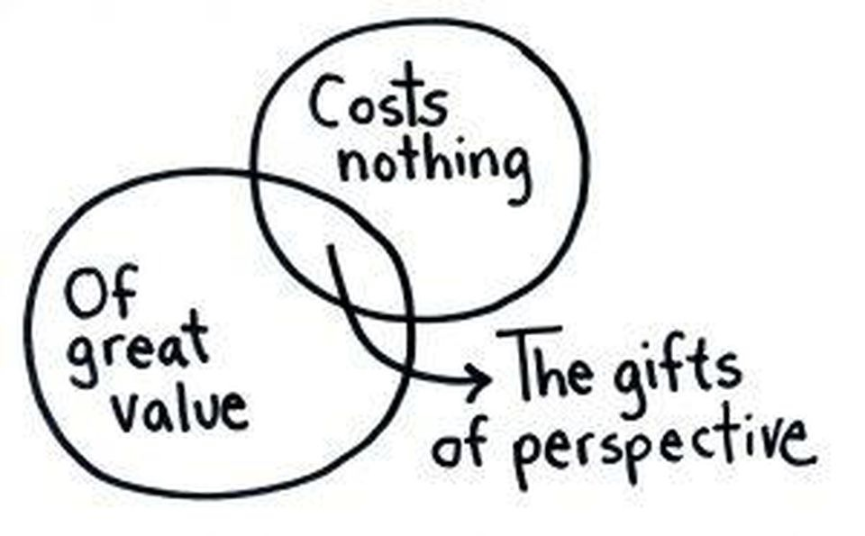

###7 Simple Gifts You Can Give Yourself Today

If you want to change your life, change how you think about it. Here are seven shifts you can make today that can greatly improve tomorrow.

#### 1 Some slack. 懒散
每天午餐前不能解决完所有的问题，做自己可以做的，对自己不能做到的不要感到自责。
You cannot solve all of the world’s problems before lunch. Do what you can, and don’t feel guilty about what you can’t. You’re *pulling your own weight*, and that’s enough.
(pull your weight: to do your fair share of work that a group of people is doing together 完成自己那份工作 )

#### 2 Some forgiveness. 原谅
是人都会犯错、搞砸、忘记东西、浪费时间、说话不友好等等。原谅自己。
You messed up. You forgot something. You spent time unwisely. You spoke unkindly. You’re not evil. **You’re just human**.

#### 3 Some time. 放松
为了下一件事情完成的更好，学会给自己放松。
If you are exhausted, find a room with a door and hide in it. If no such room exists, escape to the outdoors for at least fifteen minutes. You earned that time.

#### 4 Some entertainment. 开心
Watch the cat video. Stream the *sappy*(多愁善感的) movie. Read the *pulpy*(庸俗的) novel. Consider it a form of vacation.

#### 5 Some optimism. 乐观
希望最美！
Tomorrow will be better. You will learn more. You will feel better. You will hone your skills, your crafts, your outlook. Don’t worry. You’ll figure out how.

#### 6 Some goals. 目标
要想完成一个事情，记录在日上，确定好什么时间去做，预估需要花费多久，给自己一个截止时间。
You need a destination, a deadline, a reason to move forward. Goals dissolve *listlessness*(无精打采). Give yourself one.

#### 7 Some control. 控制
Give yourself permission to be in charge of yourself. Switch the voice in your head from passive to active and let your opinions matter.