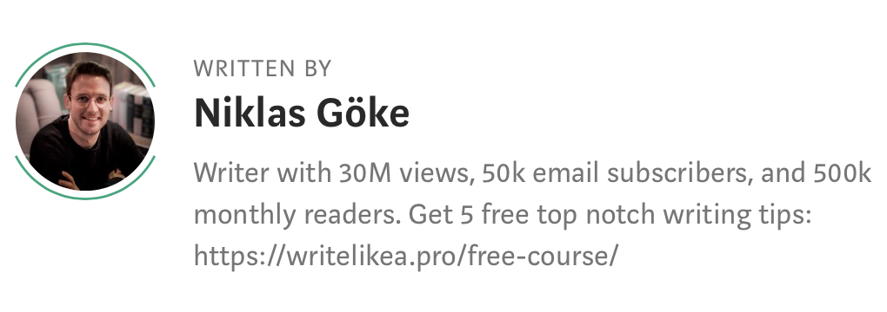

今天的原文来自Medium，摘录了Jordan Peterson的书《12 Rules for Life》中的十二条法则。这本书我没有看，我摘录了豆瓣上的一个书评放这里。

> 这本书包括了Jordan Peterson的生活十二法则，不管是对个人，还是对社会，都是一剂良药。
> 
> 贯穿这本书的一个主题就是人生并没有那么绝望，个人的改变是可能的，生活有希望变得更好。毫无疑问，从小事做起，你可以每天进步一点点。生活的本质是一个悲剧，这个世界也并不那么友好，但我们要正确地对待这些问题，而不是一味地扮演一个受害者的角色，像祥林嫂一样，活在过去的阴影里；或者像一个巨婴，拒绝成长。
> 
>生活的十二条法则，用JP自己的话来说就是一些让你不再可悲的法则，因为他本人也是这些法则的实践者，而且他正实践着，所以他说的这些并不是空中楼阁。他对自己的缺点和不足之处也非常坦然地承认，而不像有的作者一味地自吹自擂。

> If you make happiness the meaning of life, every time you’re not happy, you’ll feel like a failure.

###Rule 1. “Stand up straight with your shoulders back.”
立正站好，抬头挺胸。

If you face a bad day with a good attitude, it can still be a meaningful one. 
Posture holds power. 
While you can overdo the “fake it till you make it” of how you carry yourself, making an effort to not collapse in the face of adversity(逆境) — both mentally and onto the couch — is empowering(有力量的). 

You control whether you walk straight or slouch, whether you smile or look grumpy, whether you focus on what went wrong or what needs to be done. 
Reminding ourselves of this control when times are tough can dramatically transform our experience of how tough times actually are.

**Show up, stand straight, smile. Conquer your attitude, conquer the day**.

### Rule 2. “Treat yourself like someone you are responsible for helping.”
善待自己，就像善待我们有责任好好对待的他人那样善待自己。

The only perspective we have on life is our own, and since we have to look at everything that’s in it, it’s easy to miss things. Our friends, however, see only small parts of us — but those parts they can see clearly.

It’s easy to see a relationship isn’t working when it’s not yours. When it’s your friend making the career choice, the answer seems obvious.

Ask yourself: “**What would my friends tell me to do?**” What would a neutral observer see and say? If you can look into the mirror and tell your reflection the tough truth they need to hear, you’ve finally learned to act in your own best interest.

### Rule 3. “Make friends with people who want the best for you.”
交真朋友

True friends connect with you because you believe in the same things. 
**Honesty**, **curiosity**, **humility**, whatever they are, upholding(保持) those beliefs will often mean putting your interests above their own — and that’s what true friends do. You deserve true friends.

### Rule  4. “Compare yourself to who you were yesterday, not to who someone else is today.”
要攀比，但要正确地攀比，不是和别人比，而是和昨天的自己去比。

A woman who earns $500,000 per year will feel great in a neighborhood where everyone else makes $250,000, but she will be miserable in Dubai.

If you must compare, look at yesterday’s photographs of yourself. Look at how far you’ve come, what you can be proud of, and remember what you’ve learned along the way. But whenever you can, don’t compare at all.

### Rule 5. “Do not let your children do anything that makes you dislike them.”
不要让孩子做让自己讨厌他们的事情。

When your son punches a fellow student, it’s not his behavior that makes you angry. It’s the failure as a parent that stings. “What example did I set that he wanted to punch him in the first place?” That’s an ugly question to answer.

If you don’t want to bail your kids, your partner, your friends out of trouble, teach them how to become the kind of person that does not get into it. **Be aware of the example you set every day**.

Defend moral lines if you must, but as long as you can, assemble those around you on the same side of those lines by showing them what taking a stand actually looks like.

### Rule 6. “Set your house in perfect order before you criticize the world.”
先把自己的事情处理好

We have a saying in Germany: “**If everyone sweeps in front of their own doorstep, the streets will be clean**.” It’s true. 

You’re never done becoming, and there’ll always be things left to improve. 
Every morning, pick one of those things to work on. Focus on that.

Look inside, fight your own demons, and by 4 PM, you’ll find yourself smiling at your neighbor rather than shouting at them — because one hard battle every day is enough.

### Rule 7. “Pursue what is meaningful (not what is expedient).”
追求有意义的生活，而不是一时的欢愉。

When Voldemort returns in Harry Potter and the Goblet of Fire, Dumbledore eventually tells Harry: 
“Soon, we must all face the choice between what is right and what is easy.”

You and I aren’t fighting dark magic, but every day, we choose between what is right and what is easy. 
You can cut someone off in traffic. 
You can sell a supplement you don’t believe in. 
There are plenty of opportunities to take convenient but immoral roads.

Or, you can do things the hard way — and make your life easier. Not because you’re carrying a light load, but because you strengthen your back every time you shoulder it, all while alleviating your conscience.

### Rule 8. “Tell the truth — or, at least, don’t lie.”
不要撒谎，因为撒谎会让我们变得脆弱，我们自己能感受到，别人也能感受到。但是说真话又很难，因为事实的真相本身就很难说清，所以至少不要说谎。

Lying works today but gets harder with every tomorrow. The truth may feel uncomfortable now, but every day that it’s out will make your life a little lighter.

A building made of lies is a fragile construct. One tiny mistake, and the whole thing comes tumbling down. The truth is a solid foundation. It only grows inch by inch, but it’ll never crumble beneath your feet.

### Rule 9. “Assume that the person you are listening to might know something you don’t.”
假设和你对话的人知道一些你不知道的事情。

I’m not sure why Peterson is assuming. It’s a fact: Every person you’ll ever meet knows something you don’t.

No one better captured what to do about this than the Greek philosopher Epictetus: 
“We have two ears and one mouth so that we may listen twice as much as we speak.”

### Rule 10. “Be precise in your speech.”
说话不要含糊，要准确。其实很重要的一点是有话一定要说出来，因为只有说出来了，清楚地表达了，问题出在哪里才会一目了然，而唯有如此，才有解决问题的可能。

There’s that famous scene in The Notebook where Ryan Gosling asks Rachel McAdams, over and over again: “What do you want?”

This is a tough question. Humans are complex creatures. But we appreciate whoever makes an honest effort to give us a straight-up answer.

This goes beyond your relationships. Your own words to yourself should also be clear. 
“I want to be rich” is a *dream*. 
“I want to own a house on the beach in ten years” is a *plan*.

Words matter. Think hard about the right words.

### Rule 11. “Do not bother children when they are skateboarding.”
当孩子们在玩儿滑板的时候不要去打扰他们。

When I was a kid, me and my friends used to race down a long hill with our scooters. 

One time, we skidded on wet foliage and fell. We got up, walked for a bit, and then we got back on our scooters.
Failure is an essential part of life. If children don’t have room to experience it on their own, they’ll be ill-equipped to handle it later when it really matters. 

Life is not safe — or at least, always playing it safe will not lead to a good life. 
We can’t **childproof** our world, so how about we just let them be a part of it?

### Rule 12. “Pet a cat when you encounter one on the street.”
如果有什么能让你微笑，花一点时间去记住它。

If something makes you smile, take a second to remember it. 
Let the moment linger. Don’t rush past it so you can shuffle more papers.

Small moments are what life is made of. At the end of it all, these moments are what we’ll remember.

Maybe, you’re more of a dog person. That’s okay. You can also pet those. You can get ice cream if they have your favorite flavor. You can say “Thanks” to the sun for shining today.

However you choose to show it, don’t let moments pass by without noticing them. Moments are all we have.