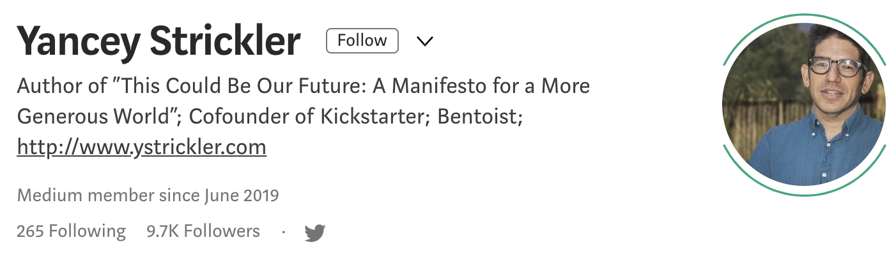
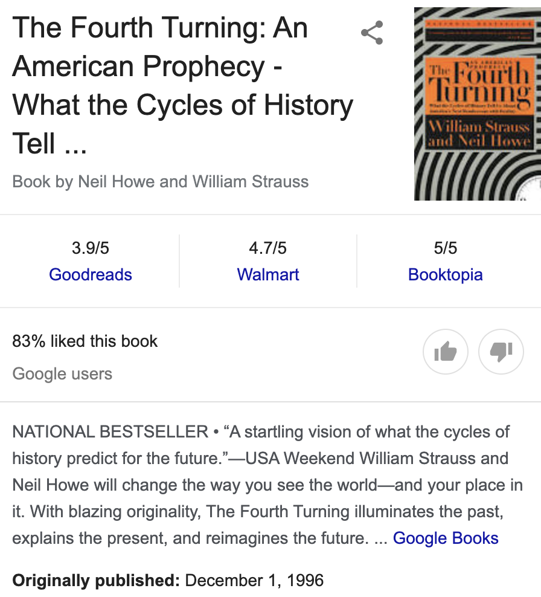
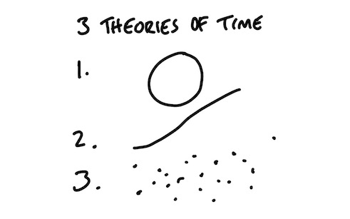
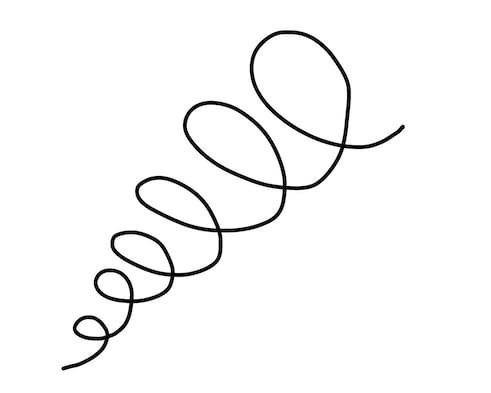
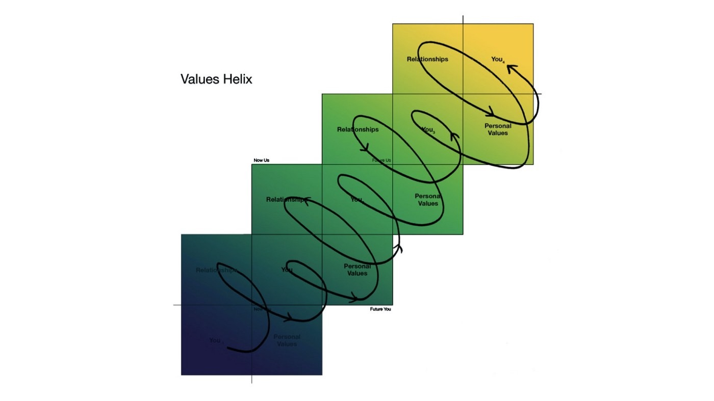

今天的文章来medium.com的付费订阅文章。时间到底是什么？为什么需要我们时间？思考时间的来源和发展，也可以帮助我们看清楚很多事情，最喜欢原文中最后一段话。请问你知道有哪些关于时间的比喻？
## Theories of Time

I recently read a book I’d been curious about called The Fourth Turning by William Strauss and Neil Howe. The book theorizes that history changes through generational shifts, and that these changes happen in predictable and repeatable patterns.

One of the big questions the book poses is *the nature of time*. The authors present three theories for how time functions:
1. Time is cyclical (the four seasons; the cycle of birth, life, and death)
2. Time is linear (things are getting progressively better)
3. Time is chaos (there’s no order at all)

Until the Renaissance the authors contend, people experienced time as **cyclical**. Life was marked by the repetition of seasons and birth and death. There was no technological progress. The world was a loop. When people started counting years they had to make the case why this was worth doing.
作者认为，在文艺复兴之前，人们经历的时间是周期性的。生命的特点是四季循环，生与死，没有技术进步。世界是一个循环。当人们开始计算年数时，他们必须说明为什么这是值得做的。

This changed with the Renaissance and the acceleration of technology. This created a linear sense of time. For the first time humanity felt it was improving. Given enough time and technology, problems could be solved. This is largely how the world sees time today.
这随着文艺复兴和技术的加速而改变。这创造了时间是线性的，人类第一次感到它在进步。只要有足够的时间和技术，问题就可以解决。这在很大程度上是当今世界看待时间的方式。

There’s a fourth metaphor for time also worth considering. 
关于时间，还有第四个比喻值得考虑。

This metaphor comes from a book called The Artist’s Way by Julia Cameron, a self-help guide for artists. Cameron writes:
这个比喻来自Julia Cameron的《艺术家之路》，一本艺术家自助指南。Cameron写道：
> “You will circle through some of the same issues over and over, each time at a different level. There is no such thing as being done with an artistic life. Frustrations and rewards exist at all levels on the path. Our aim here is to find the trail, establish our footing, and begin the climb.”
> “你会一次又一次地在不同的层面上讨论同样的问题。艺术世界里不存在完成。挫折和回报存在于道路的各个层面。我们在这里的目标是找到踪迹，站稳脚跟，开始攀登。”

Cameron’s wisdom brings our metaphors of time together. We will repeatedly face the same challenges 
— the cyclical notion of time 
— even as we seek linear growth 
— the progressive notion of time. 
Put them together and you get a fourth metaphor: time is a spiral.
Cameron的智慧将我们的时间隐喻结合在一起。我们将反复面对同样的挑战
——周期性的时间观念
——甚至在我们寻求线性增长的同时
——时间的渐进概念。
把它们放在一起，你会得到第四个比喻：时间是螺旋形的。

We constantly circle the same themes and challenges in our lives. The past keeps echoing back. Those echoes are opportunities to make better decisions and *grow into* more mature versions of ourselves (shifting the spiral “up”) or to make worse decisions and regress (shifting the spiral “down”).
在我们的生活中，我们总是围绕着相同的主题和挑战。往事不断回荡，这些回响是做出更好的决定和成长为更成熟的自我的机会（将螺旋向上移动），或者做出更糟糕的决定和倒退（将螺旋向下移动）。

This way of explaining time may seem theoretical, but it has real-life applications. Especially as navigating time is much easier when you’re aware that the spiral exists.
这种解释时间的方式看似理论上的，但却有实际应用。尤其是当你意识到螺旋线的存在时，管理时间就容易得多。

As the authors of The Fourth Turning note, when people saw time as cyclical in the pre-modern world, no one tried to pretend winter wasn’t coming. The world cycled between fat and lean times. People survived the lean because they prepared during the fat. The truth of life was plain to see.
正如《The Fourth Turning》的作者所言，在前现代社会，人们认为时间是周期性的，没有人试图假装冬天不会到来。世界在贫富之间循环。人们在艰难时期幸存下来是因为他们在一切安好期间做好了准备。生活的真相是显而易见的。

In a world where we believe time is progressive, we lose our capacity to prepare. Getting ready for the worst feels wasteful and ungrateful in a society premised on the belief that a better future is always just around the corner. Even the existence of a Plan B can challenge the entire value system.
在一个我们认为时间是进步的世界里，我们失去了准备的能力。在一个以*美好未来就在眼前*这一信念为前提的社会里，做最坏的打算是浪费和忘恩负义的。即使B计划的存在也会挑战整个价值体系。

Awareness shapes the world of today and successive generations. In my book I visualized this process as the Values Helix — a spiral.
意识塑造了今天和后代的世界。在我的书中，我把这个过程想象成价值螺旋。

Seeing time as a spiral creates **forgiveness**. Even as we move past a challenge, we should expect another version to return. This awareness gives us permission to grow without demanding perfection and opens up the longer journey towards mastery. Our struggles simply mark another loop on the climb.
把时间看成螺旋形，就可以创造**宽恕**。即使在我们完成一个挑战的时候，我们也应该期待着另一个版本的回归。这种觉知给予我们成长的许可，而不必苛求完美，并开启通往完美和成熟的漫长旅程。我们的挣扎只是在攀登的另一个循环。
