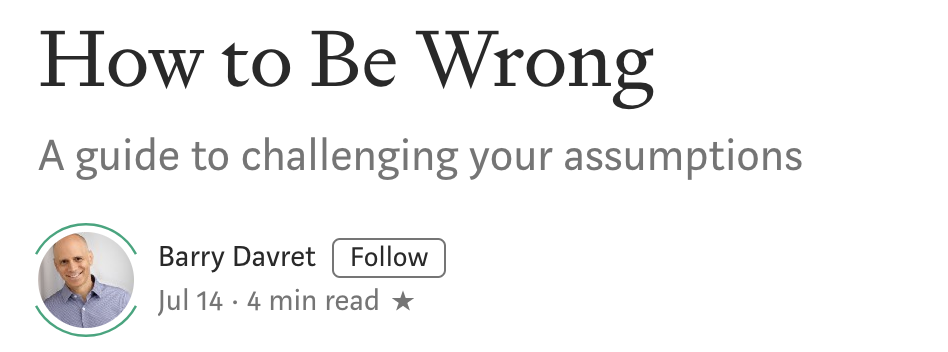

继续搬运medium的付费文章——How to be wrong.  关于如何挑战自己的假设——不仅仅是围绕某些问题，而是将之作为一种习惯。每天早上问自己: What belief will I be wrong about today? 晚上再扪心自问：我今天错了什么？你愿意将这个当做习惯去养成吗？能坚持30天吗？

Some of our mistakes are easier to admit to than others. If you underestimated, say, the amount of time it would take to change a tire? Most people probably wouldn’t have a problem saying so.
我们有些错误比其他错误更容易承认。如果你低估了换轮胎的时间？大多数人这样说可能不会有问题。

But when it comes to our deep-rooted beliefs and worldviews, we have a stake in remaining steadfast in what we’ve told ourselves is true. **Most folks see being wrong as a mark of shame instead of a prerequisite to self-improvement**. As the journalist Kathryn Schulz wrote in her book *Being Wrong*, we often see errors as “evidence of our gravest social, intellectual, and moral failures.”
但是，当涉及到我们根深蒂固的信仰和世界观时，我们需要对自己所说的话保持坚定。大多数人认为犯错是羞耻的标志，而不是自我完善的先决条件。正如记者Kathryn Schulz在她的书《Being Wrong》中所写，我们经常把错误视为“我们最严肃的社会、智力和道德失败的证据”

That’s what culture has taught us. Think about it. How often do you say to yourself at the end of a day: 
“I believed something this morning that I no longer believe now.” 
In my adult life, this revelation occurred almost never.
这就是文化告诉我们的。想想看，你有多少次在一天结束时对自己说：
“今天早上我相信了一些我现在不再相信的东西。”
在我成年的生活中，这个启示几乎从未发生过。

It’s been my loss. **There are great benefits to being wrong**: 
When you learn to **punctuate**(给…加标点符号) everything you believe with a question mark, you open yourself to the discovery of knowledge. You routinely discard old views in favor of perspectives that are informed by evidence, history, and a variety of opinions. You find a whole new way of navigating the world.
这是我的损失。犯错有很大的好处：
当你学会用问号来标点你所相信的一切时，你就会对知识的发现敞开大门。您通常会抛弃旧的观点，转而使用基于证据、历史和各种观点的观点，你会找到了一种全新的世界观。

I wanted to learn how to challenge my own assumptions — not just around certain issues, but as a habit. So I created what I called the *30-Day Becoming Wiser Challenge*, which involves both a morning and an evening routine. Here’s how it works.
我想学习如何挑战我自己的假设——不仅仅是围绕某些问题，而是作为一种习惯。所以我创造了一个我称之为“30天变聪明”的挑战，它包括早晚两个常规。下面是它的工作原理。

### Morning routine
The morning routine primes your mind to stay open and investigate reality throughout the day ahead.
早晨的例行工作会让你的头脑保持开放，并在接下来的一天里调查现实。

Ask yourself this question: **What belief will I be wrong about today**? You’ll want to document your answer somewhere, like a journal, a voice memo, or a note on your phone.
问你自己一个问题：今天我的信念会是什么？你需要把你的答案记录在某个地方，比如日记、语音备忘录或手机上的便条。

Focus on something specific. You might even want to start with something small and low-stakes (“Milk should be poured before adding the cereal”). Once you get in the habit of asking yourself the question each day, you can move onto bigger, more personal topics.
专注于具体的事情上，你甚至可以从一些小的和低风险的东西开始（“牛奶应该在加入谷类食品之前倒掉”）。一旦你养成了每天问自己这个问题的习惯，你就可以进入更大、更私人的话题。

Decide how you’ll seek out information to disprove your belief. Will you schedule a conversation with someone who believes the opposite? Will you read information from sources you don’t normally check? Put these tasks on your to-do list or schedule them in your calendar.
决定如何寻找信息来反驳你的信仰。你会安排和一个持相反观点的人谈话吗？你会从你平时不检查的信息来源中阅读信息吗？把这些任务放在你的待办事项清单上，或者把它们安排在你的日程表上。

Prepare for blowback. Ask yourself how your family, friends, or peers might judge you for changing this belief you’ve identified. One reason we resist admitting we’re wrong is that we fear how it will look in the eyes of others. So prepare yourself for it. Plan an explanation for why you’ve adopted a new belief, own it, and move on.
准备好违背初衷的解释。问问你自己、你的家人、朋友或同龄人会如何评价你改变了你已经确定的这种信念。我们拒绝承认自己错了的一个原因是我们害怕别人眼中的错误，所以你要做好准备。计划解释为什么你接受了一个新的信仰，拥有它，然后继续前进。

### Evening routine
Your evening routine prompts self-reflection that helps you cement the habit of questioning your assumptions.
Ask yourself this question: What was I proven wrong about today? Once again, document your answer.
你晚上的日常活动会促使你自我反省，这有助于你养成质疑自己假设的习惯。扪心自问：我今天错了什么？再一次，记录你的答案。

If it’s “nothing,” explain any areas in which you were challenged. Even if you confirmed what you already believe, it’s good practice to see the gray areas and holes in every stance.
如果“没什么”，解释一下你在哪些方面受到了挑战。即使你证实了你已经相信的，最好还是看看每个站姿的灰色区域和空洞。

Think about how you were challenged or proven wrong.
想想你是如何被挑战或证明是错的。

Did you seek to prove yourself wrong, allow someone else to do it, or both? In this exercise, it’s helpful to both seek out information on your own and open yourself to challenges from others.
你是想证明自己错了，还是让别人来做，还是两者兼而有之？在这个练习中，你既可以自己寻找信息，也可以让自己接受别人的挑战。

Wherever you documented your answer, add a few sentences about what you learned from the experience. When you feel the rush of excitement from discovering something new, you’ll be more open-minded the next time a belief comes into doubt. If you weren’t proven wrong or challenged at all, don’t worry. It took me several days of this practice before I developed enough awareness to recognize my resistance to being wrong.
无论你在哪里记录你的答案，都要加上几句话来说明你从这次经历中学到了什么。当你因为发现新事物而感到兴奋时，下一次当一个信念受到怀疑时，你会变得更加开放。如果你没有被证明是错的或者没有受到挑战，别担心。我花了好几天的时间才意识到自己对错误的抗拒。

Reward yourself if you made it through the day and successfully disproved something you believed, or at least opened yourself for future questioning. Treat yourself to something small — a square of dark chocolate works for me. Think of it as a way to reinforce the behavior and train your brain to favor doubt over certainty.
如果你成功地证明了你自己的未来，或者至少是你自己成功地证明了这一点。一块小小的巧克力对我来说很管用。把它看作是强化行为的一种方式，训练你的大脑倾向于怀疑而不是确定。

For me, this exercise has been transformative. I learned to see being wrong as a path for growth rather than a statement about my inadequacy.
对我来说，这项工作具有变革性。**我学会了把做错看作是一条成长之路**，而不是一种对自己不足的声明。

It takes about 30 days to grow comfortable with being wrong. You’ll find yourself less certain and more doubtful, but that’s a good thing. As the philosopher, Bertrand Russell once wrote: “*The whole problem with the world is that fools and fanatics are always so certain of themselves, and wiser people so full of doubts*.” Once you get in the habit of looking for ways to disprove your beliefs, you’ll find yourself more willing to accept criticism, challenges, and new information. And in doing so, you can transform your work, your relationships, and yourself.
大约需要30天的时间才能适应错误。你会发现自己不再那么确定，反而更加怀疑，但这是件好事。正如哲学家Bertrand Russell曾写道：“这个世界的全部问题是，愚人和狂热分子总是那么自信，而聪明的人总是充满怀疑。”一旦你养成了寻找反驳自己信仰的方法的习惯，你会发现自己更愿意接受批评、挑战和新信息。这样做，你可以改变你的工作、你的关系和你自己。